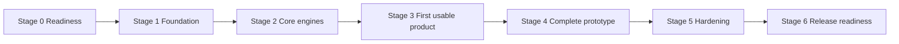

# Kineo Implementation Milestones

| Field | Value |
| --- | --- |
| Status | Approved build plan — M1–M8 complete; M9 software complete; M9 physical-device gate and M10 qualification pending |
| Platform | Native iPhone, SwiftUI, iOS 17 minimum |
| Sources | Product design, UX specification, and TD-00 through TD-08 |
| Last updated | August 17, 2026 |

## 1. Development approach

Kineo will be built in vertical increments. Each milestone must leave behind something executable, testable, or directly usable by the next milestone.

The order is deliberate:

1. Establish boundaries and storage before screens depend on them.
2. Prove safety, selection, and content composition with tests before presenting plans.
3. Deliver a complete single-area experience before adding two-area complexity.
4. Finish recovery, privacy, and accessibility before internal distribution.
5. Treat production content and public release as separate gates from functional prototype completion.

UI starts functional and native. Visual refinement comes after the complete core flow works.

## 2. Development stages

| Stage | Goal | Milestones |
| --- | --- | --- |
| 0. Readiness | Confirm the documents are consistent and authorize coding | M0 |
| 1. Foundation | Create the app structure and trustworthy local data layer | M1–M2 |
| 2. Core engines | Prove deterministic selection and bounded content composition | M3–M4 |
| 3. First usable product | Complete one real end-to-end product loop | M5–M6 |
| 4. Complete prototype | Add multi-area and supporting product features | M7–M8 |
| 5. Hardening | Improve presentation and prove internal-distribution quality | M9–M10 |
| 6. Release readiness | Replace prototype dependencies and satisfy public gates | M11–M12 |

## 3. Ordered milestones

### M0 — Implementation readiness

**Status:** Complete — Gate D0 passed and product-owner approval was recorded August 7, 2026.

**Build outcome:** none; this is the final pre-code gate.

- Run TD-08 Gate D0 against the product, UX, and technical documents.
- Confirm development tools and dependency versions.
- Record explicit product-owner approval to begin implementation.

**Learn:** how requirements, architecture, and acceptance tests constrain implementation.

**Complete when:** D0 passes and coding is explicitly approved.

### M1 — Project and module skeleton

**Status:** Complete — build, tests, and simulator launch passed August 9, 2026. See the [M1 completion report](reviews/M1_COMPLETION_REPORT_2026-08-09.md).

**Build outcome:** a launchable native iPhone app with an empty functional shell.

- Create the Xcode project, local package modules, and test targets.
- Establish `KineoApp`, `KineoUI`, `KineoCore`, and `KineoInfrastructure` dependency direction.
- Add build configurations and prohibit unapproved capabilities.
- Add the first architecture and dependency tests.

**Learn:** Xcode targets, Swift packages, dependency injection, and why Core owns the contracts.

**Complete when:** the app launches and dependency tests prove that UI and infrastructure depend inward on Core.

### M2 — Domain and persistence foundation

**Status:** Complete — domain, real-SQLite persistence, reset/delete recovery, package tests, and simulator checks passed August 9, 2026.

**Build outcome:** Kineo can create, reload, reset, and delete local fixture data safely.

- Implement domain values and repository protocols.
- Add the pinned GRDB/SQLite store, migrations, transactions, and protected-file configuration.
- Implement profile, check-in, Attention, decision, routine, event, and feedback persistence.
- Verify Reset History, Delete All, migration failure, and protected-data behavior.

**Learn:** domain modeling, SQLite relationships, migrations, transactions, actors, and data protection.

**Complete when:** M2-scoped TD-02 tests pass against a real temporary database: domain invariants; schema and repository contracts for every record; atomic command rollback; initial, failed, and future-schema migration behavior; Reset History; recoverable Delete All; and app-hosted file-attribute checks. Selection/composition semantics, full routine recovery, notifications, and physical-device lock/backup evidence remain owned by later milestones.

### M3 — Selection and safety engine

**Build outcome:** fixed inputs produce an audited plan decision or a precise no-plan result.

- Implement structural validation, conditional safety, global Attention gating, level selection, Active eligibility, and gentler overrides.
- Keep the engine pure and independent of SwiftUI, HealthKit, storage, and catalog lookup.
- Implement exhaustive decision-table and non-influence tests.

**Learn:** pure functions, deterministic rules, reducers, exhaustive testing, and safety boundaries.

**Complete when:** every TD-03 matrix passes and repeated inputs produce identical outputs.

### M4 — Catalog and routine composition

**Status:** Complete — signed prototype content, bounded composition, immutable snapshots, asset verification, and fallback matrices passed August 17, 2026. See the [M4 completion report](reviews/M4_COMPLETION_REPORT_2026-08-17.md).

**Build outcome:** Kineo can turn a selected plan into a validated immutable routine snapshot.

- Implement catalog decoding, eligibility, fingerprints, build-channel enforcement, and asset validation.
- Implement primary templates, the approved secondary slot, compatibility rules, primary-only fallback, and gentler fallback.
- Add a clearly labelled internal prototype catalog.
- Exhaustively test durations, variants, missing content, alternatives, and invalid catalogs.

**Learn:** schema design, content versioning, deterministic composition, checksums, and fail-closed behavior.

**Complete when:** TD-04 tests prove that no routine is invented, unbounded, more active, or release-ineligible.

### M5 — Single-area vertical slice

**Status:** Complete — the offline single-area product loop, persistence reload, and app integration passed August 17, 2026. See the [M5 completion report](reviews/M5_COMPLETION_REPORT_2026-08-17.md).

**Build outcome:** the first complete internal product loop.

- Build progressive onboarding.
- Build Today, the two-prompt check-in, conditional safety question, plan, guided routine, and optional feedback for one area.
- Connect screens to real Core use cases and persistence.
- Use functional native SwiftUI with minimal visual styling.

**Learn:** SwiftUI state, Observation, navigation, use-case integration, async operations, and basic accessibility semantics.

**Complete when:** a user can finish onboarding → check-in → plan → routine → feedback entirely offline and relaunch without losing committed truth.

### M6 — Safety, interruption, and recovery

**Status:** Complete — safety, interruption, recovery, package tests, and simulator checks passed August 17, 2026.

**Build outcome:** the single-area flow remains correct under safety actions and interruption.

- Complete Attention return and correction flows.
- Add Pause Today, pause/resume, alternative, skip, End, and Something Feels Wrong.
- Restore interrupted routines as paused; never infer completion.
- Add idempotent writes, failure recovery, lifecycle checkpoints, and missing-asset handling.

**Learn:** state machines, idempotency, monotonic time, lifecycle restoration, and recoverable errors.

**Complete when:** every single-area TD-05 state and failure path has an automated test and a working screen.

### M7 — Two-area experience

**Status:** Complete — ordered-pair flows, recovery, package tests, and simulator checks passed August 17, 2026.

**Build outcome:** one primary and one optional secondary area work end to end.

- Add compact two-area check-in and ordered safety questions.
- Apply conservative level reduction and reviewed module composition.
- Support disclosed primary-only catalog fallback without creating a safety bypass.
- Add per-included-area feedback and isolated history.

**Learn:** coordinated feature state, multi-entity transactions, conservative reduction, and modular content composition.

**Complete when:** every ordered area pair passes selection, safety, composition, feedback, and history-isolation tests.

### M8 — Progress, Profile, and local services

**Status:** Complete — offline Progress/Profile flows, local reminders, scoped data controls, package tests, and simulator checks passed August 17, 2026. See the [M8 completion report](reviews/M8_COMPLETION_REPORT_2026-08-17.md).

**Build outcome:** the full functional prototype feature set.

- Build Progress projections and area-specific history.
- Build Profile preferences, reminders, safety/support information, Reset, and Delete.
- Add generic local notifications and permission handling.
- Keep HealthKit and telemetry disabled.

**Learn:** read projections, local notification scheduling, permission states, privacy disclosures, and destructive-flow design.

**Complete when:** every core feature works offline and optional permissions cannot block it.

### M9 — UI and accessibility refinement

**Status:** Software implementation complete — automated adaptive-layout and accessibility checks passed August 17, 2026; TD-06 physical-device common-task evidence remains open. See the [M9 implementation report](reviews/M9_IMPLEMENTATION_REPORT_2026-08-17.md).

**Build outcome:** the functional product becomes coherent and assistive-technology ready.

- Apply the design system and refine layouts without changing domain behavior.
- Complete Dynamic Type, VoiceOver, Voice Control, Switch Control, contrast, Reduce Motion, and media alternatives.
- Test smallest layouts, long text, localization expansion, dark mode, and interruption presentation.

**Learn:** adaptive SwiftUI layout, accessibility APIs, focus management, semantic color, and accessible media.

**Complete when:** TD-06 definition of done passes for every common task.

### M10 — Internal prototype qualification

**Build outcome:** a controlled internal build that passes TD-08 Gate P1.

**Status:** Device-independent checks passed August 26, 2026; physical-device, exact-archive, and external-review gates remain open. See the [local qualification report](reviews/M10_LOCAL_QUALIFICATION_REPORT_2026-08-26.md).

- Run the complete automated suite and physical-device checks.
- Verify airplane mode, migrations, lifecycle recovery, protected storage, deletion, logs, entitlements, and zero Kineo network traffic.
- Require professionally reviewed interim safety guidance before testing with anyone outside the product team.
- Resolve every Critical and Major defect.
- Package evidence against all product acceptance scenarios.

**Learn:** release engineering, defect triage, privacy inspection, device testing, and evidence-based sign-off.

**Complete when:** D0, P0, and P1 pass on the exact internal archive. If any recipient is outside the product team, that archive also contains professionally reviewed interim wording for the safety acknowledgment, conditional branch, Attention guidance, and routine safety control; otherwise distribution remains product-team-only.

### M11 — Production-content candidate

**Build outcome:** a release-eligible content and safety package.

- Replace prototype movements, media, durations, level meanings, compatibility rules, and safety wording with reviewed production versions.
- Complete licensing, professional review, accessibility content review, and intended-use/regulatory assessment.
- Pass TD-08 Gate R0.

**Learn:** content operations, immutable review evidence, licensing, claims control, and regulatory/product boundaries.

**Complete when:** no placeholder or unreviewed content remains in the production configuration.

### M12 — Release candidate and public release

**Build outcome:** an App Store candidate tied to complete evidence.

- Run R1 against the exact archive and immutable catalog/rules/copy versions.
- Finalize privacy, accessibility, support, safety, and App Store materials from verified runtime behavior.
- Complete rollback/support planning and owner sign-off.
- Submit only after R2 passes.

**Learn:** archive integrity, App Store delivery, privacy declarations, staged release, and operational support.

**Complete when:** R2 passes and the approved build is submitted without post-evidence changes.

## 4. Build-and-learn cadence

Learning stays attached to the current milestone:

1. **Brief:** explain the concept and why Kineo needs it.
2. **Build:** implement the smallest complete slice in the real app.
3. **Verify:** run tests and inspect the behavior together.
4. **Review:** walk through the important code and tradeoffs.
5. **Record:** update the relevant TD only when implementation reveals a real design change.

There is no separate tutorial application. The target split is roughly 15% explanation, 70% building, and 15% verification/review.

## 5. Milestone completion rule

A milestone is complete only when:

- its stated behavior works in the real project;
- required automated tests pass;
- relevant failure and accessibility paths are exercised;
- no unresolved Critical or Major defect remains in its scope;
- the implementation still matches the product, UX, and owning TD;
- the next milestone can build on it without a known redesign.

## 6. Explicitly deferred from the core build

- HealthKit context until its addendum is approved.
- Kineo telemetry or third-party diagnostics until a separate data-flow review.
- Accounts, cloud sync, exports, clinician workflows, widgets, or shared containers.
- Camera, pose, joint, or generative movement analysis.
- Public distribution until M11 and M12 close the production gates.
