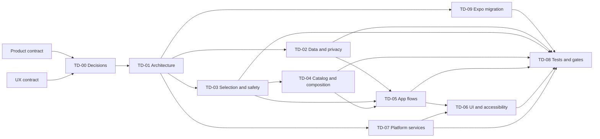

# Kineo Technical Design Index

| Field | Value |
| --- | --- |
| Technical-design version | 0.1 |
| Status | Approved prototype contract; Expo E6 cutover pending |
| Platform | Expo/React Native iPhone app; Swift retained for final qualification |
| Minimum deployment target | iOS 17.0 |
| Product source | `../KINEO_PRODUCT_DESIGN.md` |
| UX source | `../KINEO_UX_DESIGN_SPEC.md` |
| Last updated | August 28, 2026 |

## 1. Purpose and authority

This set translates the product and UX contracts into implementation specifications. It does not authorize coding or public release.

If two documents appear to disagree, use this order:

1. Product boundaries, safety rules, privacy promises, and acceptance scenarios.
2. The resolved technical decisions and invariants in this index.
3. The owning technical design for the subsystem.
4. The UX specification for presentation and interaction details.

Do not guess through a conflict involving safety, privacy, persistence, or deterministic output. Reconcile the documents first.

### Design map

Arrows show decision dependency, not runtime calls.

## 2. Document map

| Document | Owns | Does not own |
| --- | --- | --- |
| `01_APP_ARCHITECTURE.md` | Module boundaries, dependencies, concurrency, configuration, error handling | Selection rules or content meaning |
| `02_DOMAIN_DATA_PRIVACY.md` | Domain records, persistence, migrations, deletion, protection, aggregation | Screen layout |
| `03_SELECTION_SAFETY_ENGINE.md` | Check-in validation, Attention Required, level selection, Active eligibility, overrides, explanations | Movement authoring |
| `04_ROUTINE_CATALOG_COMPOSITION.md` | Catalog schema, validation, composition, duration bounds, alternatives, installed assets | User-state persistence |
| `05_APP_FLOW_STATE_MACHINES.md` | Onboarding, check-in, plan, guided session, feedback, and destructive-flow states | Visual styling |
| `06_UI_ARCHITECTURE_ACCESSIBILITY.md` | Presentation and accessibility behavior; SwiftUI details are historical reference | Domain decisions |
| `07_PLATFORM_SERVICES.md` | Notifications, HealthKit boundary, media, app lifecycle, logging, feature flags | Selection or content policy |
| `08_TESTING_RELEASE_GATES.md` | Test layers, traceability, fixtures, privacy checks, prototype and release gates | Production content approval itself |
| `09_EXPO_MIGRATION.md` | Platform migration order, parity seams, cutover conditions | Product behavior or release approval |

## 3. Non-negotiable system invariants

- The app is useful without an account, network connection, HealthKit, analytics, or notification permission.
- A routine is selected only from validated, bundled, versioned content. The app never invents or generatively modifies a movement.
- The selection engine is deterministic for the same current inputs, history, rules version, and catalog version.
- HealthKit, reminder settings, time available, telemetry state, and device activity never affect routine level or composition.
- A `Yes` or `Not sure` conditional-safety answer creates an area-specific Attention record that blocks every new Kineo routine while unresolved. Isolation between adjacent neck and back movements is not assumed.
- A safety block cannot be bypassed by an override, duration choice, catalog fallback, secondary omission, or changing selected areas. The documented return or correction flow is required.
- Quick and Standard are separately authored variants. Quick is never a runtime truncation of Standard.
- Active eligibility is stored and calculated independently for each body area. History never transfers between areas.
- Sensitive product values remain on-device, use iOS Complete Protection, carry Apple's documented backup-exclusion marker, and never appear in logs, notifications, crash payloads, or network requests. Kineo does not claim absolute control over OS backup behavior.
- Data deletion is complete and testable; reset and delete are different operations only if the UI describes the difference precisely.
- Placeholder content can run only in an internal prototype configuration and makes no production or professional-review claim.

## 4. Resolved prototype decisions

These decisions remove implementation ambiguity while preserving explicit public-release gates.

| ID | Decision | Resolution | Reason |
| --- | --- | --- | --- |
| TD-001 | Region selection | Use accessible text choice cards for Neck, Upper or mid-back, and Lower back; no body map | Clear, localizable, and usable without anatomy-image interpretation |
| TD-002 | Trigger logging | Defer from version one | It is not needed for selection and would expand the two-prompt check-in and sensitive-data surface |
| TD-003 | Reset/breathing experience | Defer from version one | It is not part of the core decision loop and has no accepted content or placement |
| TD-004 | Placeholder catalog | Permit a small, schema-complete internal catalog marked `prototypeOnly`; prevent it from entering a distribution configuration | Enables end-to-end testing without representing placeholder movement guidance as approved content |
| TD-005 | Prototype durations | Use 5 minutes for Quick and 10 minutes for Standard as internal test targets, within the catalog's validated prototype ranges; these are not production claims | Provides deterministic timers and fixtures while keeping production duration a release gate |
| TD-006 | Composition | A primary template owns ordered replaceable slots; one approved secondary module may replace designated slots only when an ordered compatibility entry permits it | Keeps two-area routines bounded, reproducible, and duration-valid |
| TD-007 | HealthKit | Keep the service and UI seam disabled in the initial prototype; enable only after baseline and presentation rules are approved | Prevents unresolved context rules from delaying the core product or implying that health data selected a plan |
| TD-008 | Deployment target | iOS 17.0 | Supports a coherent modern SwiftUI and Apple-native persistence baseline without compatibility branches in the prototype |
| TD-009 | Persistence | Use SQLite through Swift Package Manager with GRDB `7.10.0` pinned by exact version behind repository protocols; record the resolved revision and completed MIT-license/dependency review. Maintain direct SQLite as the dependency-rejection fallback | Explicit constraints, transactions, migrations, sidecar handling, deletion, corruption behavior, and real-database tests matter more here than avoiding one local source dependency |
| TD-010 | Telemetry | No Kineo-controlled telemetry or third-party diagnostics in the initial prototype | Satisfies the strongest privacy state and avoids an unapproved data flow |
| TD-011 | Notifications | Local notifications only; request permission after the user enables a reminder and use generic lock-screen copy | Reminders do not need a server or sensitive notification text |
| TD-012 | Safety scope | Any unresolved Attention record blocks all new Kineo routines until return-to-usual or a fully submitted valid correction clears the named area | No reviewed evidence proves that movement for another supported neck/back area is isolated from the flagged area; preference changes or abandoned correction must not become bypasses |
| TD-013 | Time and calendar | Inject a clock and calendar into domain services; never use wall-clock globals in rules or tests | Makes daily boundaries, timer restoration, time zones, and DST deterministic |
| TD-014 | Version capture | Every decision and session captures rules, catalog, and content versions at creation | Preserves auditability after app or catalog updates |
| TD-015 | Remote configuration | None in version one; flags are local build configuration plus persisted rollout state only where specified | Core behavior must be stable offline and not change invisibly |
| TD-016 | Implementation platform | Migrate to Expo SDK 57 through tested vertical slices; keep the Swift app as the runnable reference until parity cutover | Preserves verified behavior while enabling a cross-platform implementation without a dual-runtime production app |

## 5. Remaining gates, not implementation ambiguities

The technical design intentionally does not invent professional, legal, or production-content approval. Before public distribution, the product still requires:

- qualified review of intended use, safety behavior, and all user-facing safety language;
- reviewed and licensed production movement content, alternatives, media, and compatibility entries;
- approved production meanings and durations for Gentle, Balanced, Active, Quick, and Standard;
- approval of the production Active-unlock threshold;
- physical-device accessibility validation and accurate App Store declarations;
- storage, backup, deletion, and network inspection against the privacy promises;
- a separate approved HealthKit design before that feature is enabled;
- a separate data-flow review before any telemetry or third-party SDK is added.

Before any prototype is used with someone outside the product team, its safety acknowledgment, conditional branch, Attention guidance, and routine safety-control guidance require professionally reviewed interim wording. Without that wording, participants may receive only isolated, non-functional mockups that cannot accept check-ins, enter safety branches, or start routines.

These gates can block distribution even when the application functions correctly.

## 6. Recommended implementation sequence

The ordered execution milestones, learning cadence, and completion rules are maintained in `../KINEO_IMPLEMENTATION_MILESTONES.md`. The sequence below summarizes technical dependency order.

1. Create domain value types, clocks, repositories, and versioned persistence with deletion tests.
2. Implement the pure selection and safety engine using fixed fixtures and exhaustive decision-table tests.
3. Implement catalog decoding, validation, composition, asset verification, and prototype-only build enforcement.
4. Build onboarding and the single-area Today flow through saved feedback.
5. Complete single-area Attention correction, guided-session restoration, pause, skip, alternative, stop, and safety-control behavior.
6. Add two-area check-in, global unresolved-Attention gating, composition, per-area feedback, and disclosed primary-only catalog fallback.
7. Add Progress and Profile using on-device queries and aggregates.
8. Add local reminders, then run accessibility, privacy, offline, lifecycle, and destructive-flow gates.
9. Keep HealthKit and telemetry disabled until their separate prerequisites are approved.

Each step must leave a testable vertical slice. UI work must call domain use cases rather than reproduce decision rules.

Single-area safety and recovery precede two-area expansion so those paths are proven before coordinated state is added.

## 7. Definition of ready for implementation

This TD set is ready for implementation review when:

- every product acceptance scenario maps to an automated or manual test in `08_TESTING_RELEASE_GATES.md`;
- no safety rule differs between the product, UX, engine, and flow documents;
- domain records and catalog objects have stable identities, versions, lifecycle rules, and deletion behavior;
- every state transition identifies its input, persisted effect, recovery behavior, and user-visible result;
- platform permissions are optional and denied/restricted states preserve the core flow;
- placeholder content and internal-only flags cannot be confused with public-release approval.

“Ready for implementation review” is documentation status only. Coding begins only after explicit product-owner approval.
