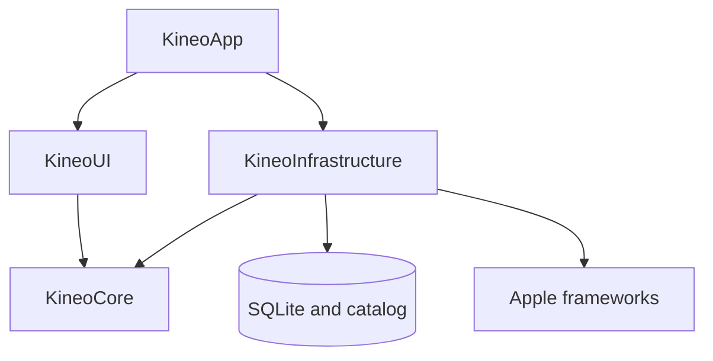

# Kineo v1 — Application Architecture

| Field | Value |
| --- | --- |
| Status | Verified Swift reference architecture; Expo target architecture is owned by TD-09 |
| Scope | Swift reference implementation during Expo migration |
| Sources | `../KINEO_PRODUCT_DESIGN.md`, `../KINEO_UX_DESIGN_SPEC.md` |
| Last reviewed | August 9, 2026 |

This document defines the verified Swift reference architecture. TD-09 overrides its platform-specific choices for migrated slices; product behavior remains governed by the source documents and TD-00.

## 1. Goals and constraints

The architecture must enforce:

- deterministic output for the same versioned inputs;
- Core-owned safety gates that navigation cannot bypass;
- local, network-free core operation with no HealthKit selection input;
- one-way dependencies from UI and adapters into Core contracts;
- recoverable sessions without false completion;
- build rejection of placeholder public content;
- accessibility within each feature contract.

Version one has no account, server, sync, remote configuration, generative content, camera analysis, or exercise marketplace.

## 2. Decisions

### 2.1 Platform baseline

| Decision | Prototype choice | Reason |
| --- | --- | --- |
| Platform | iPhone only | Matches the approved product boundary. iPad may run in compatibility mode but is not a designed target. |
| Minimum deployment | iOS 17.0 | Supports modern SwiftUI navigation, Observation, and current accessibility APIs while retaining a deliberate compatibility floor. |
| UI | SwiftUI | Matches the UX contract and enables Dynamic Type, semantic colors, and assistive-technology behavior. |
| Language/toolchain | Swift 6.1 or later in Swift 6 language mode, Xcode 16.3 or later, with strict concurrency checking | Meets the pinned persistence package floor and makes isolation violations visible during development. |
| Project structure | Thin Xcode application target plus local Swift package modules | Enforces dependency direction without creating separate repositories. |
| Persistence | SQLite through Swift Package Manager with GRDB `7.10.0` using an exact-version requirement | Provides explicit schemas, transactions, migrations, and testable queries. It is a local source library, not a remote service or diagnostics SDK. |
| Content | Versioned JSON manifest with explicit review evidence and bundled media in the application bundle | Guarantees offline availability and reproducible composition without implying a cryptographic signature. |
| Networking | No general network client in the prototype | Prevents accidental transmission and is unnecessary for the core product. |
| Telemetry | Disabled; no telemetry dependency or endpoint | Safest implementation of the unresolved telemetry decision. Add only through a separate approved design. |
| HealthKit context | Feature flag off in the prototype | Baseline window and display rules are unresolved. The selection core has no HealthKit dependency regardless. |

Revalidate the deployment target before public release against device coverage, accessibility testing, App Store requirements, and production content dependencies.

GRDB is chosen for explicit migrations, relationships, file handling, and deletion. Pin `7.10.0`, commit the resolved revision, and review its license and dependency graph. A version change requires design review. If third-party source is rejected, use direct SQLite behind the same ports; do not switch to SwiftData implicitly.

## 3. Module map

The application uses four production modules with matching test targets. Arrows show compile-time dependencies.



`KineoCore` has no dependency on UI, persistence, HealthKit, notifications, media, networking, or concrete catalog storage.

### `KineoCore`

Contains:

- Domain value types and invariants.
- Pure selection, eligibility, safety, and composition policies.
- Application use cases and port protocols.
- Stable error types and explanation reason codes.

It may depend only on the Swift standard library and Foundation value types required for dates, durations, identifiers, and localization keys. It must not import SwiftUI, GRDB, HealthKit, UserNotifications, AVKit, or a network framework.

### `KineoInfrastructure`

Contains adapters for:

- SQLite persistence and migrations.
- Bundled catalog loading and validation.
- Protected-file and backup-exclusion enforcement.
- Local notifications.
- Media asset lookup and playback preparation.
- Clock, UUID, and calendar implementations.
- HealthKit context only after its feature design is approved.

Infrastructure implements ports declared by `KineoCore`; Core never references adapter types.

### `KineoUI`

Contains:

- Design tokens and reusable SwiftUI components.
- Today, onboarding, routine, feedback, Progress, Profile, and system-state features.
- Feature state models that invoke application use cases.
- Accessibility labels, focus, announcements, Dynamic Type layout, and Reduce Motion handling.

UI may import `KineoCore`. It must not import GRDB or issue database queries. Direct platform UI APIs are acceptable only for presentation concerns; permissions and durable side effects go through Core ports.

### `KineoApp`

Contains only:

- Application entry point and scene lifecycle.
- Dependency construction.
- Build configuration and prototype/public capability gates.
- Root navigation restoration.

No product decision is implemented here.

## 4. Internal feature organization

Within `KineoUI`, organize by user flow rather than by generic technical type:

```text
Features/
  Onboarding/
  Today/
  Routine/
  Feedback/
  Progress/
  Profile/
  Safety/
DesignSystem/
Navigation/
```

Each feature owns its views, presentation state, and accessibility behavior. Cross-feature product operations live as Core use cases, not copied helpers. Shared visual elements become design-system components only after at least two real uses.

## 5. Dependency contracts

Core defines narrow `Sendable` ports. Required capabilities are:

- `PreferencesRepository`: onboarding, areas, routine preferences, reminder configuration, and consent choices.
- `HistoryRepository`: check-ins, immutable decisions, routine checkpoints, movement events, and feedback.
- `SafetyStateRepository`: read and transition area-specific Attention Required state.
- `CatalogRepository`: return one validated immutable catalog snapshot.
- `RoutineSelectionService`: pure deterministic decision from explicit inputs.
- `RoutineCompositionService`: pure bounded composition from a decision and catalog snapshot.
- `NotificationScheduler`: local reminder authorization status and schedules.
- `ProtectedDataStatus`: report whether protected storage is currently available.
- `Clock`, `CalendarProvider`, and `IdentifierGenerator`: injected sources for deterministic tests.

Cross-record writes use transaction-owning command ports declared by Core: complete a check-in and apply Attention transitions; append a decision only after the in-transaction global Attention check; create a prepared session; append a routine event with its checkpoint; finalize a routine; submit feedback; and reset history. One SQLite store implements these commands. Core never receives a database handle or transaction closure.

Repositories return domain values, never database rows. Read repositories may remain separate; no use case composes writes across independent repository instances and calls that result atomic.

## 6. State ownership and concurrency

### 6.1 Ownership

- SwiftUI feature models and navigation state are `@MainActor`.
- The SQLite adapter is a single injected `actor`-isolated store. GRDB may manage its own read pool internally, but writes enter through one repository boundary.
- Selection and composition are immutable, pure, and `Sendable`; they may execute off the main actor.
- The active routine coordinator is `@MainActor` because it drives visible timer and control state. Durable checkpoints are written asynchronously through the history port.
- Platform services that hold mutable state, including notifications and any future HealthKit adapter, use their own actor isolation.
- No global mutable singleton is permitted. The composition root owns one dependency container for a scene.

### 6.2 Structured concurrency rules

- View lifecycle tasks may be cancelled at any time; cancellation must not equal completion or deletion.
- Every long-running operation checks cancellation and maps it to a neutral UI state.
- Detached tasks are prohibited unless a design review records why structured parentage is impossible.
- Repository operations are `async throws`; callers handle typed domain failures rather than matching database error strings.
- UI changes occur on `MainActor`; database and media preparation must not block it.
- Time-based routine state is derived from an injected monotonic-capable clock and stored timestamps, never from decrementing a counter as the source of truth.

### 6.3 Transaction boundaries

The following database operations are atomic:

1. Complete check-in + transition any conditional safety state + save its immutable entries.
2. Append a deterministic selection/composition decision revision before presenting or updating its plan; duration or gentler-level changes append revisions rather than mutating one.
3. On Start, save the selected revision’s composed routine snapshot + create its `prepared` routine session.
4. After local assets prepare, transition `prepared` to `inProgress` + append its initial `started` event.
5. Record a routine control event + update its checkpoint.
6. Finalize routine status + terminal event.
7. Save all feedback submitted together on one screen; feedback remains optional and occurs after finalization.
8. Reset history, removing history and transition audits while retaining profile/preferences and only a currently active Attention state.

Each operation either commits its entire database change or leaves the previous durable state intact. Delete All spans SQLite, files, and platform schedules, so it is an idempotent verified erasure workflow rather than one transaction; TD-02 owns its recovery contract.

## 7. Application state machines

Navigation reflects durable domain state; it does not define it.

### 7.1 Root routing

```text
launch
  ├─ protected data unavailable → protected-data holding screen
  ├─ deletion marker present    → resume verified erasure
  ├─ onboarding incomplete      → onboarding
  ├─ recoverable active session → resume/end decision
  └─ otherwise                  → Today
```

The selected tab may be ephemeral. Onboarding completion, Attention Required, check-ins, decisions, and routine sessions are durable.

### 7.2 Routine lifecycle

```text
prepared → inProgress ↔ paused → completed
                       ├───────→ stopped
                       └───────→ safetyStopped

prepared/inProgress/paused → abandoned
```

Terminal states never transition back to active. `completed` requires all authored steps to meet their completion rule; skipped steps are recorded and may still allow routine completion only when catalog policy explicitly permits them. Feedback is optional and stored independently of the terminal status.

On relaunch, `prepared` retries local asset preparation or offers End; `inProgress` or `paused` offers Resume or End. No nonterminal state is auto-completed. If the referenced bundled content is missing or incompatible, mark the session `abandoned` with a recovery reason and keep its audit record.

### 7.3 Global routine safety gate

Before a plan is composed, Core reads every unresolved Attention record, including records for areas not in the current preference set. If any exists, no new Kineo routine is returned. The UI cannot bypass the gate by omitting a secondary area or changing selected areas. This conservative rule remains until qualified review establishes that movement for another supported neck/back region is isolated from the flagged region.

The user may:

- answer that the area returned to its usual recurring pattern;
- correct “Selected by mistake” and repeat the relevant check-in; or
- end without a routine.

The safety gate is enforced in the Core use case and composition service, even if a deep link or restored UI attempts to open a plan directly.

## 8. Error and recovery model

Use stable failure categories with recoverability, not raw error messages:

| Failure | Required behavior |
| --- | --- |
| Protected files unavailable while device is locked | Do not create an empty database. Hold or pause the UI, explain that data becomes available after unlock, and retry on protected-data notification. If a final write was prevented, recover only the last committed routine checkpoint and infer nothing after it. |
| Catalog missing, invalid, placeholder in public build, or incompatible | Produce Content Unavailable. Never improvise or substitute unrelated content. |
| Database write failure | Preserve the last committed state, stop forward navigation, and offer Retry. Do not show a plan that lacks its saved decision or start a routine that lacks its saved snapshot/session. |
| Database corruption or future schema | Do not silently recreate. Preserve the file, show a local-data recovery screen, and offer user-confirmed deletion. |
| Routine asset missing | Move a prepared session to abandoned and prevent guidance from starting. If already active after an update anomaly, retain the session and offer End. |
| Notification permission denied | Keep reminders off and link to system settings; core use is unchanged. |
| HealthKit unavailable or yields no observable context | Hide context or show a neutral no-context state; never claim read denial, and keep selection output identical. |
| No connectivity | Core UI remains fully functional. The prototype should not present a blocking network error because it has no required network call. |
| Application termination during a session | Restore the latest checkpoint and offer Resume or End; never infer elapsed repetitions or completion. |

Errors shown to users are plain-language and non-clinical. Diagnostic logs must use category codes and must not interpolate body area, answers, routine identifiers, feedback, or free text.

## 9. Build and capability gates

Use separate build configurations with compile-time enforcement:

- `DebugPrototype`: may load a visibly marked placeholder catalog.
- `InternalPrototype`: placeholder catalog allowed; no telemetry or HealthKit context.
- `Release`: build fails unless the catalog declares production review, contains no placeholder item, passes completeness/compatibility validation, and uses approved safety copy identifiers.

Capabilities are deny-by-default:

- No general network client in prototype modules.
- No HealthKit entitlement until its separate implementation decision is approved.
- Notification entitlement/use is local-only and optional.
- No iCloud or CloudKit container.
- No background modes unless a later approved feature requires one.

A feature flag may remove unfinished presentation, but it must not switch safety, privacy, selection, eligibility, or catalog-validation rules at runtime. Those changes require versioned configuration and tests.

## 10. Observability without sensitive data

For prototype debugging:

- Use Apple unified logging with privacy redaction and fixed event/category names.
- Never log domain object descriptions, database rows, user-entered values, generated explanation text, file paths containing identifiers, or HealthKit values.
- Disable verbose SQL tracing outside local developer builds.
- Keep logs useful through operation IDs created in memory and discarded at process end; do not persist or transmit them.

Remote crash reporting and product telemetry are outside prototype scope. Adding either requires an approved data-flow design, vendor review, opt-in behavior where applicable, network inspection tests, and updates to both technical documents.

## 11. Testing architecture

### Core tests

- Exhaustive selection matrix for every change × comfort × eligibility combination.
- Whole-session Attention Required gate for primary and secondary areas.
- Area-isolated history and Active qualification/reset.
- Quick/Standard independence from selected level.
- Catalog compatibility and fallback behavior.
- Fixed clock, UUID, rules version, and catalog fixtures for reproducibility.

### Persistence contract tests

Run the same repository suite against a temporary real SQLite database:

- atomic commits and rollback;
- relationships and uniqueness constraints;
- launch recovery from every nonterminal routine state;
- migration from every supported schema version;
- reset and full deletion scopes;
- protected-file and backup-exclusion attributes.

### UI and integration tests

- Launch routing for first use, returning use, Attention Required, locked data, and interrupted session.
- No UI route can obtain a plan when the Core safety gate denies one.
- Airplane-mode completion of onboarding, check-in, plan, routine, feedback, Progress, and settings.
- VoiceOver, Voice Control, Dynamic Type, Differentiate Without Color, Increase Contrast, Reduce Motion, light, and dark scenarios required by the UX contract.
- Release fixture rejects placeholder or incomplete content.

## 12. Architecture acceptance criteria

Architecture is correctly implemented when all statements below are proven:

1. A dependency scan shows `KineoCore` imports no UI, persistence, platform health, notification, media, or networking framework.
2. UI code has no direct database access and contains no selection or eligibility mapping.
3. The same frozen input fixture returns byte-for-byte equivalent decision reason codes and catalog identifiers across repeated runs.
4. Any unresolved Attention Required area causes every new routine request to return no routine, including after area-preference changes.
5. A deep link, stale navigation path, or restored plan cannot bypass the Core safety or catalog gates.
6. Airplane mode does not change any core result or disable a core task.
7. Killing the app from every routine state never creates a false completion.
8. A persistence failure cannot leave a visible plan without its saved decision or start a routine without its saved snapshot/session.
9. Protected-data unavailability never causes an empty replacement database.
10. Prototype targets contain no telemetry SDK, network client, HealthKit entitlement, cloud container, or background mode.
11. A release build fails when placeholder, unreviewed, incompatible, or incomplete content is present.
12. Accessibility test evidence covers each common task on physical supported iPhones before public release.

## 13. Safety scope

Any unresolved area-specific Attention row blocks all new routines. `E3 Secondary omitted` is catalog-only and cannot bypass safety.

## 14. Public-release gates and deferred decisions

These do not block architecture or an internal prototype, but they block the stated release:

- Revalidate minimum iOS target against current supported-device evidence.
- Pin and approve the persistence dependency and supply-chain process.
- Complete qualified regulatory assessment of implemented behavior and claims.
- Replace prototype catalog and safety copy with licensed, professionally reviewed production material.
- Approve production duration, Active threshold, compatibility matrix, and demonstration format.
- Decide whether HealthKit context ships; if yes, specify baseline behavior and complete privacy/accessibility review.
- Decide whether any telemetry or crash vendor ships; if yes, approve its separate threat and data-flow design.
- Complete physical-device accessibility, protected-storage, backup, deletion, and network inspections.
- Produce App Store privacy, accessibility, and support materials from verified runtime behavior.

Dependency reference: [GRDB official releases](https://github.com/groue/GRDB.swift/releases).

## 15. Implementation references

- [Apple: Managing model data in a SwiftUI app](https://developer.apple.com/documentation/SwiftUI/Managing-model-data-in-your-app) — Observation availability begins with iOS 17.
- [Swift: Concurrency](https://docs.swift.org/swift-book/documentation/the-swift-programming-language/concurrency/) — structured concurrency and actor-isolation language contract.
- [GRDB.swift official repository and documentation](https://github.com/groue/GRDB.swift) — package installation, SQLite access, transactions, migrations, concurrency, and data-protection guidance.
