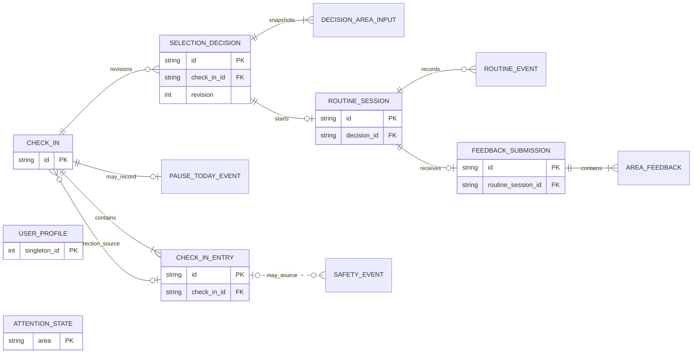

# Kineo v1 — Domain, Data, and Privacy Design

| Field | Value |
| --- | --- |
| Status | Approved prototype contract — implementation through M2 complete August 9, 2026; M3 not authorized |
| Scope | Domain model, local persistence, data lifecycle, and privacy enforcement |
| Sources | `../KINEO_PRODUCT_DESIGN.md`, `../KINEO_UX_DESIGN_SPEC.md`, `01_APP_ARCHITECTURE.md` |
| Last reviewed | August 9, 2026 |

This document defines the source of truth for Kineo’s local state. It specifies no server, account, synchronization, research export, or telemetry implementation.

## 1. Prototype decisions

1. **Durable store:** one migrated SQLite database through GRDB.
2. **Local-first:** core flows never require or check a network.
3. **No prototype telemetry:** no SDK, endpoint, queue, identifier, or event transmission.
4. **No prototype HealthKit data:** store no derived value or speculative health field.
5. **Immutable catalog input:** user records capture versions and resolved snapshots but never edit catalog content.
6. **Global Attention gate:** any unresolved area row blocks every new routine; primary-only fallback is catalog-only.
7. **Protected files:** use Complete Protection and Apple's backup-exclusion resource value; verify both without claiming control over OS backup behavior.
8. **No alternate sensitive storage:** exclude `UserDefaults`, logs, filenames, notifications, Spotlight, widgets, and shared app groups.

## 2. Domain language

Use these exact concepts across Core, persistence, tests, and UI adapters.

| Concept | Allowed values / meaning |
| --- | --- |
| `BodyArea` | `neck`, `upperMidBack`, `lowerBack` |
| `AreaRole` | `primary`, `secondary` |
| `ChangeReport` | `better`, `similar`, `worse` |
| `MovementComfort` | `limited`, `okay`, `good` |
| `ConditionalSafetyAnswer` | `no`, `yes`, `notSure`; exists only for Worse or Limited |
| `SafetyStatus` | `normal`, `attentionRequired` |
| `RoutineLevel` | ordered `gentle < balanced < active` only for conservatism comparisons |
| `DurationVariant` | `quick`, `standard`; never interpreted as a level or health signal |
| `RoutineStatus` | `prepared`, `inProgress`, `paused`, `completed`, `stopped`, `safetyStopped`, `abandoned` |
| `AreaResponse` | `better`, `same`, `worse`; absence means skipped/unanswered |
| `OmissionReason` | `secondaryUnanswered`, `catalogIncompatible`, `contentUnavailable`; never a safety reason |
| `ReviewStatus` | Catalog-owned values defined by TD-04: `prototypePlaceholder`, `draft`, `professionallyReviewed`, `approvedForRelease`, `retired` |

Enum raw values are stable storage/API identifiers, not localized display copy. Renaming user-facing text must not migrate history.

## 3. Aggregate boundaries

### `UserProfile`

Owns age-eligibility acknowledgment, versioned safety-boundary acknowledgment, onboarding completion, selected primary area, optional distinct secondary area, routine preference if content needs one, weekly consistency goal, reminder settings, and any future telemetry choice. It contains no birth date, name, email, account ID, advertising ID, or device fingerprint.

Invariants:

- Age acknowledgment is a Boolean declaration that the user is 18 or older; no age or date of birth is collected.
- Completed onboarding records which safety-boundary copy version was acknowledged and when; changing that copy for public release may require a new acknowledgment decision.
- Primary is required after onboarding.
- Secondary is optional and must differ from primary.
- At most two areas are active.
- Changing selected areas does not move, merge, or delete their histories.
- Weekly consistency goal is an integer from one through seven; the prototype default is three and it never changes selection or eligibility.

### `CheckIn`

Represents one attempt to obtain a plan. It owns one required primary entry and zero or one secondary entry. Each area entry owns a change report, movement comfort, and conditional safety answer when required.

Invariants:

- A completed check-in has exactly one current entry for the primary area.
- An unanswered secondary is omitted for that session; it is not assigned a default.
- `worse` or `limited` requires a conditional answer before completion.
- Any `yes` or `notSure` enters Attention Required for that area and makes the entire check-in ineligible for a plan.
- `no` is not a safety certification; it merely continues the product mapping.
- A new routine attempt, including another on the same day, requires a new check-in identifier.
- A check-in purpose is either `normal` or `attentionCorrection`. A correction identifies its target area and links the triggering entry while that history still exists; it never changes a frozen record.
- If the correction target is no longer selected in the current profile, the correction may only clear or reaffirm Attention. It cannot produce a plan; clearing routes to a new normal check-in for current preferences.

### `SafetyState`

Owns a minimal current Attention Required record per affected body area and an append-only transition history. Keeping current state separate allows Reset History to remove old event history without turning reset into a safety bypass.

Events:

- `attentionEntered`: conditional answer was `yes` or `notSure`.
- `attentionClearedReturnedToUsual`: user later answered Yes to return-to-usual.
- `attentionClearedCorrection`: user selected “Selected by mistake” and submitted a corrected entry.
- `attentionReaffirmed`: user answered No or Not sure to return-to-usual.
- `attentionReaffirmedCorrection`: a submitted correction still answered `yes` or `notSure` to a required conditional question.

Entering Attention atomically upserts current state and appends an event. Clearing Attention atomically removes current state and appends the relevant clear event. An Attention Required state cannot be cleared by changing preferences, omitting the area, resetting ordinary history, reinstall-free relaunch, or catalog/rules update. Full deletion necessarily removes it along with every other local value and returns the app to first use.

Every clear or reaffirm command carries the `updatedAt` value of the Attention state it read. Its event time must be strictly newer. The store compares the prior value inside the write transaction and rejects stale or same-version commands, preventing delayed UI work from clearing or regressing a newer Attention state.

### `SelectionDecision`

An immutable, revisioned audit record created after a completed eligible check-in. It stores explicit inputs, rules/catalog versions, area-level results, recommended and user-selected levels, requested duration, catalog-delivered level/content, override disposition, omissions, and up to two explanation reason codes. The initial plan revision uses Standard as the visible prototype default. Changing duration or choosing a permitted gentler level appends a new decision revision linked to the same frozen check-in; it never mutates a prior revision.

Invariants:

- No decision exists for a check-in blocked by Attention Required.
- HealthKit, available time, reminders, consistency, and telemetry never appear as inputs.
- The recommended level is the most conservative included area result.
- The user-selected level equals the recommendation unless a permitted gentler override is requested.
- `selected` requires an exact or approved fallback composition for that revision’s duration. A catalog fallback may make the delivered level gentler than the selected level.
- `contentUnavailable` has no delivered level/content and routes to E2; it never invents or silently substitutes content.
- Active eligibility is derived independently for each area.
- Explanation text is rendered from versioned reason codes; arbitrary prose is not stored as selector output.

### `RoutineSession`

Owns the resolved content snapshot, lifecycle, current checkpoint, and movement-control events. It references exactly one successful selection-decision revision, which is authoritative for chosen duration, override, and delivered level.

Invariants:

- A session uses only content in its frozen validated snapshot.
- Its snapshot `includedAreas` exactly matches the included inputs of its referenced decision.
- Quick is separately authored; it is never a truncated Standard session.
- A terminal session cannot resume.
- Completion is explicit; elapsed wall-clock time alone never completes a routine.
- Stopped, safety-stopped, abandoned, and paused sessions never qualify for Active unlock.
- Movement alternative and skip events retain their originating module and step identifiers.

### `AreaFeedback`

Stores at most one optional response for each body area actually included in a routine session.

Invariants:

- Feedback is optional and never changes routine completion status.
- A response cannot be stored for an omitted area.
- A Worse response immediately resets that area’s Active qualifying sequence when eligibility is next derived.
- Feedback after an incomplete routine may become the area’s most recent recorded response, but the session never qualifies toward Active.

### Derived projections

Active eligibility, latest recorded response, consistency days, Progress summaries, and distributions are computed from authoritative records. They are not separately mutable sources of truth. Cache them only if measurement proves a need; every cache must be discardable and reproducible.

For the prototype, Active unlock is derived as follows for a single area:

1. Read that area’s eligible sessions and feedback in chronological order.
2. On any `worse` feedback, reset the consecutive qualifying count to zero.
3. Increment only for a `completed` Gentle or Balanced session with `better` or `same` feedback for that area.
4. A missing response does not increment or reset the count. A non-completed session never increments it; explicit Worse feedback on that session still resets it under step 2.
5. Active is unlocked at two qualifying completions after the latest reset.

This threshold is configuration versioned with the selection rules and remains a public-release review gate.

## 4. Logical relationships

The diagram shows the audit spine, not every child table. `AttentionState` is keyed independently by body area so preferences and Reset History cannot clear it. Catalog records are installed read-only content, not user tables; a session stores the resolved content snapshot.

## 5. SQLite schema contract

The names below are normative enough to remove implementation ambiguity. A migration may adjust physical details without changing the domain contract.

All timestamps are signed 64-bit Unix milliseconds in UTC. Each event that contributes to a calendar-day view also stores `local_day` (`YYYY-MM-DD`), `time_zone_id`, and `calendar_id` captured at the time; later travel must not move past consistency days. UUIDs use lower-case canonical text. Booleans are constrained integers `0` or `1`.

### Metadata and profile

#### `schema_migrations`

| Column | Constraint |
| --- | --- |
| `version` | integer primary key, monotonically increasing |
| `name` | nonempty text |
| `checksum` | nonempty text tied to shipped migration |
| `applied_at_ms` | non-null integer |

SQLite `PRAGMA user_version` must equal the greatest committed migration version. The table detects an accidentally edited historical migration.

GRDB `DatabaseMigrator` is the transaction and ordering authority. Each registered migration owns a canonical, version-controlled manifest containing its ordered SQL and any explicit data-transform identifier; `checksum` is the SHA-256 of the exact UTF-8 manifest bytes. Its transaction also updates `PRAGMA user_version`. Launch preflight rejects a future version or checksum mismatch before pending work. GRDB's destructive schema-change erase option is never enabled.

#### `user_profile`

| Column | Constraint |
| --- | --- |
| `singleton_id` | integer primary key constrained to `1` |
| `onboarding_completed_at_ms` | nullable integer |
| `adult_acknowledged` | non-null Boolean, default `0` |
| `safety_boundary_version` | nullable nonempty text; required when onboarding is complete |
| `safety_acknowledged_at_ms` | nullable integer; required when onboarding is complete |
| `primary_area` | nullable `BodyArea`; required when onboarding is complete |
| `secondary_area` | nullable `BodyArea`, must differ from primary |
| `routine_preference` | nullable stable catalog preference identifier |
| `weekly_goal_days` | non-null integer `1...7`, prototype default `3` |
| `telemetry_choice` | `notOffered`, `declined`, or `optedIn`; prototype remains `notOffered` and has no transmitter |
| `created_at_ms` | non-null integer |
| `updated_at_ms` | non-null integer |

#### `reminder_settings`

| Column | Constraint |
| --- | --- |
| `singleton_id` | primary/foreign key to profile `1`, cascade delete |
| `enabled` | non-null Boolean |
| `window_start_minutes` | nullable integer `0...1439`; required when enabled |
| `window_end_minutes` | nullable integer `1...1440`; greater than start; required when enabled |
| `time_zone_id` | nullable text; last zone used for scheduling |
| `updated_at_ms` | non-null integer |

The system authorization status is queried live and is not duplicated as authoritative app data.

### Check-in and safety

#### `check_ins`

| Column | Constraint |
| --- | --- |
| `id` | text primary key UUID |
| `status` | `draft`, `completed`, or `abandoned` |
| `purpose` | `normal` or `attentionCorrection` |
| `primary_area` | non-null `BodyArea` snapshot |
| `secondary_area` | nullable distinct `BodyArea` snapshot |
| `correction_area` | nullable `BodyArea`; required only for `attentionCorrection` |
| `source_triggering_entry_id` | nullable foreign key to `check_in_entries` with `ON DELETE SET NULL`; present for `attentionCorrection` when Reset History has not removed the triggering entry |
| `started_at_ms` | non-null integer |
| `completed_at_ms` | nullable; required only for completed |
| `local_day` | non-null text |
| `time_zone_id` | non-null text |
| `calendar_id` | non-null text |

#### `check_in_entries`

| Column | Constraint |
| --- | --- |
| `id` | text primary key UUID |
| `check_in_id` | non-null foreign key, cascade delete |
| `area` | non-null `BodyArea` contained in parent check-in |
| `role` | non-null `AreaRole`, consistent with parent snapshot |
| `change_report` | non-null `ChangeReport` |
| `movement_comfort` | non-null `MovementComfort` |
| `conditional_safety_answer` | nullable `ConditionalSafetyAnswer`; required exactly when change is Worse or comfort is Limited |
| `submitted_at_ms` | non-null integer |

For `normal`, both correction columns are null. For `attentionCorrection`, `correction_area` is required and the triggering-entry link is retained when available; Reset History may remove it while preserving the current Attention row. There is at most one entry per check-in and area. Draft entries may be edited until commit; all entries become immutable when the check-in completes. A later Attention correction preserves any retained blocked check-in, links a fresh correction check-in to its triggering entry, and appends a correction safety event rather than revising frozen history.

#### `safety_events`

| Column | Constraint |
| --- | --- |
| `id` | text primary key UUID |
| `area` | non-null `BodyArea`, indexed with time |
| `kind` | one of the five `SafetyState` transition events |
| `source_check_in_entry_id` | nullable foreign key with `ON DELETE SET NULL`; required for enter, correction-clear, and correction-reaffirmation events |
| `return_answer` | nullable `ConditionalSafetyAnswer`; `yes` for return-to-usual clearance and `no` or `notSure` for return reaffirmation; null for entry-sourced events |
| `occurred_at_ms` | non-null integer |
| `local_day`, `time_zone_id`, `calendar_id` | non-null event-day snapshot |

#### `attention_states`

| Column | Constraint |
| --- | --- |
| `area` | `BodyArea` primary key; row existence means Attention Required |
| `updated_at_ms` | non-null integer |

Absence means Normal. The state row and its transition event change in one transaction. Invalid transitions are rejected by the Core use case before either write.

#### `pause_today_events`

| Column | Constraint |
| --- | --- |
| `id` | text primary key UUID |
| `check_in_id` | non-null unique foreign key, cascade delete |
| `chosen_at_ms` | non-null integer |
| `local_day`, `time_zone_id`, `calendar_id` | non-null event-day snapshot |

Pause Today is allowed only after an otherwise eligible completed check-in containing at least one Worse or Limited report whose conditional answer is No. The already-audited selection decision may remain, but Pause Today creates no routine, does not change Active eligibility, and may count once toward that local calendar day’s consistency.

### Decision and routine history

#### `selection_decisions`

| Column | Constraint |
| --- | --- |
| `id` | text primary key UUID |
| `check_in_id` | non-null foreign key, restrict delete except history-reset transaction |
| `revision` | integer `>= 1`, unique with check-in |
| `rules_version` | nonempty text |
| `catalog_version_requested` | nonempty text |
| `catalog_version_delivered` | nullable text; required for selected outcome |
| `outcome` | `selected` or `contentUnavailable` |
| `recommended_level` | non-null `RoutineLevel` from check-in/history rules |
| `requested_override` | nullable `RoutineLevel` |
| `override_disposition` | `none`, `acceptedGentler`, `sameAsRecommended`, or `rejectedHigher` |
| `selected_level` | non-null `RoutineLevel`; never more active than recommended |
| `delivered_level` | nullable `RoutineLevel`; required for selected outcome, absent for unavailable, never more active than selected |
| `duration_variant` | non-null `DurationVariant` |
| `secondary_omission_reason` | nullable `OmissionReason`, never a safety value |
| `validation_result` | `exact`, `fallback`, or `unavailable`, consistent with outcome |
| `primary_template_id` | nullable text; required for selected outcome |
| `primary_template_revision` | nullable positive integer; required for selected outcome |
| `secondary_module_id` | nullable text; present only when secondary content is delivered |
| `secondary_module_revision` | nullable positive integer paired with module ID |
| `compatibility_rule_id` | nullable text; required when a secondary module is delivered |
| `composition_fingerprint` | nullable lower-case SHA-256 hex digest using TD-04's exact composition projection; required for selected outcome |
| `created_at_ms` | non-null integer |

#### `decision_area_inputs`

| Column | Constraint |
| --- | --- |
| `decision_id` | foreign key, cascade delete |
| `area` | `BodyArea`; composite primary key with decision |
| `role` | `AreaRole` |
| `check_in_entry_id` | non-null foreign key to the exact immutable entry |
| `base_level` | non-null `RoutineLevel` |
| `active_unlocked` | non-null Boolean snapshot |
| `qualifying_count` | non-null integer `>= 0` snapshot |
| `latest_response` | nullable `AreaResponse` snapshot |
| `included` | non-null Boolean; primary must be included |

Each decision contains exactly one input for every entry committed by its frozen check-in. A secondary omitted before answering is absent from both the check-in and decision; a checked secondary that cannot be composed remains an explicit `included = false` input with an omission reason.

If the current profile has a secondary area but the frozen check-in omits it, the decision must record `secondaryUnanswered` and the `notice.secondary_skipped` disclosure. Silent omission is invalid.

#### `decision_reasons`

| Column | Constraint |
| --- | --- |
| `decision_id` | foreign key, cascade delete |
| `kind` | `selection` or `presented`; part of composite primary key |
| `position` | integer `0` or `1`; part of composite primary key with decision and kind |
| `reason_code` | versioned, allow-listed text |
| `parameters_json` | canonical allow-listed parameter object; no display prose or free text |

`selection` reasons explain the rule result. `presented` reasons explain the delivered plan after catalog fallback. Each kind has at most two rows.

#### `decision_notices`

| Column | Constraint |
| --- | --- |
| `decision_id` | foreign key, cascade delete |
| `position` | integer `>= 0`; composite primary key with decision |
| `notice_code` | versioned, allow-listed text |
| `area` | nullable `BodyArea` |
| `parameters_json` | canonical allow-listed parameter object; no display prose or free text |

#### `routine_sessions`

| Column | Constraint |
| --- | --- |
| `id` | text primary key UUID |
| `decision_id` | non-null unique foreign key, restrict delete except history-reset transaction |
| `check_in_id` | non-null unique foreign key, must equal the referenced decision’s check-in |
| `status` | non-null `RoutineStatus` |
| `routine_snapshot_json` | non-null canonical JSON blob validated before insertion |
| `snapshot_checksum` | non-null lower-case SHA-256 hex digest of the exact UTF-8 canonical `routine_snapshot_json` bytes |
| `current_step_index` | non-null integer `>= 0` |
| `step_elapsed_ms` | non-null integer `>= 0` |
| `started_at_ms` | nullable integer |
| `updated_at_ms` | non-null integer |
| `ended_at_ms` | nullable; required for terminal status |
| `local_day`, `time_zone_id`, `calendar_id` | non-null session-day snapshot |

The snapshot contains catalog version, primary template ID, optional secondary module ID, included areas, delivered level, duration variant, ordered resolved steps, authored timing/repetition rules, alternative IDs, localized content keys/version, asset IDs, module origin, review status, and the composition fingerprint. It contains no user-authored text.

`routine_snapshot_json` uses the canonical serialization rules in TD-04: object keys are lexicographically ordered, sets are sorted, arrays retain semantic order, integers use base-10, and no insignificant whitespace is emitted. The checksum covers every stored snapshot field, including IDs and timestamps; the checksum itself is a separate column and is not part of the JSON input.

#### `routine_events`

| Column | Constraint |
| --- | --- |
| `id` | text primary key UUID |
| `routine_session_id` | non-null foreign key, cascade delete |
| `sequence_number` | integer `>= 1`, unique per session |
| `kind` | `started`, `paused`, `resumed`, `stepCompleted`, `skipped`, `alternativeSelected`, `stopped`, `safetyStopped`, `completed`, or `abandoned` |
| `step_id` | nullable stable ID; required for step/skip/alternative events |
| `module_id` | nullable stable ID; required when step ID is present |
| `alternative_id` | nullable; required only for alternative selection |
| `local_reason_code` | nullable allow-listed reason (`uncomfortable`, `unclear`, `notEnoughSpace`); never free text |
| `occurred_at_ms` | non-null integer |
| `resulting_status`, `resulting_step_index`, `resulting_step_elapsed_ms` | non-null resulting checkpoint used to verify idempotent retries |
| `resulting_updated_at_ms`, `resulting_ended_at_ms` | checkpoint timestamps; end time is nullable |

Event insert and mutable session checkpoint/status update occur in one transaction. The coordinator assigns the event UUID before the first write attempt and retains it with the command until a terminal result. Every retry of that logical event MUST reuse the same UUID; a new UUID represents a new event. The unique event UUID plus per-session sequence number makes retries idempotent.

#### `feedback_submissions`

| Column | Constraint |
| --- | --- |
| `id` | text primary key request UUID |
| `routine_session_id` | non-null unique foreign key, cascade delete |
| `submitted_at_ms` | non-null integer |
| `local_day`, `time_zone_id`, `calendar_id` | non-null submission-day snapshot, including skip-all submissions |

One screen submission owns all supplied area responses. Its request UUID is assigned before the first write and reused for every retry.

#### `area_feedback`

| Column | Constraint |
| --- | --- |
| `id` | text primary key UUID |
| `feedback_submission_id` | non-null foreign key, cascade delete |
| `area` | non-null `BodyArea` present in the routine snapshot |
| `response` | non-null `AreaResponse` |
| `submitted_at_ms` | non-null integer |
| `local_day`, `time_zone_id`, `calendar_id` | non-null event-day snapshot |

Unique constraint: one feedback row per submission and area. Because each session has at most one submission, this enforces one response per routine session and area. A skipped response creates no row.

### Required indexes

- `check_ins(local_day, completed_at_ms)` for Progress chronology.
- `check_in_entries(check_in_id, area)` unique for area lookup.
- `safety_events(area, occurred_at_ms DESC)` for transition history; current state is the indexed primary-key lookup in `attention_states`.
- `pause_today_events(local_day, chosen_at_ms)` for consistency history.
- `decision_area_inputs(area, decision_id)` for area-isolated decision history.
- `routine_sessions(local_day, ended_at_ms)` and `routine_sessions(status)` for Progress and recovery.
- A unique partial index over a constant expression where status is `prepared`, `inProgress`, or `paused`, enforcing at most one nonterminal routine globally.
- `area_feedback(area, submitted_at_ms)` for latest response and eligibility derivation.
- `feedback_submissions(routine_session_id)` unique for idempotent submission lookup.
- `routine_events(routine_session_id, sequence_number)` unique for replay/audit.

Foreign keys are enabled on every connection. Schema-level `CHECK`, foreign-key, and uniqueness constraints protect structural shapes. Transaction-owning Core command ports enforce cross-table membership and lifecycle rules; they are tested against the real store rather than duplicated in SQLite triggers.

## 6. Write workflows

### Complete check-in

1. Validate primary/current secondary shape and conditional answers.
2. Atomically apply any `attention_states` transition and append its safety event.
3. Mark the check-in and its entries immutable/completed.
4. Commit.
5. Read the complete current `attention_states` table. If any row exists, return the global blocked state and create no selection decision.

This workflow is the sole writer of Attention transitions produced by submitted check-in or correction answers. A blocked check-in never proceeds to plan creation. If the pure selector is exercised defensively or in isolation with such answers, any returned `SafetyTransition` values describe the already-derived transition and MUST NOT be written again by the plan coordinator.

If the user later chooses “Selected by mistake,” keep the current Attention row and create a correction draft linked to the triggering entry when retained. Never mutate or reuse the blocked check-in's answers. Clear that area's Attention row and append `attentionClearedCorrection` only in the same transaction that submits a structurally valid corrected entry: either the corrected entry has no conditional trigger, or it includes the required `No` answer. `Yes` or `Not sure` reaffirms Attention. Abandoning the correction draft leaves the gate intact. If the corrected area is no longer selected, the submitted correction cannot create a decision; after clearance, start a normal check-in from current preferences.

### Create plan and routine

1. Load one database snapshot containing exact current entries, per-area history, and safety status.
2. Load one validated immutable catalog snapshot.
3. For the initial revision, use Standard as the visible default and no override. Run pure selection with explicit rules version, then bounded composition with only approved fallbacks.
4. In one transaction, re-read the complete current `attention_states` table and verify that the check-in still accepts a revision. If any Attention row exists, append no decision and route to the authoritative Attention flow. Otherwise append the decision revision, exact area inputs, explanations/notices, and composition audit fields.
5. Show the plan only for `selected` after that revision commits; otherwise show E2.
6. If the user changes Quick/Standard or chooses a gentler level, repeat selection/composition over the same frozen check-in and append a new immutable revision. Keep prior revisions.
7. On Start, verify that the newest revision is still `selected`, its installed catalog/fingerprint validates, and no Attention state exists for any supported area.
8. In one transaction, insert the routine snapshot/session in `prepared`, referencing that newest revision.
9. Prepare and verify every required local asset. On success, atomically transition to `inProgress` and append `started`; on failure, transition to `abandoned` with a fixed local recovery event.
10. Start routine guidance only after the `inProgress` transaction commits.

### Choose Pause Today

Validate that the completed check-in is eligible for Pause Today, insert exactly one event for that check-in, and create no routine. Retrying the same check-in action returns the existing event. A later eligible check-in on the same local day may own its own audit event, but the Progress projection groups Pause Today participation by captured `local_day` and contributes at most one consistency day. Prior decision revisions remain audits of plans shown; a check-in cannot own both a Pause Today event and a routine session.

### Checkpoint routine

Record meaningful transitions, not timer ticks. Persist when starting, pausing, resuming, completing/skipping a step, selecting an alternative, stopping, safety-stopping, completing, and when the app enters background. Assign the command/event UUID before the transaction and reuse it across every retry. The wall clock plus saved step checkpoint reconstructs presentation; the app must not write every second.

### Submit feedback

After a routine is `completed`, `stopped`, or `safetyStopped`, insert one feedback-submission row and all supplied responses in one transaction. Abandoned preparation does not accept feedback. `submitted_at_ms` cannot precede the routine end. Missing areas create no placeholder response. Retrying the same request UUID returns the stored submission; a different request after feedback already exists for that session is rejected without changing it.

## 7. Storage protection

### Location

Store the database and any derived sensitive cache under a dedicated directory inside Application Support, for example conceptually `Application Support/KineoPrivate/`. Do not put them in Documents, shared app groups, iCloud ubiquity containers, or caches that the system may purge.

Catalog JSON and licensed offline media ship read-only in the application bundle. They contain no user data and may be backed up only as part of the installed app package.

### File attributes

For the private directory, database, SQLite WAL, SQLite shared-memory file, and any migration/recovery artifact:

- apply `NSFileProtectionComplete`;
- set Apple’s documented “excluded from backup” resource value;
- verify attributes after creation, database open, migration, and any save/rename/replacement operation that could reset a resource value;
- fail closed if attributes cannot be applied;
- never make an unprotected temporary migration copy.

Create and protect the directory before opening SQLite so newly created sidecars inherit protection. Recheck `database`, `database-wal`, and `database-shm`, because sidecar creation timing can vary. A runtime storage audit must enumerate only the exact app-owned private directory, not broad user paths.

Reapply protection before reading an existing store and again after migration or any write, including failed migration/preflight paths that preserve the file for recovery. If post-commit protection fails, close and poison that store instance; it rejects further access until a fresh open reapplies and verifies protection.

M2 app-hosted tests enumerate every created item and verify backup exclusion. The Complete Protection assertion runs on physical iOS; simulator explicitly skips it because it does not report `NSFileProtectionKey`. Locked-device and backup-content evidence remain later gates in TD-08.

Complete Protection means records become inaccessible when the device locks. The app must handle the protected-data-unavailable condition without treating it as missing data. In-memory routine state may continue only while the process remains alive; durable changes wait for unlock. If the lock prevents a final checkpoint write, recovery uses the last successfully committed checkpoint and never infers activity after it. If safe persistence cannot be guaranteed, pause the routine UI and explain how to resume after unlock.

When iOS announces that protected data will become unavailable, the active routine coordinator attempts one immediate checkpoint, then stops accepting progress-changing actions until storage is available again. Failure of that final attempt is recoverable only from the prior committed checkpoint.

### Other storage channels

- `UserDefaults`: non-sensitive presentation toggles only; preferably none in v1.
- Keychain: not required because there is no account, token, or encryption key managed by Kineo.
- Logs: allow-listed fixed category codes only, private/redacted by default.
- Notifications: neutral copy without area, report, routine level, or HealthKit detail.
- Pasteboard, Spotlight, widgets, Live Activities, Siri/App Intents, and file export: out of scope.
- Screenshots and OS-level screen recording are controlled by the user; UI should avoid unnecessary sensitive detail in app-switcher snapshots if later privacy review requires it.

## 8. Migrations and compatibility

- `DatabaseMigrator` applies ordered, forward-only definitions transactionally; each definition updates Kineo's migration metadata and `PRAGMA user_version` in the same migration.
- Never edit a released definition. Add a new one; verify each installed checksum against the shipped immutable definition before applying pending migrations.
- Test upgrade from every previously shipped schema fixture to current.
- Before a migration, confirm protected data availability and sufficient disk space.
- Schema migration must not reinterpret a stored enum silently. Map explicitly or preserve the old value/version.
- Rules and catalog updates do not rewrite historical decisions or snapshots.
- An application opening a database with a future schema version stops and presents a recovery state; it never downgrades or deletes.
- A failed migration rolls back and preserves the prior database.
- Internal developer builds may expose a clearly labeled fixture reset. Public builds have no automatic destructive recovery.

Kineo does not create or control a backup or restore path. It marks its sensitive container excluded from backup and tests representative device backups, but the operating system ultimately controls backup behavior. Users must therefore be told that local deletion, app deletion, device loss, or unrecoverable corruption may be permanent.

## 9. Reset, deletion, and permission behavior

### Reset Kineo history

User-confirmed Reset History atomically deletes:

- check-ins and their entries;
- Pause Today events;
- safety transition events;
- selection decisions, reasons, and area-input snapshots;
- routine sessions, snapshots, and events;
- feedback and every derived Progress/eligibility cache;
- pending telemetry aggregates if a future approved implementation exists.

It retains:

- onboarding/adult acknowledgment;
- current area and routine preferences;
- reminder settings and scheduled reminders;
- explicit data-use choice;
- only the minimum current Attention Required row for an affected area; cleared safety history is removed.

Retaining only current Attention Required state prevents an ordinary history reset from becoming a safety bypass without retaining prior cleared-event history. The confirmation screen must disclose this exception and distinguish Reset History from Delete All Data.

### Delete all Kineo data

Delete All crosses database, filesystem, and platform-service boundaries. It is an idempotent, verified erasure workflow, not one transaction:

1. Create a constant, non-sensitive `deletion-pending` marker outside the private database directory, with Complete Protection and backup exclusion.
2. Stop any active routine without completing it, then stop new persistence work.
3. Cancel Kineo-scheduled local notifications and close every database handle.
4. Delete the private directory, database, WAL/SHM, caches, recovery artifacts, and any pending telemetry.
5. Verify the exact owned paths and schedules are empty.
6. Delete the marker last and route to first-use onboarding without creating a replacement store.

Bootstrap checks the marker before opening SQLite and resumes deletion when it exists. This removes Attention Required because the user asked to delete all app data. It does not revoke system permissions or delete Apple-held HealthKit source data or Apple-managed diagnostics. The UI explains this distinction. If any phase fails, keep the marker, remain on a blocking recovery screen, list only nonsensitive categories that remain, and allow Retry; never claim success early.

### App uninstall

Kineo creates no cloud copy and marks its local private directory for backup exclusion. A normal reinstall therefore begins as a new user. An operating-system restore remains outside Kineo's control and must not be described as impossible. System permission history may also remain under Apple’s control and must be queried again when the relevant feature is later offered.

## 10. Offline behavior

Offline is the normal architecture, not a degraded replica.

The installed app must support without connectivity:

- first-use onboarding and age acknowledgment;
- selected-area changes;
- every check-in and safety transition;
- selection and composition from installed approved content;
- demonstration playback from installed assets;
- pause, skip, alternative, stop, completion, and feedback;
- Progress calculations;
- reminder preference changes and local notification scheduling;
- reset and deletion.

No flow should wait for reachability. Do not add a reachability dependency until a separately approved remote feature exists. The UX `E4 Offline` state should therefore be subtle or omitted in the no-network prototype; showing a persistent warning would falsely imply reduced core functionality.

## 11. Failure recovery and integrity

### Launch checks

In order:

1. Confirm protected data availability.
2. If the protected deletion-pending marker exists, resume and verify erasure without opening SQLite.
3. Ensure private-directory protection and backup exclusion.
4. Open SQLite and enable foreign keys.
5. Validate schema version and migration checksums; migrate if needed.
6. Validate profile invariants.
7. Load and validate the bundled catalog.
8. Find a nonterminal routine and route to recovery if present.

Do not run an expensive full database integrity scan every launch. Run a quick check after an unclean database error, after migration in test/internal builds, and as part of release verification.

### Corruption or inconsistent state

- Stop writes and preserve the protected, backup-excluded file.
- Do not upload it, attach it to diagnostics, or copy it to an unprotected location.
- Present Retry and Delete All Data. There is no truthful restore option in v1.
- If a recoverable projection disagrees with authoritative history, discard and rebuild the projection.
- If a catalog snapshot checksum fails, do not run the routine; retain history and mark the nonterminal session abandoned with a fixed recovery code.

### Disk-full and write errors

- Transactions roll back.
- Do not navigate to a plan or completion screen until its durable commit succeeds.
- During a routine, keep the last committed checkpoint, pause forward progress, and offer Retry or End.
- Never solve a write error by deleting old history automatically.

## 12. Privacy threat controls

| Threat | Control |
| --- | --- |
| Sensitive values in network traffic | No prototype network client; release network inspection; allow-list any future endpoint and payload. |
| Data restored through device backup | Apply and verify Apple’s exclusion resource value on the directory and every SQLite file; inspect representative encrypted and unencrypted device backups. Do not claim control over all OS backup behavior. |
| Read while device locked | Complete Protection; fail closed when protected data is unavailable. |
| Accidental logging | Fixed allow-listed log events, redaction, release scan for interpolation and SQL tracing. |
| Cross-area inference bug | Area is mandatory on feedback, entries, decision inputs, and safety events; eligibility queries require it. |
| Safety state lost during reset | Reset History deletes transition events but retains the minimal current Attention row; only explicit full deletion removes that active gate. |
| Placeholder shipped publicly | Release build-time catalog validator and production review status gate. |
| History altered by new rules/catalog | Immutable decision/version/snapshot records; no retroactive rewrite. |
| Sensitive screen data in notifications | Neutral, static notification templates only. |
| Third-party collection | No third-party remote SDK by default; dependency inventory and runtime network audit. |

## 13. Data acceptance tests

### Schema and invariants

1. A completed onboarding profile cannot lack a primary area or use the same secondary area.
2. A completed check-in cannot lack its primary entry.
3. Worse or Limited cannot complete without `no`, `yes`, or `notSure`.
4. A secondary `yes`/`notSure` creates Attention Required and no selection decision or routine for that check-in.
5. Selecting correction preserves the original blocked check-in and creates a fresh draft without clearing Attention; submitting a valid corrected entry atomically appends the clear event and removes the current gate.
6. Feedback cannot reference an area omitted from the routine snapshot.
7. Duplicate retry identifiers do not create duplicate events or feedback.
8. Terminal routine status cannot transition back to active.
9. A check-in may retain its offered selection decision after Pause Today, but it cannot own both a Pause Today event and a routine session.

### Eligibility and history

10. First use is not Active-eligible.
11. Exactly two completed Gentle/Balanced sessions with Same/Better feedback unlock Active only for that area.
12. Worse feedback resets only that area’s count, including explicit Worse feedback after an incomplete routine.
13. Missing feedback does not replace the latest response; a stated response on an incomplete session can become latest but cannot qualify.
14. Changing primary/secondary preferences leaves every area history unchanged.
15. Rules or catalog update leaves historical decision results and snapshots unchanged.
16. Pause Today affects neither Active eligibility nor latest feedback and counts at most once for its local calendar day.

### Persistence and recovery

17. Every multi-record workflow is all-or-nothing under injected failure at each write boundary.
18. A process kill after each routine event restores the last committed checkpoint and never infers completion.
19. Device locking immediately before and during checkpoint failure recovers only the last committed checkpoint after unlock.
20. Every supported old database fixture migrates without record loss or changed decision meaning.
21. A future schema, failed migration, or corrupt database never causes silent recreation.
22. Protected-data unavailability never routes to first use or creates a new store.
23. Catalog/snapshot checksum failure cannot start or resume content.

For M2, tests 17, 20–22, Reset, Delete, and app-hosted file-attribute inspection apply to synthetic fixture records. Selection/composition integration, full routine interruption, notification removal, and physical-device lock/backup evidence remain additive gates in their owning later milestones.

### Privacy and lifecycle

24. File inspection proves Complete Protection and the documented backup-exclusion marker on database, WAL, SHM, and recovery artifacts.
25. Representative encrypted and unencrypted device-backup inspection contains no Kineo sensitive records; product copy does not overstate this test as an OS guarantee.
26. Network inspection throughout all common tasks finds no Kineo product traffic in the prototype.
27. Log capture contains no body area, check-in answer, safety answer, routine/catalog identifier, feedback, HealthKit value, free text, or stable identifier.
28. Reset History removes history, safety transition events, and projections but preserves profile, reminder configuration, and only a currently active Attention Required row.
29. Delete All Data removes all Kineo-owned local files and schedules, then returns to first use.
30. Airplane mode passes the complete core-flow suite.
31. No sensitive value is present in `UserDefaults`, notification payloads, filenames, Spotlight, or an app-group container.

## 14. Public-release gates and deferred work

- Validate the production data map and privacy labels against runtime inspection, not this document alone.
- Complete qualified privacy/security review of storage protection, deletion, logging, dependencies, and threat model.
- Decide whether no-backup/no-restore remains acceptable in final user messaging.
- Approve production content, safety wording, compatibility matrix, duration, and Active threshold before accepting production history.
- If HealthKit context is added, write a separate amendment for authorization, exact read types, query windows, derived-cache schema, deletion, baseline sufficiency, UI separation, and network prohibition.
- If telemetry or crash reporting is added, write a separate data-flow design covering opt-in, coarse on-device aggregation, lack of stable identifiers, vendor network metadata, retention, deletion, SDK behavior, and packet-level tests.
- Any account, sync, export, research, clinician workflow, widget, Live Activity, or shared container requires a new privacy and security design review.

## 15. Safety scope

Attention is stored per area, but any unresolved row blocks every new routine. Primary-only fallback is catalog-only.

## 16. Platform references

- [Apple: FileProtectionType.complete](https://developer.apple.com/documentation/foundation/fileprotectiontype/complete) — protected files cannot be read or written while the device is locked or booting.
- [Apple: isExcludedFromBackupKey](https://developer.apple.com/documentation/foundation/urlresourcekey/isexcludedfrombackupkey) — backup-exclusion resource value and the need to reapply it after file operations that may reset it.
- [Apple: protected data will become unavailable](https://developer.apple.com/documentation/uikit/uiapplicationdelegate/applicationprotecteddatawillbecomeunavailable(_:)) — notification used to release/prepare protected-file access before lock.
