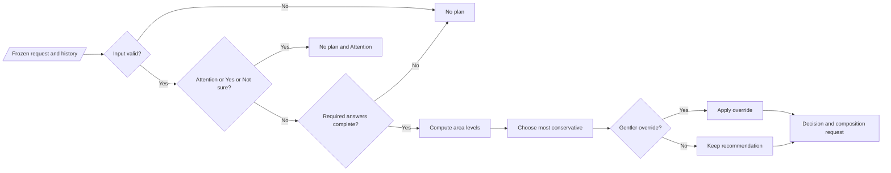

# Kineo v1 — Selection and Safety Engine

| Field | Value |
| --- | --- |
| Status | Approved prototype contract — implementation through M2 complete August 9, 2026; M3 not authorized |
| Scope | Deterministic plan selection, safety state, history eligibility, overrides, explanations, and audit records |
| Product inputs | `KINEO_PRODUCT_DESIGN.md` 0.5; `KINEO_UX_DESIGN_SPEC.md` |
| Rules version | `selection-v1.0.0-prototype` |

## 1. Purpose and boundaries

This document turns the product rules into one deterministic, testable contract. Given the same request, history snapshot, rules version, and catalog capabilities, the engine must return the same result.

The engine selects among bounded, pre-authored content. It does not diagnose, decide whether movement is medically safe, infer honesty, score readiness or recovery, use HealthKit, or create movements. Its results describe Kineo product behavior, not clinical conclusions.

The coordinator calls it only after onboarding confirms the user-reported 18+ product boundary and the one-time safety acknowledgment. Those acknowledgments are access preconditions, not selection inputs, and never change a level.

### Decision path



## 2. Product decisions

### 2.1 Attention is stored per area but blocks all routines while unresolved

- Attention remains recorded against the named area.
- Any unresolved Attention state blocks routine creation, including when its area was later skipped or removed from preferences.
- A secondary area cannot be skipped after a triggering `Worse`/`Limited` answer to bypass its conditional safety question or Attention result.
- Primary-only continuation is allowed only when a secondary area was skipped before any safety trigger and no Attention state exists, or later when the catalog cannot include independently safety-eligible secondary content.
- The engine never composes content for an area in Attention.

UX state `E3 Secondary omitted` is therefore catalog-only; it is never a safety fallback.

### 2.2 Active requires `Better + Good`

Only `Better + Good` can produce Active in v1. `Similar + Good` is Balanced even when Active is unlocked. Changing this requires a versioned rules release, not a runtime flag.

### 2.3 Safety-control behavior during a routine

Activation pauses playback and opens guidance. Confirming ends the routine as `safetyStopped`; accidental dismissal returns to Paused and requires an explicit Resume.

### 2.4 “Selected by mistake” is a two-step correction

The mistake action starts a fresh correction check-in but does not clear Attention. Attention clears atomically only after a valid corrected entry with no trigger or a required `No`; `Yes`, `Not sure`, cancellation, or abandonment keeps it.

## 3. Normative vocabulary

`MUST`, `MUST NOT`, `SHOULD`, and `MAY` are normative. Enum raw values are stable persistence and test-fixture values and must not be renamed after implementation.

```text
enum BodyArea: String {
  neck = "neck"
  upperMidBack = "upperMidBack"
  lowerBack = "lowerBack"
}

enum AreaRole: String {
  primary = "primary"
  secondary = "secondary"
}

enum ChangeReport: String {
  better = "better"
  similar = "similar"
  worse = "worse"
}

enum MovementComfort: String {
  limited = "limited"
  okay = "okay"
  good = "good"
}

enum ConditionalSafetyAnswer: String {
  no = "no"
  yes = "yes"
  notSure = "notSure"
}

enum AttentionReturnAnswer: String {
  returnedToUsual = "returnedToUsual"
  notReturned = "notReturned"
  notSure = "notSure"
  selectedByMistake = "selectedByMistake"
}

enum RoutineLevel: String {
  gentle = "gentle"
  balanced = "balanced"
  active = "active"
}

routineLevelRank: Map<RoutineLevel, UInt> = {
  gentle: 0,
  balanced: 1,
  active: 2
}

enum DurationVariant: String {
  quick = "quick"
  standard = "standard"
}

enum AreaResponse: String {
  better = "better"
  same = "same"
  worse = "worse"
}

enum RoutineStatus: String {
  prepared = "prepared"
  inProgress = "inProgress"
  paused = "paused"
  completed = "completed"
  stopped = "stopped"
  safetyStopped = "safetyStopped"
  abandoned = "abandoned"
}

enum SafetyStatus: String {
  normal = "normal"
  attentionRequired = "attentionRequired"
}

enum SecondaryParticipation: String {
  include = "include"
  skipForSession = "skipForSession"
}
```

`RoutineLevel` identifiers and ranks are separate contracts. Lower `routineLevelRank` means gentler. Code must use this total map for comparison, never enum declaration order or localized labels.

## 4. Input contract

### 4.1 Check-in and per-area state

```text
struct AreaCheckIn {
  checkInEntryID: UUID
  entryRevision: UInt
  area: BodyArea
  change: ChangeReport
  comfort: MovementComfort
  safetyAnswer: ConditionalSafetyAnswer? // required iff conditionalSafetyRequired is true
}

struct AreaHistorySnapshot {
  area: BodyArea
  qualifyingActiveCount: UInt
  mostRecentRecordedResponse: AreaResponse?
}

struct AreaSafetySnapshot {
  area: BodyArea
  safetyStatus: SafetyStatus
}

struct SelectionRequest {
  decisionID: UUID
  checkInID: UUID
  decisionRevision: UInt
  primaryArea: BodyArea
  secondaryArea: BodyArea?
  secondaryParticipation: SecondaryParticipation? // required iff secondaryArea exists
  checkInsByArea: Map<BodyArea, AreaCheckIn>
  safetyByArea: Map<BodyArea, AreaSafetySnapshot> // must contain all three areas
  historyByArea: Map<BodyArea, AreaHistorySnapshot>
  requestedOverride: RoutineLevel?
  duration: DurationVariant
  rulesVersion: String
  catalogVersion: String
}
```

### 4.2 Input invariants

The boundary layer MUST reject the request as `invalidInput` before selection when:

- primary and secondary are the same area;
- more than one secondary area is supplied;
- secondary participation is missing when a secondary exists, or present when none exists;
- an area key disagrees with the `area` inside its value;
- a safety snapshot is missing for any of the three supported areas;
- a supplied check-in is not for the primary or selected secondary;
- a conditional safety answer is supplied when neither `Worse` nor `Limited` applies;
- the rules version is unsupported;
- IDs are missing or reused for a distinct stored decision;
- a count is negative or not an integer.

An unanswered secondary is omitted only after the user explicitly selects `skipForSession`. When participation is `include`, missing answers yield a continuation state rather than silently dropping the area. An unanswered primary area yields `needsPrimaryCheckIn` so the UI can continue the flow.

HealthKit data, available time beyond the duration enum, occupation, age, streaks, and telemetry state MUST NOT be accepted as selection inputs.

## 5. Output contract

```text
enum NoPlanReason: String {
  needsPrimaryCheckIn = "needs_primary_check_in"
  needsPrimaryConditionalSafetyAnswer = "needs_primary_safety_answer"
  needsSecondaryCheckIn = "needs_secondary_check_in"
  needsSecondaryConditionalSafetyAnswer = "needs_secondary_safety_answer"
  attentionRequired = "attention_required"
  invalidInput = "invalid_input"
}

enum OmissionReason: String {
  secondaryUnanswered = "secondaryUnanswered"
  catalogIncompatible = "catalogIncompatible"
  contentUnavailable = "contentUnavailable"
}

struct AreaDecision {
  area: BodyArea
  role: AreaRole
  baseLevel: RoutineLevel
  activeUnlocked: Bool
}

struct OmittedArea {
  area: BodyArea
  reason: OmissionReason
}

struct CompositionRequest {
  primaryArea: BodyArea
  secondaryArea: BodyArea?
  selectedLevel: RoutineLevel
  duration: DurationVariant
  rulesVersion: String
  catalogVersion: String
}

struct SelectedPlanDecision {
  recommendedLevel: RoutineLevel
  selectedLevel: RoutineLevel
  duration: DurationVariant
  includedAreaDecisions: [AreaDecision]
  omittedAreas: [OmittedArea]
  compositionRequest: CompositionRequest
  explanationKeys: [Explanation] // one or two only
  notices: [DecisionNotice]
  pauseTodayAvailable: Bool
}

struct Explanation {
  key: String
  parameters: Map<String, String>
}

struct DecisionNotice {
  key: String
  area: BodyArea?
  parameters: Map<String, String>
}

enum SelectionOutcome {
  noPlan(reason: NoPlanReason, affectedAreas: [BodyArea],
         safetyTransitions: [SafetyTransition])
  selected(SelectedPlanDecision)
}

enum SafetyTransition {
  enterAttention(area: BodyArea, sourceCheckInEntryID: UUID,
                 answer: ConditionalSafetyAnswer)
}
```

`safetyTransitions` is a pure description for defensive evaluation and test fixtures, not a second persistence command. In the application workflow, TD-02's check-in coordinator derives and commits submitted-answer Attention transitions before any plan operation; a blocked check-in never reaches plan creation.

`noPlan` carries no general-purpose notices. Its typed reason plus ordered affected areas selects the approved pending, Attention, or unavailable presentation. `safetyTransitions` is empty for every reason except a defensive `attentionRequired` evaluation that derives new transitions.

Catalog composition occurs after selection and may return a content fallback described in the catalog design. The final presented plan MUST use the composer’s delivered level and included areas, not assume the request was fulfilled exactly.

## 6. Conditional safety logic

```text
conditionalSafetyRequired(checkIn) =
  checkIn.change == worse OR checkIn.comfort == limited
```

For a required conditional question:

- `no` makes that area eligible for ordinary level selection.
- `yes` or `notSure` creates/maintains Attention Required for that area and blocks all new Kineo routines while unresolved.
- `nil` is pending and blocks selection until answered. A secondary cannot be skipped after the triggering `Worse`/`Limited` check-in has been supplied.

A conditional answer supplied when the condition is false violates the check-in invariant and returns `invalidInput`; it is never persisted or interpreted.

### 6.1 Attention return reducer

```text
reduceAttention(area, answer):
  precondition area.safetyStatus == attentionRequired

  switch answer:
    returnedToUsual:
      atomically append attentionClearedReturnedToUsual event
      and remove current Attention row
      require a new current check-in

    notReturned, notSure:
      append attentionReaffirmed event
      keep current Attention row
      return approved guidance; no check-in for that area

    selectedByMistake:
      keep current Attention row
      create a new draft check-in and require the relevant questions again
      do not reuse or mutate the blocked check-in

submitCorrection(area, correctedEntry):
  precondition area.safetyStatus == attentionRequired
  precondition correctedEntry belongs to the new correction draft

  if conditionalSafetyRequired(correctedEntry)
     AND correctedEntry.safetyAnswer IN {yes, notSure}:
    append attentionReaffirmedCorrection sourced to correctedEntry;
    keep Attention; no plan
  else:
    precondition correctedEntry has no conditional answer when not required,
                 or has answer == no when required
    atomically append attentionClearedCorrection event sourced to correctedEntry
    and remove current Attention row
    continue completing the new check-in
```

Selecting the mistake action alone never clears Attention. Correction is an append-only entry/event workflow, not deletion of historical evidence and not a claim that movement is safe. If its area is no longer selected, the correction never enters this selector; after clearance, the coordinator creates a normal check-in for current preferences.

### 6.2 Selected-session behavior

| Primary state | Secondary state | Result |
| --- | --- | --- |
| Normal and fully answered | absent or explicitly skipped | Primary-only selection |
| Normal and fully answered | Normal and fully answered | Two-area selection |
| Normal and fully answered | Attention Required | No routine for the session |
| Normal and fully answered | selected for inclusion but unanswered | Continue secondary check-in; user may explicitly skip it |
| Normal and fully answered | conditional answer pending after Worse/Limited | Continue safety question; skipping cannot bypass it |
| Attention Required | Any | No plan |
| Conditional answer pending | Any | No plan until primary answer |

The app MUST NOT silently skip a secondary area. A user may skip it before providing a triggering check-in. Once its current check-in contains `Worse` or `Limited`, the conditional safety question must be resolved; `Yes`/`Not sure` blocks all new Kineo routines while unresolved, and `No` may then permit an explicit skip. Changing preferences, skipping the area, or resetting ordinary history never clears or bypasses an existing Attention state. Every permitted omission appears before start and remains in the plan snapshot.

## 7. Base-level and Active rules

### 7.1 Exhaustive base mapping

| Change | Comfort | Conditional answer required | Active locked result | Active unlocked result |
| --- | --- | ---: | --- | --- |
| Better | Limited | Yes | Gentle | Gentle |
| Better | Okay | No | Balanced | Balanced |
| Better | Good | No | Balanced | Active |
| Similar | Limited | Yes | Gentle | Gentle |
| Similar | Okay | No | Balanced | Balanced |
| Similar | Good | No | Balanced | Balanced |
| Worse | Limited | Yes | Gentle | Gentle |
| Worse | Okay | Yes | Gentle | Gentle |
| Worse | Good | Yes | Gentle | Gentle |

Rows requiring a conditional answer yield no area level until the answer is `no`. `yes` and `notSure` create Attention instead.

### 7.2 Active unlock configuration

```text
struct ActiveUnlockConfiguration {
  qualifyingCountRequired: UInt = 2
  qualifyingLevels: Set<RoutineLevel> = { gentle, balanced }
  qualifyingResponses: Set<AreaResponse> = { better, same }
}

struct RoutineAreaOutcomeEvent {
  area: BodyArea
  routineStatus: RoutineStatus // must be a terminal status
  deliveredLevel: RoutineLevel // actual catalog level, not pre-fallback selection
  response: AreaResponse?
  includedInDeliveredRoutine: Bool
}
```

An area is Active-unlocked when `qualifyingActiveCount >= qualifyingCountRequired`. Counts above the threshold are allowed; the UI may display only locked/unlocked, never a readiness score.

The prototype value is two. Changing it requires a new rules version. The public-release value remains subject to professional and product review.

### 7.3 History reducer

The stored count is derived exclusively by applying routine-area events in finalization order:

```text
updateActiveHistory(previous, event):
  precondition event.includedInDeliveredRoutine
  precondition event.routineStatus IN
               {completed, stopped, safetyStopped, abandoned}

  // An explicit Worse always resets, including after an incomplete routine.
  if event.response == worse:
    return count = 0, mostRecentRecordedResponse = worse

  nextMostRecent = event.response ?? previous.mostRecentRecordedResponse

  qualifies =
    event.routineStatus == completed AND
    event.deliveredLevel IN {gentle, balanced} AND
    event.response IN {better, same} AND
    event.area was included in the delivered routine

  if qualifies:
    return count = previous.count + 1,
           mostRecentRecordedResponse = event.response

  return count = previous.count,
         mostRecentRecordedResponse = nextMostRecent
```

Consequences:

- Quick and Standard qualify identically; duration never affects eligibility.
- Skipped feedback does not increment, reset, or replace the last response.
- Stopped, abandoned, and safety-ended routines never increment.
- Explicit Better/Same on an incomplete routine becomes the most recent response but does not increment.
- Explicit Worse always becomes most recent and resets the count.
- Active routine completion does not increment the qualifying count.
- Pause Today creates no **Active-eligibility** event and changes no area history. The data and flow layers persist its separate consistency-participation event; that event is never read by this selector.
- Area histories never transfer when preferences change.
- Each included area gets its own event and response.

`mostRecentRecordedResponse` does not independently raise or lower today’s base level. Its only v1 selection consequence is already captured when a Worse event resets the qualifying count. It remains in the snapshot for explanation/audit and future versioning; skipped feedback never replaces it.

## 8. Multi-area level reduction

For every included area, compute the base result independently. The recommended session level is the minimum level rank:

| Primary | Secondary | Session level |
| --- | --- | --- |
| Gentle | Gentle/Balanced/Active | Gentle |
| Balanced | Gentle | Gentle |
| Balanced | Balanced/Active | Balanced |
| Active | Gentle | Gentle |
| Active | Balanced | Balanced |
| Active | Active | Active |

If both areas produce the same level, the primary area is the deterministic explanation anchor. If levels differ, the gentler (limiting) area is the anchor.

## 9. User override contract

V1 exposes only gentler overrides:

```text
overrideIsAllowed(recommended, requested) = requested.rank <= recommended.rank
```

- `nil` means use the recommendation.
- A lower level is accepted and becomes `selectedLevel`.
- The same level is treated as no override.
- A higher level is rejected as `overrideNotAllowed`; the recommendation remains selected.
- A user who previously chose gentler may restore the current recommendation before starting; this is not an upward override.
- No override can include an omitted area, clear Attention, or bypass pending safety.

This removes ambiguity from “more active when allowed”: in v1, the engine already returns the most active level allowed by the current check-in and unlock state, so there is no higher allowed level to choose.

## 10. Deterministic selection algorithm

```text
select(request):
  validate structural input; if invalid -> noPlan(invalidInput, [], [])

  primary = request.primaryArea
  secondary = request.secondaryArea
  selectedAreas = [primary] + secondary if configured
  transitions = []

  // Any persisted Attention state has priority over participation/preferences.
  existingAttention = all supported areas where
                      safety[area].safetyStatus == attentionRequired

  for area in selectedAreas with a supplied checkIn:
    if conditionalSafetyRequired(checkIn[area]):
      if safetyAnswer IN {yes, notSure}:
        transitions += enterAttention(area, checkIn[area].checkInEntryID,
                                      safetyAnswer)

  newlyFlagged = areas in transitions
  if existingAttention or newlyFlagged is not empty:
    -> noPlan(attentionRequired,
              affectedAreas = primary-first union(existingAttention, newlyFlagged),
              safetyTransitions = transitions)

  // A trigger cannot be skipped to avoid answering it.
  if primary checkIn exists AND conditionalSafetyRequired(primary checkIn)
     AND primary safetyAnswer is nil:
    -> noPlan(needsPrimaryConditionalSafetyAnswer, [primary], [])

  if secondary checkIn exists AND conditionalSafetyRequired(secondary checkIn)
     AND secondary safetyAnswer is nil:
    -> noPlan(needsSecondaryConditionalSafetyAnswer, [secondary], [])

  if checkIn[primary] is missing:
    -> noPlan(needsPrimaryCheckIn, [primary], [])

  included = [primary]
  notices = []

  if secondary exists:
    if request.secondaryParticipation == skipForSession:
      notices += secondaryUnanswered
    else if checkIn[secondary] is missing:
      -> noPlan(needsSecondaryCheckIn, [secondary], [])
    else:
      included += secondary

  compute base level and Active state for each included area
  recommended = minimum(base levels by RoutineLevel rank)

  if requestedOverride is lower than recommended:
    selected = requestedOverride
  else:
    selected = recommended
    record rejected higher override if one was supplied

  explanations = buildExplanations(
    selected, recommended, includedAreaDecisions, override
  )
  pauseAvailable = any submitted checkIn has Worse or Limited
                   AND its conditional answer == no

  -> selected(
       recommendedLevel = recommended,
       selectedLevel = selected,
       duration = request.duration,
       includedAreaDecisions = computed decisions for included,
       omittedAreas = secondary skip if present,
       compositionRequest = exact included areas + selected + duration,
       explanationKeys = explanations limited to 2,
       notices = notices,
       pauseTodayAvailable = pauseAvailable
     )
```

The engine is pure. `SafetyTransition` values returned by a defensive or isolated evaluation describe transitions owned by TD-02's check-in coordinator; the plan coordinator MUST NOT commit them with a decision audit. In the application flow, blocked check-ins stop before plan creation. The selection engine does not probe catalog alternatives. The composer receives the exact request and returns an exact composition, a disclosed fallback, or unavailable. This keeps safety writes, rule decisions, and content failures separately auditable.

## 11. Duration independence

Duration is passed through only to the catalog composer after the level is final.

For otherwise identical requests, changing `quick` to `standard` MUST NOT change:

- safety branching or Attention state;
- area inclusion before catalog availability checks;
- Active unlock state;
- recommended or selected level;
- explanation keys;
- history eligibility rules.

It MAY change only the authored routine variant, movement count, repetitions, rests, and nominal time within the approved variant. Quick is never created by truncating Standard and is never described as physiologically equivalent.

### 11.1 Immutable plan revisions

The first visible plan calculation for an eligible completed check-in uses `standard` and no override. It is decision revision `1`. If the user changes duration or selects/restores a permitted gentler level before Start, the coordinator reruns selection and composition and appends revision `n + 1`; it never mutates a displayed revision.

Every revision for one check-in reuses the frozen:

- exact check-in entry IDs and entry revisions;
- area/history snapshots used by revision 1;
- rules version and requested catalog version.

Only `decisionID`, `decisionRevision`, `requestedOverride`, and `duration` may differ. Current Attention state is re-read before each revision and again before Start; any newly required Attention stops the flow without appending a selected decision. Start references only the newest committed revision with a valid catalog fingerprint. This makes duration and override changes auditable while proving that duration did not alter the underlying check-in result.

After a routine starts or Pause Today is recorded, that check-in accepts no further plan revisions or second routine. Another routine attempt on the same day requires a new `checkInID`, new entries, and a new revision sequence beginning at `1`.

## 12. Explanation contract

Explanations are localized from stable keys and parameters. Store keys and parameters, not rendered English, in the decision audit; store presented copy in the immutable session snapshot.

At most two “Why this routine?” reasons are emitted in this priority:

1. Accepted gentler override.
2. Limiting area’s current check-in rule.
3. Active-lock fact when `Better + Good` resolved to Balanced.
4. Second-area conservatism when it changed the session level.

Omission and catalog-fallback disclosures are notices, not selection reasons, and do not consume the two-reason limit.

| Key | Parameters | Prototype English |
| --- | --- | --- |
| `reason.user_gentler_override` | selected level | “You chose a gentler {level} plan.” |
| `reason.reported_worse` | area | “Gentle was selected because you reported that your {area} feels worse today.” |
| `reason.movement_limited` | area | “Gentle was selected because movement feels limited for your {area} today.” |
| `reason.better_good_active` | area | “Active was selected from today’s answers for your {area}.” |
| `reason.balanced_checkin` | area | “Balanced was selected from today’s answers for your {area}.” |
| `reason.active_locked` | area, threshold | “Active becomes available for your {area} after {threshold} qualifying Kineo routines.” |
| `reason.secondary_more_conservative` | area | “The plan uses the gentler level from your {area} check-in.” |

When both Worse and Limited apply, `reported_worse` wins deterministically. Explanations MUST NOT mention safety, capacity, readiness, recovery, medical conclusions, HealthKit, or a hidden score.

Notice examples:

- `notice.secondary_skipped`
- `notice.secondary_content_unavailable`
- `notice.primary_content_gentler_fallback`
- `notice.pairing_not_approved`

After composition, presentation reconciles requested and delivered levels. If `deliveredLevel != selectedLevel`, it replaces level-specific selection reasons with at most two accurate reasons:

1. `reason.content_gentler_fallback(selectedLevel, deliveredLevel)` — “The {deliveredLevel} plan is shown because the {selectedLevel} routine is unavailable.”
2. `reason.today_answers_considered(anchorArea)` — “Kineo used today’s answers for your {area}.”

The immutable session snapshot and audit store these as `presentedExplanationKeys`. This prevents a Balanced fallback from displaying “Active was selected.” Prototype copy may name unavailable prototype content; production wording requires content review.

## 13. Catalog fallback integration

The composer applies fallbacks in this exact order:

1. Try the exact primary template and, when requested, exact secondary module/pairing at selected level and duration.
2. If the secondary module, pairing, or composed-duration validation fails, return the exact primary template alone with a disclosure.
3. If the exact primary template is unavailable, try primary templates for successively gentler levels in rank order: Active → Balanced → Gentle or Balanced → Gentle.
4. After a primary-level fallback, retry the secondary only at the delivered gentler level and exact duration.
5. If no eligible primary template exists, return `noApprovedPrimaryContent`.

The composer MUST NOT:

- substitute another body area, role, or duration;
- mix levels in one labeled plan;
- use a more active level;
- invent, truncate, reorder, or concatenate content outside authored slots;
- treat a missing secondary module as total failure when primary content is valid.

The final plan label and audit use `deliveredLevel`. A fallback from Active to Balanced is visibly Balanced.

## 14. Decision audit record

All fields remain local and use the approved iOS data-protection and backup-exclusion policy.

```text
struct SelectionDecisionAudit {
  decisionID: UUID
  checkInID: UUID
  decisionRevision: UInt
  createdAt: Instant
  rulesVersion: String
  catalogVersionRequested: String
  catalogVersionDelivered: String?

  primaryArea: BodyArea
  secondaryAreaSelected: BodyArea?
  checkIns: [AreaCheckInAudit]
  historySnapshots: [AreaHistorySnapshot]

  recommendedLevel: RoutineLevel
  requestedOverride: RoutineLevel?
  overrideDisposition: OverrideDisposition
  selectedLevel: RoutineLevel
  deliveredLevel: RoutineLevel?
  duration: DurationVariant

  requestedAreas: [BodyArea]
  includedAreas: [BodyArea]
  omittedAreas: [OmittedAreaAudit]
  outcome: DecisionOutcomeCode

  explanationKeys: [String]
  explanationParameters: [Map<String, String>]
  presentedExplanationKeys: [String]?
  presentedExplanationParameters: [Map<String, String>]?
  noticeKeys: [String]

  primaryTemplateID: String?
  primaryTemplateRevision: UInt?
  secondaryModuleID: String?
  secondaryModuleRevision: UInt?
  compatibilityRuleID: String?
  composedRoutineFingerprint: String?
  validationResult: DecisionValidationResult?
}

struct AreaCheckInAudit {
  checkInEntryID: UUID
  area: BodyArea
  role: AreaRole
  change: ChangeReport
  comfort: MovementComfort
  conditionalSafetyRequired: Bool
  conditionalSafetyAnswer: ConditionalSafetyAnswer?
}

enum OverrideDisposition: String {
  none = "none"
  acceptedGentler = "acceptedGentler"
  sameAsRecommended = "sameAsRecommended"
  rejectedHigher = "rejectedHigher"
}

enum DecisionOutcomeCode: String {
  selected = "selected"
  contentUnavailable = "contentUnavailable"
}

enum DecisionValidationResult: String {
  exact = "exact"
  fallback = "fallback"
  unavailable = "unavailable"
}

struct OmittedAreaAudit {
  area: BodyArea
  reason: OmissionReason
}
```

`noPlan` continuation and Attention outcomes do not create a selection-decision record. Their exact check-in revisions and any returned safety transitions are audited in the check-in/safety aggregates. `SelectionDecisionAudit` is created only after an eligible check-in reaches a terminal composer result: `selected` or `contentUnavailable`. It does not redundantly store three “Normal” safety snapshots; absence of Attention is enforced transactionally before the revision commit and again before Start.

Audit timestamps and generated IDs describe the event but MUST NOT influence selection. Never include HealthKit, free text, or remote analytics identifiers. A correction appends a corrected check-in-entry revision and safety-clear event that point to the triggering source entry; it does not mutate historical answers or decisions already performed.

## 15. Failure behavior

| Failure | Required result |
| --- | --- |
| Corrupt/unsupported rules version | No plan; recoverable local error; never default to a level |
| Missing primary check-in | Resume check-in |
| Missing primary safety answer | Present conditional question |
| Secondary selected for inclusion; check-in missing | Continue its check-in; user may explicitly skip it |
| Secondary safety pending after Worse/Limited | Ask it; skip cannot bypass the question |
| Primary Attention | No plan; approved guidance and correction path |
| Secondary Attention | No new Kineo routine while unresolved; approved guidance and correction path |
| History missing/corrupt | Treat Active as locked; do not infer response; log local diagnostic |
| Override higher than recommendation | Ignore override, keep recommendation, record rejection |
| Exact catalog content missing | Apply only the ordered gentler/primary-only fallbacks |
| No eligible primary content | Content unavailable; no routine |
| Persistence failure before plan start | Do not start; preserve check-in in memory and offer retry |
| Persistence failure after session start | Continue from immutable in-memory snapshot; retry local save; never send sensitive data |

## 16. Acceptance and test matrices

### 16.1 Exhaustive single-area mapping

For each of the nine rows in section 7.1, test both Active states (18 cases), both duration variants (36 cases), and all three areas (108 cases). Assertions:

- required conditional questions behave identically by duration and area;
- `yes`/`notSure` never produce a routine;
- `no` produces the table level;
- only `Better + Good + unlocked` produces Active;
- the two duration runs have identical decision fields except duration/composition variant.

### 16.2 Safety matrix

| Case | Expected |
| --- | --- |
| Worse + missing safety answer, primary | `needsPrimaryConditionalSafetyAnswer` |
| Limited + missing safety answer, primary | `needsPrimaryConditionalSafetyAnswer` |
| Worse + No | Gentle |
| Limited + No | Gentle |
| Worse/Limited + Yes | Attention; no new Kineo routine while unresolved |
| Worse/Limited + Not sure | Same as Yes |
| Similar + Okay + stray Yes value | `invalidInput`; value is not persisted or interpreted |
| Primary already in Attention | No plan before check-in mapping |
| Secondary already in Attention, even after skip/preference removal | No routine until its Attention state is resolved |
| Secondary selected; check-in missing | `needsSecondaryCheckIn`, not silent omission |
| Secondary selected; safety answer missing | `needsSecondaryConditionalSafetyAnswer`, not silent omission |
| Secondary explicitly skipped before any trigger | Primary-only plus skipped notice |
| Secondary Worse/Limited then skipped before safety answer | Still `needsSecondaryConditionalSafetyAnswer` |
| Secondary Worse/Limited + Yes/Not sure then skipped | Still Attention; no plan |
| Non-selected area has unresolved Attention | No routine; route to that area's return/correction flow |
| Attention return Yes | Clear; require new check-in |
| Attention return No/Not sure | Remain Attention; no routine while area is selected |
| Selected by mistake | Keep Attention; create fresh correction draft; no immediate plan |
| Valid corrected entry with No/non-trigger answers | Append correction-clear; remove Attention; complete new check-in |
| Corrected entry still Yes/Not sure | Reaffirm Attention; no plan |

### 16.3 Active-history matrix

Starting from count 0, run each event independently and in sequence:

| Completion | Delivered level | Response | Count effect | Latest response |
| --- | --- | --- | --- | --- |
| Completed | Gentle | Better | +1 | Better |
| Completed | Gentle | Same | +1 | Same |
| Completed | Balanced | Better/Same | +1 | supplied value |
| Completed | Active | Better/Same | unchanged | supplied value |
| Completed | Any | Worse | reset to 0 | Worse |
| Completed | Any | skipped | unchanged | unchanged |
| Stopped/abandoned/safety-ended | Any | Better/Same | unchanged | supplied value |
| Stopped/abandoned/safety-ended | Any | Worse | reset to 0 | Worse |
| Any | Any | no feedback | unchanged | unchanged |

Sequence assertions:

1. Qualifying, qualifying → count 2 → Active unlocked.
2. Qualifying, skipped feedback, qualifying → count 2.
3. Qualifying, stopped with Same, qualifying → count 2.
4. Qualifying, Worse → count 0.
5. Two neck events never unlock upper/mid-back or lower back.
6. Quick and Standard sequences produce identical counts.

### 16.4 Override matrix

Test every recommended/requested pair:

| Recommended | Requested Gentle | Requested Balanced | Requested Active |
| --- | --- | --- | --- |
| Gentle | same/no override | reject | reject |
| Balanced | accept Gentle | same/no override | reject |
| Active | accept Gentle | accept Balanced | same/no override |

Repeat while primary or secondary is in Attention; no override may produce a plan.

### 16.5 Two-area matrix

Test all nine primary/secondary level pairs from section 8 with each ordered pair of distinct areas (54 cases) and both durations (108 included cases). Separately test secondary skipped-before-trigger, Attention, and pending-safety states for every ordered pair and duration. Verify minimum-level reduction for eligible included areas; Attention always produces no plan; only a pre-trigger skip produces a selection-engine omission.

Pause Today assertions:

- no Worse/Limited entry → unavailable;
- any primary or secondary Worse/Limited + No → available;
- a secondary trigger answered No remains eligible for Pause even if that secondary is then omitted;
- pending, Yes, Not sure, or any existing Attention → no plan and no Pause action from the selector;
- persisting Pause creates one consistency-participation event for that check-in and no Active-history event;
- multiple eligible Pause events captured on one `local_day` remain separate audits but project to one consistency day.

### 16.6 Catalog integration matrix

For every area × level × duration:

- exact primary present → exact delivery;
- exact primary absent with gentler present → first gentler delivery and notice;
- no primary at any allowed level → unavailable;
- secondary exact and compatible → included;
- secondary missing/incompatible/invalid duration → primary-only and precise notice;
- no result ever becomes more active or changes duration/area.

### 16.7 Non-influence tests

Add randomized values for HealthKit, connectivity, reminder settings, telemetry choice, weekly goal, occupation, and clock time outside the request. Verify byte-equivalent selection output apart from generated audit metadata. This guards against accidental future coupling.

## 17. Release gates

Before internal implementation is considered conformant:

- all matrices above pass against a pure engine test target;
- rules and catalog version mismatches fail closed;
- every outcome persists the audit before routine start;
- UI snapshot tests use the engine’s keys/notices rather than recomputing logic.

Before public release:

- production Active threshold and safety wording receive required professional/product review;
- regulatory review evaluates actual implemented selection behavior and claims;
- only release-approved catalog content is eligible;
- physical-device accessibility and privacy verification passes.
