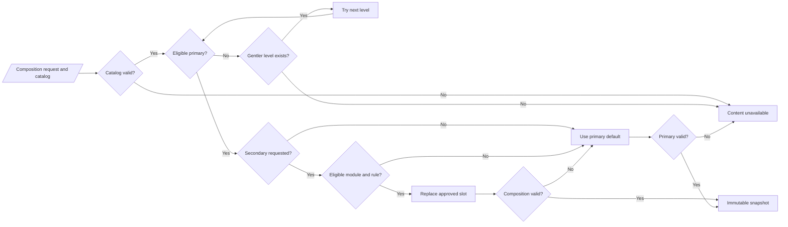

# Kineo v1 — Routine Catalog and Composition

| Field | Value |
| --- | --- |
| Status | Approved prototype contract — M1–M3 complete; M4–M12 sequentially authorized subject to documented gates |
| Scope | Versioned content schema, bounded composition, prototype catalog, validation, fallbacks, and session snapshots |
| Product inputs | `KINEO_PRODUCT_DESIGN.md` 0.5; `KINEO_UX_DESIGN_SPEC.md`; `03_SELECTION_SAFETY_ENGINE.md` |
| Schema version | `1` |

## 1. Purpose and boundary

The catalog is an installed, versioned set of pre-authored routine content. The composer may select and combine only records that already exist and pass all eligibility and compatibility checks. It never generates a movement, converts Standard into Quick, guesses a replacement, or joins arbitrary modules.

This document approves an **abstract prototype catalog** for navigation, timing, persistence, and selection tests. It does not approve movement guidance for public use. All prototype records and presentation surfaces must say “Prototype content,” and release builds must reject them.

The coordinator may call the composer only after the safety engine confirms there is no unresolved Attention state for any supported area. The composer contains no safety bypass: changing preferences, omitting secondary content, or using a catalog fallback cannot make an Attention-blocked check-in composable.

### Composition path



## 2. Resolved design decisions

### 2.1 Version-one region selector

The catalog uses the three accessible list choices already selected by the UX specification: Neck, Upper or mid-back, Lower back. A body map is not required and has no catalog semantics.

### 2.2 Prototype duration values

- Quick nominal duration: **300 seconds (5 minutes)**; valid range 270–360 seconds.
- Standard nominal duration: **600 seconds (10 minutes)**; valid range 480–720 seconds.

These values exist only to build and test timers and composition. Production durations remain a content approval gate. Duration does not affect selection level or Active eligibility.

### 2.3 Secondary composition model

Each primary variant owns one explicit `secondaryFocus` replacement slot with an authored primary-only default fragment. A compatible secondary module replaces that fragment; it does not append to the routine. The module must match area, level, duration, slot kind, equipment, position and time budget through an explicit compatibility rule.

This keeps the resulting duration bounded and prevents unreviewed concatenation.

## 3. Stable types

Types shared with the selection/domain contracts (`BodyArea`, `AreaRole`, `RoutineLevel`, `DurationVariant`, `OmissionReason`) use the same raw values.

```text
type CatalogID = String       // lowercase namespaced slug; immutable
type ContentRevision = UInt   // starts at 1; increments on any content change
type Seconds = UInt

enum BuildChannel: String {
  internalPrototype = "internal_prototype"
  publicRelease = "public_release"
}

enum ReviewStatus: String {
  prototypePlaceholder = "prototypePlaceholder"
  draft = "draft"
  professionallyReviewed = "professionallyReviewed"
  approvedForRelease = "approvedForRelease"
  retired = "retired"
}

enum ContentRole: String {
  primaryTemplate = "primary_template"
  secondaryModule = "secondary_module"
  fragment = "fragment"
  movement = "movement"
}

enum SequenceItemKind: String {
  movement = "movement"
  transition = "transition"
  rest = "rest"
  replacementSlot = "replacement_slot"
}

enum DoseKind: String {
  timed = "timed"
  repetitions = "repetitions"
}

enum Position: String {
  seated = "seated"
  standing = "standing"
  floor = "floor"
  adaptable = "adaptable"
  prototypeAbstract = "prototype_abstract"
}

enum SlotKind: String {
  secondaryFocus = "secondary_focus"
}
```

## 4. Catalog envelope

```text
struct RoutineCatalog {
  schemaVersion: UInt
  catalogVersion: String       // semantic version, immutable once shipped
  createdAt: Instant
  buildEligibility: Set<BuildChannel>
  durationPolicies: [DurationPolicy]
  movements: [MovementDefinition]
  fragments: [RoutineFragment]
  primaryTemplates: [PrimaryTemplateVariant]
  secondaryModules: [SecondaryModuleVariant]
  compatibilityRules: [CompatibilityRule]
  manifestFingerprint: String  // SHA-256 of canonical manifest
}

struct DurationPolicy {
  variant: DurationVariant
  nominalSeconds: Seconds
  minimumSeconds: Seconds
  maximumSeconds: Seconds
}
```

Canonical serialization sorts object keys lexicographically, sorts sets lexicographically, sorts unordered content collections by stable `(id, revision)`, retains the authored order of semantic arrays such as sequence items, encodes integers in base-10, and emits no insignificant whitespace. Every fingerprint is the lower-case hexadecimal SHA-256 digest of the UTF-8 canonical representation.

Fingerprint inputs are exact:

- `manifestFingerprint` covers the entire catalog envelope and every nested content record except the `manifestFingerprint` field itself.
- `ComposedRoutine.fingerprint` covers `catalogVersion`, status, selected and delivered levels, duration, primary-first included areas, omitted area/reason, primary-template reference, optional secondary-module and compatibility-rule references, the complete ordered resolved item projection, and nominal/minimum/maximum path seconds. It excludes generated `compositionID` and timestamps.
- `RoutineSessionSnapshot.fingerprint` is copied unchanged from `ComposedRoutine.fingerprint`. TD-02 separately defines the checksum over the complete persisted snapshot JSON.

## 5. Content metadata and review eligibility

```text
struct ContentMetadata {
  id: CatalogID
  revision: ContentRevision
  reviewStatus: ReviewStatus
  locale: String                 // v1: "en-US"
  displayNameKey: String
  accessibilityDescriptionKey: String?
  contentOwner: String
  reviewedBy: String?
  reviewedAt: Instant?
  reviewEvidenceID: String?
  intendedBuilds: Set<BuildChannel>
}
```

Eligibility:

```text
eligible(metadata, channel):
  if channel == internalPrototype:
    return status IN {prototypePlaceholder, professionallyReviewed, approvedForRelease}
           AND channel IN intendedBuilds

  if channel == publicRelease:
    return status == approvedForRelease
           AND reviewedBy/reviewedAt/reviewEvidenceID are non-null
           AND channel IN intendedBuilds
```

`draft` and `retired` are never selectable. Prototype placeholders MUST NOT declare professional review or public-release eligibility.

## 6. Movement and alternative schema

```text
struct MovementDefinition {
  metadata: ContentMetadata
  supportedAreas: Set<BodyArea>
  supportedLevels: Set<RoutineLevel>
  position: Position
  equipment: Set<String>          // empty means none
  instructionKey: String
  safetyCueKey: String
  media: MediaReference?
  spokenCueKey: String?
  alternatives: [AlternativeReference]
}

struct MediaReference {
  assetID: String
  kind: String                    // video, illustration
  localBundlePath: String
  captionTrackPath: String?
  transcriptKey: String?
  accessibilityDescriptionKey: String
  licenseEvidenceID: String?
  sha256: String
}

struct AlternativeReference {
  movementID: CatalogID
  reasonCodes: Set<AlternativeReason>
  dosePolicy: AlternativeDosePolicy
}

enum AlternativeReason: String {
  uncomfortable = "uncomfortable"
  unclear = "unclear"
  notEnoughSpace = "notEnoughSpace"
  userPreference = "userPreference"
}

enum AlternativeDosePolicy {
  preserveScheduledDose
  explicit(Dose)
}

struct Dose {
  kind: DoseKind
  activeSeconds: Seconds?         // required for timed
  repetitionCount: UInt?         // required for repetitions
  estimatedSeconds: Seconds       // always required for validation/timer estimate
}
```

Alternatives must be directly referenced, eligible for the same build, area and level, and must not form cycles. The composer does not automatically select alternatives. User selection creates a session event and substitutes only that scheduled movement. Every alternative path must remain inside the duration range.

## 7. Sequence, fragments and slots

```text
struct SequenceItem {
  itemID: CatalogID
  kind: SequenceItemKind
  movementID: CatalogID?          // movement only
  dose: Dose?                     // movement only
  fixedSeconds: Seconds?          // transition/rest only
  slot: ReplacementSlot?          // replacementSlot only
}

struct ReplacementSlot {
  slotID: CatalogID               // unique within template
  kind: SlotKind                  // v1: secondaryFocus
  budget: DurationBudget
  defaultFragmentID: CatalogID
  allowedPositions: Set<Position>
  allowedEquipment: Set<String>
}

struct DurationBudget {
  minimumSeconds: Seconds
  nominalSeconds: Seconds
  maximumSeconds: Seconds
}

struct RoutineFragment {
  metadata: ContentMetadata
  area: BodyArea
  level: RoutineLevel
  duration: DurationVariant
  items: [SequenceItem]           // no nested slots
}
```

Sequence item order is the array order and is immutable within a revision. Item IDs are unique within their owning artifact and become stable session-event anchors.

## 8. Primary and secondary variants

```text
struct PrimaryTemplateVariant {
  metadata: ContentMetadata
  area: BodyArea
  level: RoutineLevel
  duration: DurationVariant
  nominalSeconds: Seconds
  items: [SequenceItem]           // exactly one secondaryFocus slot in v1
}

struct SecondaryModuleVariant {
  metadata: ContentMetadata
  area: BodyArea
  level: RoutineLevel
  duration: DurationVariant
  slotKind: SlotKind
  nominalSeconds: Seconds
  position: Position
  equipment: Set<String>
  items: [SequenceItem]           // no slots
}

struct CompatibilityRule {
  metadata: ContentMetadata
  primaryArea: BodyArea
  secondaryArea: BodyArea
  level: RoutineLevel
  duration: DurationVariant
  primaryTemplateID: CatalogID
  slotID: CatalogID
  secondaryModuleID: CatalogID
  allowed: Bool
  transitionOrderReviewed: Bool
  duplicateMovementReviewed: Bool
  equipmentReviewed: Bool
  positionChangesReviewed: Bool
  cueInteractionReviewed: Bool
}
```

A compatibility rule is selectable only when `eligible(rule.metadata, buildChannel)` is true, `allowed` is true, and all five review booleans are true. Absence of a rule means prohibited. A negative rule may document a deliberate exclusion but is equivalent to absent during composition.

## 9. Required catalog cardinality

For each build-supported content set, exact primary and module variants are required for:

```text
3 areas × 3 levels × 2 durations = 18 primary variants
3 areas × 3 levels × 2 durations = 18 secondary variants
```

This corresponds to nine conceptual templates and nine conceptual modules, each with separately authored Quick and Standard variants. Variants are separate records; neither inherits from nor truncates the other.

Completeness for public release additionally requires every allowed ordered pair of distinct areas:

```text
3 primary areas × 2 possible secondary areas × 3 levels × 2 durations
= 36 explicit compatibility rules
```

A future decision may intentionally prohibit a pairing, but it must be represented as a reviewed negative rule and tested as a primary-only fallback.

## 10. Prototype catalog

### 10.1 Identity convention

```text
catalogAreaSlug = {
  neck: "neck",
  upperMidBack: "upper-mid-back",
  lowerBack: "lower-back"
}

primary:  kineo.primary.{areaSlug}.{level}.{duration}.v1
module:   kineo.secondary.{areaSlug}.{level}.{duration}.v1
fragment: kineo.fragment.{areaSlug}.{level}.{duration}.default.v1
movement: kineo.prototype.movement.{areaSlug}.{base|alternative}.{ordinal}.v1
rule:     kineo.compat.{primaryAreaSlug}.{secondaryAreaSlug}.{level}.{duration}.v1
item:     {ownerID}.item.{oneBasedOrdinal}
slot:     {primaryID}.slot.secondary-focus
```

All prototype metadata:

```text
reviewStatus = prototypePlaceholder
intendedBuilds = { internalPrototype }
displayName = "Prototype movement"
contentOwner = "Kineo prototype"
reviewedBy/reviewedAt/reviewEvidenceID = nil
media = static non-instructional placeholder labeled "Prototype content"
position = prototypeAbstract
equipment = {}
```

No prototype movement name, instruction, illustration or cue may resemble production guidance or claim professional/clinical approval.

### 10.2 Exact placeholder record generation

The internal fixture is generated from these finite sets, not handwritten ad hoc:

```text
areas     = [neck, upperMidBack, lowerBack]
levels    = [gentle, balanced, active]
durations = [quick, standard]
ordinals  = [1, 2, 3, 4, 5]
```

For each area, create five base movements and five one-to-one alternatives (30 movement records total):

```text
kineo.prototype.movement.{area}.base.{ordinal}.v1
kineo.prototype.movement.{area}.alternative.{ordinal}.v1
```

Every base movement supports all three levels, has exactly one alternative of the same area/ordinal, and the alternative uses `preserveScheduledDose`. Alternatives have no further alternatives. All ten records per area use the prototype metadata in section 10.1 and the rendered strings:

- title: “Prototype movement {ordinal}” or “Prototype alternative {ordinal}”;
- instruction: “Prototype instruction placeholder. Production guidance is not included.”;
- safety cue: “Prototype safety cue placeholder.”;
- accessibility description: “Non-instructional prototype media placeholder.”

For each area × level × duration, generate:

- one default fragment containing base movement 4;
- one primary template using the timing shape below;
- one secondary module containing base movement 5;
- one module and template record with independent revision `1`, even when their placeholder sequence shape matches another level.

This yields 18 fragments, 18 primary variants, 18 modules, 30 movements and 36 compatibility rules. Gentle/Balanced/Active differences are metadata-only in this abstract fixture; no product meaning may be inferred from the placeholder content.

In the timing tables, primary A/B/C are base movements 1/2/3, the default fragment is base movement 4, and the secondary module is base movement 5. Every sequence/item and slot ID follows section 10.1, making the fixture reproducible without author discretion.

### 10.3 Authored prototype timing shapes

Quick primary template, exactly 300 seconds with its default fragment:

| Order | Item | Seconds |
| ---: | --- | ---: |
| 1 | Prototype primary movement A | 60 |
| 2 | Transition | 15 |
| 3 | `secondaryFocus` slot/default primary fragment | 120 |
| 4 | Transition | 15 |
| 5 | Prototype primary movement B | 90 |

Standard primary template, exactly 600 seconds with its default fragment:

| Order | Item | Seconds |
| ---: | --- | ---: |
| 1 | Prototype primary movement A | 120 |
| 2 | Transition | 15 |
| 3 | `secondaryFocus` slot/default primary fragment | 240 |
| 4 | Transition | 15 |
| 5 | Prototype primary movement B | 120 |
| 6 | Transition | 15 |
| 7 | Prototype primary movement C | 75 |

Every Quick secondary module totals exactly 120 seconds. Every Standard secondary module totals exactly 240 seconds. Thus replacement leaves nominal duration unchanged. Prototype alternatives use `preserveScheduledDose`.

These shapes are repeated across all area/level variants strictly to test composition; they do not define production movements or make Gentle, Balanced, and Active clinically meaningful.

### 10.4 Prototype compatibility matrix

For internal mechanics testing, all six ordered distinct-area pairs are allowed at every level and duration:

| Primary | Secondary | Levels | Durations | Slot |
| --- | --- | --- | --- | --- |
| Neck | Upper/mid-back | G/B/A | Quick/Standard | secondaryFocus |
| Neck | Lower back | G/B/A | Quick/Standard | secondaryFocus |
| Upper/mid-back | Neck | G/B/A | Quick/Standard | secondaryFocus |
| Upper/mid-back | Lower back | G/B/A | Quick/Standard | secondaryFocus |
| Lower back | Neck | G/B/A | Quick/Standard | secondaryFocus |
| Lower back | Upper/mid-back | G/B/A | Quick/Standard | secondaryFocus |

This expands to 36 explicit rule records. It validates the software path only; production rules require content/professional review and may differ.

For prototype rules, the five `...Reviewed` booleans mean only that the abstract fixture passes the corresponding mechanical test. `reviewStatus = prototypePlaceholder` prevents those booleans from implying professional content review or public-release eligibility.

## 11. Composition request and result

```text
struct CatalogCompositionRequest {
  decisionID: UUID
  primaryArea: BodyArea
  secondaryArea: BodyArea?
  selectedLevel: RoutineLevel
  duration: DurationVariant
  catalogVersion: String
  buildChannel: BuildChannel
}

enum CompositionStatus: String {
  exact = "exact"
  primaryOnly = "primary_only"
  gentlerFallback = "gentler_fallback"
  gentlerFallbackPrimaryOnly = "gentler_fallback_primary_only"
  unavailable = "unavailable"
}

enum CompositionUnavailableReason: String {
  invalidCatalog = "invalid_catalog"
  catalogVersionMismatch = "catalog_version_mismatch"
  noApprovedPrimaryContent = "no_approved_primary_content"
}

struct VersionedContentRef {
  id: CatalogID
  revision: ContentRevision
}

struct ComposedSequenceItem {
  sourceOwner: VersionedContentRef
  sourceRole: ContentRole
  sourceArea: BodyArea
  item: SequenceItem
}

struct PresentedAlternative {
  movementID: CatalogID
  movementRevision: ContentRevision
  localizedTitle: String
  localizedInstruction: String
  localizedSafetyCue: String
  accessibleDescription: String
  mediaAssetID: String?
  scheduledDose: Dose
}

struct ComposedRoutine {
  compositionID: UUID
  status: CompositionStatus
  selectedLevel: RoutineLevel
  deliveredLevel: RoutineLevel
  duration: DurationVariant
  includedAreas: [BodyArea]
  omittedArea: BodyArea?
  omissionReason: OmissionReason?
  primaryTemplate: VersionedContentRef
  secondaryModule: VersionedContentRef?
  compatibilityRule: VersionedContentRef?
  orderedItems: [ComposedSequenceItem]
  nominalSeconds: Seconds
  minimumPathSeconds: Seconds
  maximumPathSeconds: Seconds
  fingerprint: String
}
```

An unavailable result contains a `CompositionUnavailableReason` and no partial sequence.

Decision persistence maps composer status exactly:

| Composition status | Decision outcome | Validation result | Secondary omission reason |
| --- | --- | --- | --- |
| `exact` | `selected` | `exact` | none |
| `primaryOnly` because module/content is absent | `selected` | `fallback` | `contentUnavailable` |
| `primaryOnly` because rule/composition is invalid | `selected` | `fallback` | `catalogIncompatible` |
| `gentlerFallback` | `selected` | `fallback` | none |
| `gentlerFallbackPrimaryOnly` | `selected` | `fallback` | `contentUnavailable` or `catalogIncompatible` by cause |
| `unavailable` | `contentUnavailable` | `unavailable` | none |

The initial plan revision composes the Standard variant. A duration or permitted gentler-level change creates a new decision ID/revision and reruns this same function against the selection document’s frozen inputs; it does not mutate the prior composition.

## 12. Deterministic composition algorithm

```text
compose(request, catalog):
  coordinator assertion: global Attention preflight passed for this decision revision
  validate catalog envelope and requested version
  if invalid -> unavailable(invalidCatalog)

  for candidateLevel in descendingGentlerLevels(request.selectedLevel):
    primary = exact eligible primary(
      request.primaryArea, candidateLevel, request.duration, buildChannel
    )
    if primary missing:
      continue

    if request.secondaryArea is nil:
      return validateAndFinalize(primary default sequence,
        status = exact if candidateLevel == requested else gentlerFallback)

    secondary = exact eligible module(
      secondaryArea, candidateLevel, request.duration, buildChannel
    )
    rule = exact eligible allowed compatibility rule(
      primary ID, secondary ID, candidateLevel, duration, secondaryFocus slot
    )

    if secondary and rule exist:
      candidate = replace exactly the rule's slot default fragment
                  with secondary.items
      if candidate passes all composition validation:
        return candidate with exact/gentlerFallback status

    // Secondary failures do not discard a valid primary.
    primaryOnly = expand primary using slot.defaultFragment
    if primaryOnly passes validation:
      return primaryOnly with primaryOnly/gentlerFallbackPrimaryOnly status

  return unavailable(noApprovedPrimaryContent)
```

The Attention assertion belongs to the plan coordinator, not the composer. The composer receives no check-in or Attention state and MUST NOT translate a safety-state race into `CompositionUnavailableReason`. TD-02 requires the coordinator to re-read Attention inside the decision-write transaction; failure routes to the Attention flow and appends no decision.

`descendingGentlerLevels` returns:

- Active request: `[Active, Balanced, Gentle]`
- Balanced request: `[Balanced, Gentle]`
- Gentle request: `[Gentle]`

Lookup ties are invalid catalog data, never resolved by array order. The composer never searches a different duration, area, role, more-active level, or unspecified module.

## 13. Composition validation

Validation runs when the catalog is built, when installed, and before session snapshot creation. A routine is eligible only if all checks pass.

### 13.1 Structural checks

- Schema and catalog version supported; manifest fingerprint matches.
- IDs are unique globally across every content role; `(area, level, duration, role)` has at most one eligible record.
- `eligible(metadata, buildChannel)` passes for every selected primary, fragment, movement, secondary module, alternative, and compatibility rule; compatibility rules also require `allowed` plus all five review booleans.
- All revisions are positive; all referenced IDs and revisions exist.
- Exactly one `secondaryFocus` slot exists in every primary v1 variant.
- Fragments and modules contain no slots.
- Item IDs are unique inside their owner.
- Movement dose fields match `DoseKind`; durations and repetitions are non-zero.
- Every localization key resolves for `en-US`.

### 13.2 Content and media checks

- Every movement supports the artifact’s area and level.
- Every instruction and safety cue is non-empty.
- Every required asset exists locally and its SHA-256 matches.
- Meaningful video speech has captions/transcript; silent media has an accessible description.
- Public-release media has license evidence.
- No prototype placeholder is public-release eligible.
- Alternative graph is acyclic and every target is build-eligible.

### 13.3 Compatibility checks

- Primary and secondary areas differ.
- Rule, template and module exactly match level and duration.
- Rule points to an existing slot with matching `slotKind`.
- Module equipment is allowed by the slot.
- Module position is allowed by the slot.
- All five review booleans are true for an allowed rule.
- The resulting order has no duplicate movement unless the rule explicitly records reviewed duplication; v1 prototype rules use no duplicates.

### 13.4 Duration checks

```text
itemPathRange(item):
  timed movement       -> scheduled seconds, scheduled seconds
  repetition movement  -> estimated seconds, estimated seconds
  rest/transition      -> fixed seconds, fixed seconds
  movement alternatives -> min/max across original and every direct alternative

routinePathRange = sum item path minima, sum item path maxima
```

Validate:

- default fragment is within the slot budget;
- secondary module is within the same slot budget;
- template nominal equals the sum of default scheduled items;
- composed nominal equals the sum after replacement;
- default and every allowed composition’s minimum and maximum paths stay inside the duration policy range;
- stored nominal lies between computed minimum and maximum and inside the duration policy.

Skipping a movement shortens actual user participation but does not alter the authored nominal duration. UI completion records actual elapsed and skipped items separately.

## 14. Session snapshot and runtime controls

The composer produces an immutable snapshot before a routine starts. Runtime never reads mutable catalog records for the active session.

```text
struct RoutineSessionSnapshot {
  sessionID: UUID
  decisionID: UUID
  compositionID: UUID
  catalogVersion: String
  rulesVersion: String
  fingerprint: String
  selectedLevel: RoutineLevel
  deliveredLevel: RoutineLevel
  duration: DurationVariant
  includedAreas: [BodyArea]
  notices: [String]
  presentedExplanationKeys: [String]
  presentedExplanationParameters: [Map<String, String>]
  items: [PresentedRoutineItem]
  createdAt: Instant
}

struct PresentedRoutineItem {
  sourceOwnerID: CatalogID
  sourceOwnerRevision: UInt
  sourceRole: ContentRole
  sourceArea: BodyArea
  itemID: CatalogID
  movementID: CatalogID?
  movementRevision: UInt?
  localizedTitle: String
  localizedInstruction: String?
  localizedSafetyCue: String?
  accessibleDescription: String?
  mediaAssetID: String?
  scheduledDose: Dose?
  availableAlternatives: [PresentedAlternative]
}
```

The snapshot's `fingerprint` MUST equal the selected composition's fingerprint. Snapshot serialization and the separate whole-snapshot checksum are specified in TD-02.

- Pause preserves item, elapsed dose, and timer state.
- Skip records item ID and optional reason; it does not trigger automatic replacement.
- Alternative substitutes only an offered snapshot alternative and records both IDs/revisions.
- Ordinary stop marks incomplete and retains events.
- Safety activation follows the selection/safety document and marks `safetyStopped` on confirmation.
- Feedback is requested independently per `includedAreas`; omitted areas never receive feedback prompts.

## 15. Versioning, updates and recovery

- `schemaVersion` changes only for incompatible structural changes.
- `catalogVersion` follows semantic versioning and is immutable after distribution.
- Every content change increments that object’s `revision`; never edit a shipped revision in place.
- Catalog installation is atomic: download/bundle → verify fingerprint/assets → validate full matrix → activate.
- V1 content is bundled and works offline. A future downloader may not remove the last validated installed catalog.
- Failed validation leaves the previously active catalog untouched and emits a non-sensitive local diagnostic.
- An active session finishes from its snapshot across app updates.
- History stores IDs, revisions and versions; Progress uses stored session presentation snapshots, not current catalog labels.
- Old catalog bodies may be pruned only when no unfinished session references them; audit metadata and completed session snapshots remain.
- Selection decisions made under old rules/catalog versions are never recomputed silently.

## 16. Failure and fallback matrix

| Condition | Result |
| --- | --- |
| Exact primary and compatible secondary exist | Exact composed routine |
| Exact primary exists; module absent | Primary-only; secondary-content notice |
| Exact primary/module exist; rule absent or denied | Primary-only; pairing notice |
| Exact composition violates duration/equipment/position/order | Primary-only; composition-invalid notice |
| Exact primary missing; next gentler primary exists | Delivered level changes to gentler; disclose fallback |
| Gentler primary plus compatible gentler module exists | Gentler composed routine |
| Gentler primary exists but its secondary cannot compose | Gentler primary-only routine; both disclosures |
| No primary at requested or gentler levels | Unavailable; no sequence |
| Duplicate eligible exact records | Invalid catalog; unavailable, never choose arbitrarily |
| Required asset missing for one artifact | Artifact ineligible; follow the same ordered content fallback |
| Manifest fingerprint mismatch | Entire candidate catalog is invalid; retain the prior validated catalog or show unavailable if none exists |
| Unsupported schema/catalog corruption | Retain prior installed catalog; if none, unavailable |
| Offline | Installed validated catalog behaves identically |

## 17. Acceptance and exhaustive tests

### 17.1 Cardinality and identity

For the prototype fixture assert:

- 18 eligible primary variants;
- 18 eligible secondary variants;
- 36 explicit allowed compatibility rules;
- each exact `(role, area, level, duration)` lookup has one result;
- each ordered distinct-area × level × duration pairing has one rule;
- no same-area pairing exists;
- every ID matches the naming convention and is globally unique.

### 17.2 Exact single-area composition

For 3 areas × 3 levels × 2 durations = 18 requests:

- status is `exact`;
- delivered level/duration/area equal request;
- default fragment is expanded;
- Quick nominal is 300 seconds; Standard nominal is 600;
- path range stays within its policy;
- identical requests yield identical sequence and fingerprint.
- no composition request is issued while any global Attention row exists, including for an area absent from the content request.

### 17.3 Exact two-area composition

For 6 ordered area pairs × 3 levels × 2 durations = 36 requests:

- status is `exact`;
- exactly one slot is replaced;
- both areas appear once in `includedAreas` in primary-then-secondary order;
- all items retain correct source role and area;
- nominal remains 300/600 seconds;
- compatibility rule ID/revision appears in audit and fingerprint.

### 17.4 Fallback mutation suite

Starting from each exact fixture, mutate one condition at a time:

1. Remove secondary module → exact primary-only.
2. Remove compatibility rule → exact primary-only.
3. Mark rule denied → exact primary-only.
4. Fail one review boolean → rule ineligible; primary-only.
5. Exceed slot budget by one second → primary-only.
6. Add unallowed equipment → primary-only.
7. Remove exact primary → first available gentler primary.
8. Remove every allowed primary → unavailable.
9. Remove Quick only → no Standard substitution.
10. Remove requested area only → no other-area substitution.
11. Add duplicate eligible record → invalid catalog, not first-match behavior.
12. Mark placeholder public-release → validation failure.

Run each mutation for both durations and representative primary levels, including Gentle where no gentler fallback exists.

### 17.5 Alternative-path tests

- Every alternative target exists and supports identical area/level/build.
- Self-reference and A→B→A cycles fail validation.
- Every alternative timing path remains within duration range.
- Selecting an offered alternative changes only one scheduled item.
- Unknown alternative IDs are rejected without modifying the session.
- Alternative and skip events preserve source module/area for feedback history.

### 17.6 Version and determinism tests

- Canonical serialization of the same logical catalog is byte-identical regardless of input array order.
- Any content change without a revision increment fails validation.
- Any manifest mutation changes the fingerprint.
- Old active session continues unchanged after catalog activation.
- Historical Progress renders from snapshots after old catalog pruning.
- Identical request + catalog yields identical content fingerprint; only generated IDs/timestamps differ.

### 17.7 Release-channel tests

- Internal build accepts prototype fixture and visibly labels every presented movement.
- Public-release build rejects every prototype and draft artifact.
- Public-release fixture fails if review evidence or media license evidence is missing.
- Network-disabled test completes composition, playback, alternatives, feedback and snapshot persistence.

### 17.8 Accessibility content tests

- Every movement remains understandable from written text without media/audio.
- Media has the required accessible description and caption/transcript combination.
- Timer/repetition state exists as accessible text.
- Alternative, skip, pause, stop and safety actions do not depend on gestures, color, sound or animation.
- Localized strings survive accessibility text sizes without being authored as images.

## 18. Implementation and release gates

Internal implementation may use the prototype fixture after the schema validator, composer, fallback suite, and visible prototype labels pass.

Public release remains blocked until:

- a qualified professional authors/reviews the full movement catalog, alternatives, safety cues, positions, equipment rules, and every compatibility pairing;
- production Quick/Standard ranges and Active meanings are approved;
- media is original or properly licensed and available offline;
- all content records are `approvedForRelease` with evidence;
- the entire matrix and physical-device accessibility review pass;
- the complete product receives regulatory/intended-use review.
