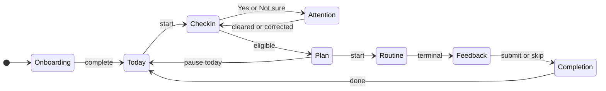

# Kineo v1 App Flow State Machines

| Field | Value |
| --- | --- |
| Status | Approved prototype contract — M1 authorized August 7, 2026 |
| Scope | Onboarding, Today/check-in, attention, plan, routine, feedback, Progress, and Profile |
| Product source | `../KINEO_PRODUCT_DESIGN.md` v0.5 |
| UX source | `../KINEO_UX_DESIGN_SPEC.md` |
| Related documents | `06_UI_ARCHITECTURE_ACCESSIBILITY.md`, `08_TESTING_RELEASE_GATES.md` |

This document defines observable behavior; state names need not become source-code names. A transition completes only after its required write succeeds.

### Lifecycle map

The map shows the main lifecycle. The tables below define guards, writes, recovery, and secondary paths.

## 1. Decisions that remove source ambiguity

These decisions are authoritative for implementation unless the product contract is revised.

1. **Attention is per area and globally blocking.** Any unresolved row blocks every new routine. Preference changes and secondary omission cannot bypass it; primary-only fallback is catalog-only.
2. **The in-routine safety control pauses first.** It creates no persistent Attention state without an explicit conditional-safety answer. Confirming End records `safetyStopped`.
3. **Accidental safety activation never auto-resumes.** It returns to Paused; Resume requires a separate tap.
4. **Pause Today requires Gentle from a current Worse or Limited answer with conditional No.** It counts as one consistency day and cannot bypass Attention.
5. **Feedback is optional per included area.** Users may answer some, none, or all areas; completion never depends on it.
6. **Reset and Delete differ.** Reset removes history and transition audits but retains preferences, acknowledgements, permissions, and the minimum current Attention row. Delete removes all Kineo-owned data and returns to first launch. Neither changes Apple-owned Health data or system permissions.
7. **Onboarding requests no routine preference.** Standard is the first visible duration; Quick remains selectable. Any future preference belongs in Profile after a product decision.
8. **A draft resumes only on the same local day with the same area set.** Otherwise discard it. A committed check-in never powers a second routine.
9. **HealthKit and telemetry are optional.** Their state never blocks core navigation.
10. **The mistake action starts correction but does not clear Attention.** Only a valid submitted correction clears it; `Yes`, `Not sure`, cancellation, or abandonment keeps it.

## 2. State-machine conventions

- `State`: the only currently rendered feature state.
- `Event`: a user action, lifecycle signal, or completed dependency operation.
- `Guard`: a deterministic condition that must be true.
- `Effect`: a local write or domain operation performed before entering the destination.
- `→`: destination state after successful effects.
- A failed required write transitions to the same feature's recoverable persistence-error state with Retry and Cancel. It never fabricates success.
- Back navigation may edit an uncommitted draft. It cannot rewrite a committed decision or completed session.
- Every plan attempt owns a unique session identifier created before the first check-in answer. Repeating on the same day creates a new identifier and new check-in.
- App termination may interrupt any state. Durable states below must reconstruct from local storage; transient animations and sheets need not.

## 3. Root application state

| State | Event | Guard/effect | Destination |
| --- | --- | --- | --- |
| `Launching` | `bootstrapSucceeded` | Read onboarding status, active Attention flags, unfinished routine, and catalog availability | Route by precedence below |
| `Launching` | `protectedDataUnavailable` | Do not attempt destructive recovery; explain that protected local data is unavailable while device is locked | `ProtectedDataUnavailable` |
| `ProtectedDataUnavailable` | `protectedDataBecameAvailable` | Retry bootstrap | `Launching` |
| Any non-routine state | `onboardingIncomplete` | — | `Onboarding` at first incomplete step |
| Any non-routine state | `onboardingComplete` | — | `MainTabs.Today` |
| `MainTabs` | `selectTab(Today/Progress/Profile)` | Retain an independent navigation path per tab | Selected tab root |
| Any state | `deleteAllCommitted` | Complete deletion transaction | `Onboarding.Welcome` |

Bootstrap precedence is: protected-data availability, onboarding, then main tabs. Attention flags affect Today content but do not block access to Progress, Profile, privacy, deletion, support, or safety information. An unfinished routine never auto-resumes into active playback; Today offers an explicit Resume or End choice and reconstructs it paused.

## 4. Onboarding state machine

Durable checkpoint: persist each completed step. No notification, HealthKit, or telemetry permission appears in this machine.

| State | Event | Guard/effect | Destination |
| --- | --- | --- | --- |
| `Welcome` | `getStarted` | — | `AgeConfirmation` |
| `AgeConfirmation` | `answeredYes` | Persist adult eligibility acknowledgement and copy version | `PrimaryArea` |
| `AgeConfirmation` | `answeredNo` | Store no birth date | `AgeUnavailable` |
| `AgeUnavailable` | `correctAnswer` | — | `AgeConfirmation` |
| `PrimaryArea` | `select(area)` | Area is Neck, Upper/Mid-back, or Lower back | `PrimaryArea` with selection |
| `PrimaryArea` | `continue` | A primary is selected; persist it | `SecondaryArea` |
| `SecondaryArea` | `select(None or area)` | Secondary differs from primary | `SecondaryArea` with selection |
| `SecondaryArea` | `continue` | Persist optional secondary | `SafetyBoundary` |
| `SecondaryArea` | `back` | Preserve current draft | `PrimaryArea` |
| `SafetyBoundary` | `acknowledge` | Persist acknowledgement plus exact copy version; acknowledgement does not certify safety | `FirstCheckInHandoff` |
| `FirstCheckInHandoff` | `startCheckIn` | Atomically mark onboarding complete and create a new draft session | `CheckIn` |

If the app terminates before `startCheckIn`, it returns to the last incomplete onboarding step. If the selected primary changes while navigating backward, an invalid duplicate secondary is cleared before continuing. Under-18 users retain access only to the unavailable explanation and correction path; they cannot enter the main tabs.

## 5. Today and check-in state machine

### 5.1 Today entry precedence

When Today becomes active, evaluate in this order:

1. If an unfinished routine exists, show `InterruptedRoutineChoice`.
2. If any supported area has Attention Required, show its `AttentionReturn` and withhold all routines.
3. If more than one area is flagged, resolve each return prompt before a new check-in, in stable body-area order.
4. If a same-day, same-area-set check-in draft exists, offer Resume Check-in or Start Over.
5. Otherwise show `TodayReady`.

### 5.2 Check-in collection

Each included area owns `{change?, comfort?, safetyAnswer?}`. Primary is required. Secondary is initially included but may be omitted before commit. A safety answer is required for an area when `change == Worse` or `comfort == Limited`.

| State | Event | Guard/effect | Destination |
| --- | --- | --- | --- |
| `TodayReady` | `startCheckIn` | Create unique draft session with current area snapshot and local-day key | `CollectingAnswers` |
| `CollectingAnswers` | `setChange(area, value)` | Area is currently included; update presentation draft | Re-evaluate completeness |
| `CollectingAnswers` | `setComfort(area, value)` | Area is currently included; update presentation draft | Re-evaluate completeness |
| `CollectingAnswers` | `omitSecondary` | Target is secondary and has not supplied a triggering Worse/Limited answer; clear its draft answers and persist omission | `CollectingAnswers` |
| `CollectingAnswers` | `continue` | Primary has both answers and each included area has both answers | `SafetyQuestion(nextTriggeredArea)` or `CommitCheckIn` |
| `SafetyQuestion(area)` | `answerNo` | Complete that area's draft entry with `No`; do not create Attention | Next unresolved safety question or `CommitCheckIn` |
| `SafetyQuestion(area)` | `answerYes` | Complete that area's draft entry with the actual answer; mark the area for an Attention transition at commit | Next unresolved safety question or `CommitCheckIn` |
| `SafetyQuestion(area)` | `answerNotSure` | Same effect as Yes, preserving actual answer | Next unresolved safety question or `CommitCheckIn` |
| `SafetyQuestion(area)` | `selectedByMistake` | Clear that area's triggering answer and safety answer | `CollectingAnswers` focused on that area |
| `CommitCheckIn` | `commitSucceededEligible` | Atomically freeze all included entries; every triggered answer is No | `PlanPreparing` |
| `CommitCheckIn` | `commitSucceededBlocked` | Atomically freeze all included entries and enter Attention for every Yes/Not sure area; create no selection decision | `AttentionGuidance(flaggedAreas)` |
| Any draft state | `startOverConfirmed` | Delete only uncommitted draft | `TodayReady` |

When both areas trigger the safety question, ask about the primary first, then secondary so every included entry is complete and every affected area's state is accurate. Any Yes/Not sure makes the eventual commit blocked; no plan can be created. The secondary cannot be removed after a triggering Worse/Limited answer. Partial answers are presentation state; only a complete area entry is persisted, so process termination may require re-answering an incomplete area. A new routine attempt begins only after every global Attention row is cleared through the documented return/correction flow; historical answers from the blocked session are never reused.

### 5.3 Attention Required

Attention state is stored per body area, not per preference slot. Changing primary/secondary ordering does not clear it.

| State | Event | Guard/effect | Destination |
| --- | --- | --- | --- |
| `AttentionGuidance(any flagged area)` | `done` | Check-in remains an immutable blocked record; no routine or selection decision exists | `TodayAttentionBlocked` |
| `AttentionGuidance(area)` | `selectedByMistake` | Keep Attention and create a fresh correction draft for the named area | `CorrectionCheckIn(area)` |
| `TodayAttentionBlocked` | `visitToday` | — | `AttentionReturn(nextFlaggedAreaInStableOrder)` |
| `AttentionReturn(area)` | `returnedToUsualYes` | Clear only this area's Attention flag; do not infer check-in answers | Next flagged-area return prompt or `TodayReady` |
| `AttentionReturn(area)` | `returnedToUsualNo` | Preserve flag and answer audit | `AttentionGuidance(area)` |
| `AttentionReturn(area)` | `returnedToUsualNotSure` | Preserve flag and actual answer | `AttentionGuidance(area)` |
| `AttentionReturn(area)` | `selectedByMistake` | Keep Attention and create a fresh correction draft for the named area | `CorrectionCheckIn(area)` |

Correction is a fresh check-in flow; the blocked check-in is never mutated or reused:

| State | Event | Guard/effect | Destination |
| --- | --- | --- | --- |
| `CorrectionCheckIn(area)` | `submit(nonTriggeringEntry)` | Atomically save the fresh entry, append correction-clear event, and remove only that area's Attention row | Next global `AttentionReturn` or continue completing this fresh `CollectingAnswers` |
| `CorrectionCheckIn(area)` | `submit(triggeringEntry + No)` | Same clear transaction; No is preserved | Next global `AttentionReturn` or continue completing this fresh `CollectingAnswers` |
| `CorrectionCheckIn(area)` | `submit(triggeringEntry + Yes/NotSure)` | Complete fresh record, append reaffirm event, and keep Attention | `AttentionGuidance(area)` |
| `CorrectionCheckIn(area)` | `cancel/appTerminates` | Leave current Attention row unchanged; an incomplete draft may be discarded | `AttentionReturn(area)` on next entry |

After the final flag clears, the user continues any remaining questions in the fresh check-in. Only that complete fresh check-in may reach plan preparation; the blocked check-in never can.

“Returned to usual” only clears the persistent gate. It never generates a routine or reuses the answers that originally caused Attention; the user must complete a fresh check-in. Selecting by mistake only opens correction. A submitted valid correction appends an audit event and may clear the row; prior blocked answers remain immutable.

## 6. Plan preparation and presentation

Plan preparation is a deterministic domain operation over the frozen check-in, per-area history, rules version, and installed catalog version. HealthKit is not an input.

| State | Event | Guard/effect | Destination |
| --- | --- | --- | --- |
| `PlanPreparing` | `standardRevisionSelected` | Run pure selection plus bounded Standard composition and atomically append revision 1 with inputs, recommendation, selected/delivered level, included areas, reasons (maximum two), and rules/catalog/content versions | `PlanReady(Standard)` |
| `PlanPreparing` | `safetyBlocked` | This should already have routed through Attention; fail closed if encountered | `AttentionGuidance` |
| `PlanPreparing` | `secondaryPairUnavailable` | Safety is normal for both areas; append a Standard primary-only revision with exact catalog omission reason | `SecondaryOmitted` then `PlanReady(Standard)` |
| `PlanPreparing` | `candidateLevelUnavailable` | Attempt only approved successively gentler Standard content; append the delivered fallback or unavailable revision | `GentlerFallbackDisclosure` then `PlanReady(Standard)`, or `ContentUnavailable` |
| `PlanReady` | `selectDuration(new Quick/Standard)` | If changed, repeat deterministic selection/composition over the frozen check-in and append an immutable revision; duration cannot alter recommended level | Newest `PlanReady` or `ContentUnavailable` |
| `PlanReady` | `chooseGentler(level)` | Target is lower than recommended and allowed; repeat selection/composition for current duration and append an immutable override revision | Newest `PlanReady` or `ContentUnavailable` |
| `PlanReady` | `chooseHigher(level)` | Reject; v1 UI does not present a level more active than the frozen recommendation | Remain `PlanReady` |
| `PlanReady` | `pauseToday` | Guard: the current completed check-in produced Gentle because at least one included area reported Worse or Limited and every required conditional answer is No; no Attention row exists. Store one Pause Today event for this check-in; create no routine session. | `PauseTodayConfirmation` then `TodayReady` |
| `PlanReady` | `start` | Revalidate the newest selected revision, installed catalog fingerprint, and absence of any global Attention row; atomically create a `prepared` session referencing that revision | `RoutineLoading` after commit |
| `ContentUnavailable` | `chooseOtherDurationOrAllowedLevel` | When a prior option exists, recompute over the same frozen check-in and append another immutable revision | Newest `PlanReady` or remain `ContentUnavailable` |
| `ContentUnavailable` | `done` | Preserve check-in and failed decision audit; no unrelated content | `TodayReady` |

Every displayed plan is an immutable decision/composition revision over the same frozen check-in. Changing duration or choosing a permitted gentler level appends a revision; it never edits history. Start references only the newest successful revision. If required installed media is missing, Start is disabled and the app uses `ContentUnavailable`; connectivity is not a required recovery path.

## 7. Guided routine state machine

Durable session status uses the data-contract values `prepared`, `inProgress`, `paused`, `completed`, `stopped`, `safetyStopped`, or `abandoned`. The latter three are incomplete terminal outcomes; they are not collapsed into a persisted `incomplete` value. Current step, elapsed progress, selected alternative, and skips are checkpointed at meaningful boundaries. Timers use monotonic elapsed time; backgrounding auto-pauses and never advances unseen.

| State | Event | Guard/effect | Destination |
| --- | --- | --- | --- |
| `RoutineLoading` | `assetsValidated` | Atomically transition `prepared` to `inProgress`, append the single start event, and checkpoint the first step | `StepReady` |
| `RoutineLoading` | `assetsInvalid` | Mark the prepared session `abandoned`, retain its audit, and do not play partial content | `ContentUnavailable` |
| `StepReady` | `beginStep` | — | `StepActive` |
| `StepActive` | `timerOrRepsComplete` | Checkpoint completed step | `StepReady(next)` or `RoutineCompleting` |
| `StepActive` | `pause` | Freeze monotonic timer and checkpoint | `RoutinePaused` |
| `StepActive` | `appBackgrounded/interrupted` | Same as Pause; no automatic resume | `RoutinePaused` |
| `RoutinePaused` | `resume` | Ordinary pause only | `StepActive` |
| `StepReady/StepActive` | `skip(reason?)` | Record source module, step, optional local reason; no replacement invented | `StepReady(next)` or `RoutineCompleting` |
| `StepReady/StepActive` | `requestAlternative` | Approved alternative exists for this content/version; remember the source state. If source is `StepActive`, freeze the monotonic timer and checkpoint before presentation. | `AlternativePreview` |
| `AlternativePreview` | `useAlternative(reason?)` | Replace only current step with approved ID; persist relation and optional reason | `StepReady(alternative)` |
| `AlternativePreview` | `cancel` | Timer remains frozen. Return to `StepReady` when opened from `StepReady`; return to `RoutinePaused` when opened from `StepActive`. Resuming playback always requires an explicit action. | `StepReady` or `RoutinePaused` by remembered source |
| `StepReady/StepActive/RoutinePaused` | `requestEnd` | Remember the source. If a timer is active, freeze it and checkpoint before presentation; otherwise preserve the last committed checkpoint. | `EndConfirmation` |
| `EndConfirmation` | `cancel` | Timer remains frozen; return to `StepReady` only when opened from `StepReady`, otherwise return to `RoutinePaused` | `StepReady` or `RoutinePaused` by remembered source |
| `EndConfirmation` | `confirmEnd` | Mark `stopped`; preserve explicit history | `Feedback` |
| `StepReady/StepActive/RoutinePaused` | `somethingFeelsWrong` | Stop timer/media immediately; checkpoint safety interruption | `SafetyGuidance` |
| `SafetyGuidance` | `endRoutine` | Mark `safetyStopped`; do not create persistent Attention without an explicit safety answer | `Feedback` |
| `SafetyGuidance` | `tappedByMistake` | Preserve the interruption audit; keep timer/media stopped | `RoutinePaused` |
| `RoutineCompleting` | `commitSucceeded` | Mark completed exactly once | `Feedback` |

Returning from an accidental activation never resumes playback directly; the user must make a separate Resume action from `RoutinePaused`. Repeated taps and lifecycle callbacks must be idempotent: a step, routine completion, skip, or feedback record cannot be written twice. A routine is never marked completed merely because its nominal timer elapsed while the app was backgrounded. Skip and alternative controls are unavailable when their next valid state does not exist; the UI explains absence rather than improvising content.

## 8. Feedback and completion state machine

Feedback rows exist only for areas actually included in the composed routine. Omitted secondary areas never receive a response prompt.

| State | Event | Guard/effect | Destination |
| --- | --- | --- | --- |
| `FeedbackDraft(area)` | `answer(Better/Same/Worse)` | Update only the in-memory response draft for that included area | Next included area or review state |
| `FeedbackDraft(area)` | `skipArea` | Leave that area's response absent; create no placeholder row | Next included area or review state |
| `FeedbackDraft` | `submit` | Atomically insert all supplied per-area responses; absent areas create no rows; a Worse response becomes that area's next derived reset boundary | `Completion` |
| `FeedbackDraft` | `skipAll` | Commit no feedback rows | `Completion` |
| `Completion` | `done` | Session already has its committed terminal status; recompute local Progress read model | `TodayReady` |
| `Completion` | `startAnother` | Create a new session and require a new check-in | `CollectingAnswers` |

A record qualifies in the derived Active-unlock sequence only when the routine status is completed, the selected level was Gentle or Balanced, and that area's explicit response is Better or Same. Skipped feedback and incomplete routines never qualify. An explicit response after an incomplete routine becomes the area's most recent response but does not qualify. The draft may be corrected until Submit; submission is one idempotent transaction, and Completion freezes it.

## 9. Progress state machine

Progress is a projection of local records, never a second source of truth.

| State | Event | Guard/effect | Destination |
| --- | --- | --- | --- |
| `ProgressLoading` | `projectionEmpty` | No qualifying local history | `ProgressEmpty` |
| `ProgressLoading` | `projectionReady` | Derive all personal values on-device | `ProgressOverview` |
| `ProgressOverview` | `selectArea(area)` | Area is supported; do not merge histories | `AreaDetail(area)` |
| `ProgressOverview/AreaDetail` | `historyChanged` | Recompute projection | Same logical screen with updated values |
| `ProgressOverview` | `healthContextAvailable` | Render in a visually separate, non-causal section | `ProgressOverview` |
| `ProgressOverview` | `healthDenied/missing/stale` | Hide comparative claims; core projection unchanged | `ProgressOverview` |
| Any Progress state | `dataDeleted` | Clear cached projections | `ProgressEmpty` or root launch after Delete All |

Consistency counts completed routines, intentional stops, and qualifying Pause Today events equally as participation; it never weights Active above other levels. Charts must label values and avoid causal wording. Progress never mutates source history.

## 10. Profile state machines

### 10.1 Areas

| State | Event | Guard/effect | Destination |
| --- | --- | --- | --- |
| `AreasEditing` | `changePrimary(area)` | Clear secondary if duplicate; retain all area histories and Attention flags; omitted flags continue to gate new routines | `AreasEditing` |
| `AreasEditing` | `changeSecondary(None/area)` | Secondary differs from primary | `AreasEditing` |
| `AreasEditing` | `save` | Persist valid area set; invalidate incompatible check-in draft, not committed history | `ProfileRoot` |

### 10.2 Reminders

| State | Event | Guard/effect | Destination |
| --- | --- | --- | --- |
| `RemindersOff` | `chooseWindow(window)` | Persist desired neutral window before requesting permission | `NotificationPermissionRequest` |
| `NotificationPermissionRequest` | `authorized` | Schedule content with no sensitive lock-screen values | `RemindersOn` |
| `NotificationPermissionRequest` | `denied` | Preserve app function; show system-settings route | `RemindersDenied` |
| `RemindersOn` | `disable` | Cancel pending Kineo notifications | `RemindersOff` |
| `RemindersOn` | `changeWindow` | Replace pending schedule idempotently | `RemindersOn` |

### 10.3 Health app context

| State | Event | Guard/effect | Destination |
| --- | --- | --- | --- |
| `HealthNotConnected` | `learnAndConnect` | Explain data types and context-only boundary before system request | `HealthPermissionRequest` |
| `HealthPermissionRequest` | `requestCompleted` | Enable approved local queries; do not copy raw samples and do not infer whether read access was denied | `HealthConnectedWithContext` or `HealthNoContext` from observable query results |
| `HealthPermissionRequest` | `requestFailed/healthDataUnavailable` | No core-flow effect | `HealthUnavailable` |
| `HealthConnectedWithContext/HealthNoContext` | `disableKineoUse` | Stop Kineo reads and discard Kineo-derived context; link to system flow for permission changes | `HealthNotConnected` |

Health context remains feature-flagged off until its baseline rules are approved. The disabled state must not request permission.

### 10.4 Telemetry choice

Telemetry is compiled/configured off unless a separately reviewed implementation exists. If enabled, its prompt becomes eligible only after the first routine reaches Completion.

| State | Event | Guard/effect | Destination |
| --- | --- | --- | --- |
| `TelemetryNotAsked` | `firstRoutineFinished` | Show later, outside Completion's required path | `TelemetryChoiceEligible` |
| `TelemetryChoiceEligible` | `nextEligibleAppForeground` | Telemetry implementation and prompt copy are enabled; app is idle outside onboarding, routine, Completion, Attention guidance, and any other modal | `TelemetryChoice` |
| `TelemetryChoice` | `optIn` | Persist explicit consent version before collecting; no historical backfill | `TelemetryOn` |
| `TelemetryChoice` | `notNow/optOut` | Clear pending permitted events | `TelemetryOff` |
| `TelemetryOn` | `disable` | Stop collection immediately and delete pending events | `TelemetryOff` |

### 10.5 Reset and deletion

| State | Event | Guard/effect | Destination |
| --- | --- | --- | --- |
| `PrivacyAndData` | `requestResetHistory` | — | `ResetHistoryConfirmation` |
| `ResetHistoryConfirmation` | `confirm` | Atomic scoped deletion per section 1 decision 6; cancel notifications only if history-dependent (v1: none) | `ResetComplete` then `ProfileRoot` |
| `PrivacyAndData` | `requestDeleteAll` | — | `DeleteAllConfirmation` |
| `DeleteAllConfirmation` | `confirm` | Atomic deletion of all Kineo records, derived files, installed mutable content, and pending telemetry; cancel notifications | `DeletionVerifying` |
| `DeletionVerifying` | `verifiedEmpty` | Recreate only non-sensitive app defaults | `Onboarding.Welcome` |
| Either confirmation | `cancel` | No mutation | `PrivacyAndData` |

Delete confirmations explicitly state that Apple-owned Health data, Apple-managed diagnostics, and system permission history are not deleted by Kineo.

## 11. Navigation invariants

1. Main tab switching cannot discard a committed check-in or an active routine.
2. A routine is full-screen and suppresses tab navigation until it reaches a terminal status.
3. A modal confirmation cannot be stacked on another modal. Resolve or dismiss the current modal first.
4. Deep links and notifications may open only non-sensitive roots in v1. They cannot bypass onboarding, Attention, check-in, or plan rules.
5. Back navigation never exposes Active, a routine, or an area that the current frozen decision did not allow; no route or preference change bypasses a global Attention row.
6. Offline status changes presentation only; they do not reroute local core flows.
7. Every destructive transition is explicit, cancellable until commit begins, and blocked against concurrent session writes.

## 12. Acceptance mapping

The state machines directly cover product acceptance scenarios as follows:

- Onboarding: 1, 8, 10.
- Check-in and Attention: 2–7, 19, 20.
- Plan/composition: 8–12, 21–22, 27.
- Guided routine and feedback: 13–14, 17–18, 26–27.
- Progress/Profile/platform behavior: 15–16, 23–25, 28.

Executable coverage and evidence requirements are defined in `08_TESTING_RELEASE_GATES.md`.

## 13. Deferred, not ambiguous

These items may use explicit prototype fixtures but cannot silently become production decisions:

- Professionally reviewed safety wording and movement content.
- Production Quick/Standard durations and Active threshold.
- HealthKit baseline window and valid-day threshold; feature remains off until approved.
- Telemetry vendor and data flow; telemetry remains off until approved.
- Demonstration format/provider and production media.
- Regulatory intended-use determination.

## 14. UX alignment

The UX contract uses the same global Attention gate, correction workflow, catalog-only `E3` fallback, and pause-before-guidance routine behavior defined here.
