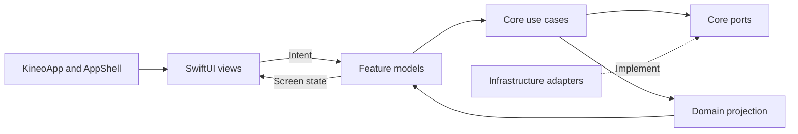

# Kineo v1 UI Architecture and Accessibility

| Field | Value |
| --- | --- |
| Status | Approved prototype contract — M1–M3 complete; M4–M12 sequentially authorized subject to documented gates |
| Platform | Native iPhone, SwiftUI, iOS 17 minimum |
| Owns | Presentation boundaries, navigation, reusable UI, adaptive layout, assistive behavior |
| Depends on | `01_APP_ARCHITECTURE.md`, `05_APP_FLOW_STATE_MACHINES.md`, `07_PLATFORM_SERVICES.md` |
| Sources | `../KINEO_PRODUCT_DESIGN.md`, `../KINEO_UX_DESIGN_SPEC.md` |

This document specifies how domain state becomes an accessible iPhone experience. It does not contain selection, safety, persistence, or catalog rules. Those rules enter the UI only as typed use-case results.

## 1. UI architecture principles

1. Views render state and send user intent; they do not select levels, infer eligibility, query storage, or call Apple service singletons.
2. Domain use cases are the only mutation boundary. UI models cannot reproduce safety or selection tables.
3. Navigation is derived from valid feature state. A route cannot grant access to a plan or routine that Core did not create.
4. Accessibility semantics are part of each component's definition and acceptance tests.
5. System settings drive text size, contrast, color differentiation, motion, and appearance. Fixed-height layouts may not override them.
6. The daily decision and its explanation remain more prominent than content browsing. There is no library route.
7. Offline is normal. The network-free prototype shows no offline warning; a future remote-only section may show its own local status.
8. Safety presentation is calm and unmistakable, never destructive-red, diagnostic, or reassuring beyond the reviewed wording.

## 2. Presentation layers

Only screen state and user intent cross the View–Model boundary. Framework and database types stop at infrastructure adapters.

### 2.1 App shell responsibilities

`AppShellModel` owns only:

- launch/bootstrap presentation;
- onboarding versus main-tabs routing;
- independent Today, Progress, and Profile paths;
- one modal route;
- one full-screen routine route;
- handling non-sensitive notification/deep-link destinations;
- responding to Delete All by clearing UI paths and returning to Welcome.

It does not own check-in answers, a selection result, timer truth, permission state, or database records. Root restoration stores only a non-sensitive route hint; it reconstructs durable state through use cases.

### 2.2 Feature-model contract

Every screen model is `@MainActor` and exposes a closed screen state containing:

- content values already formatted or represented by localization keys;
- enabled/disabled and selected states;
- a stable accessibility identity for focus restoration;
- a loading or submitting flag only when an actual asynchronous operation exists;
- one recoverable error presentation when the previous committed state is still safe.

User intents are named for user meaning (`confirmAge`, `chooseDuration`, `pauseRoutine`), not control mechanics (`buttonTapped`). Each intent is idempotent while an operation is in flight. A view never launches an unstructured task.

Feature models must not expose database rows, HealthKit types, media-player objects, catalog JSON, or arbitrary error strings.

## 3. Feature ownership

| Feature model | Owns in presentation | Calls | Must not own |
| --- | --- | --- | --- |
| `OnboardingModel` | Current onboarding step and uncommitted choices | Load/save onboarding checkpoint | Age inference, permission prompts, catalog rules |
| `TodayModel` | Today summary, entry precedence, omission/attention disclosure | Load Today state, start/restart check-in, recover interrupted routine | Selection matrix, history queries |
| `CheckInModel` | Draft rows, progress, focus, conditional-question presentation | Save draft, commit check-in, transition Attention | Level calculation, HealthKit context |
| `AttentionModel` | Named flagged area, global routine withholding, approved guidance, return choices, fresh correction draft | Read flags; submit return answer; start/submit correction | Diagnosis, urgency classification, clearing on correction-entry tap, area-preference bypass |
| `PlanModel` | Newest immutable plan revision, reason, included/omitted areas, allowed levels, visible Standard/Quick choice | Prepare/append revision, pause today, begin newest revision | Constructing explanations, composing movements |
| `RoutineModel` | Current step projection including authored step duration, controls, derived elapsed/remaining display values, and paused/alternative/safety sheets | Session commands and checkpoint stream | Timer source of truth, unapproved alternatives |
| `FeedbackModel` | Included-area response rows and optional progress | Save/correct current-screen feedback, skip | Qualification arithmetic |
| `ProgressModel` | On-device read projection, selected area, optional separate Health context | Load/reload projection | Causal claims, mutable history |
| `ProfileModel` | Menu sections and status summaries | Load preference/permission summaries | Direct settings or database operations |
| Focused Profile models | Area draft, reminders, Health context, telemetry, privacy/deletion | Corresponding use cases | Cross-feature business rules |

After a committed mutation, the model reloads or receives the authoritative returned domain projection. It must not optimistically invent a durable success state. Purely visual selection within an uncommitted draft may update immediately.

## 4. Navigation contract

### 4.1 Root and tabs

- Root routes: `protectedDataUnavailable`, `onboarding`, `mainTabs`.
- Main tabs: Today, Progress, Profile.
- Each tab owns a separate typed navigation path; switching tabs retains its path.
- Today is the default after onboarding, routine completion, or notification open.
- Any unresolved supported-area Attention row blocks all plan creation, not access to Progress/Profile, privacy, support, or deletion.
- Routine runs in a full-screen presentation. Tab and interactive-dismiss gestures are unavailable while active.

### 4.2 Route inventory

| Feature | Push routes | Modal routes |
| --- | --- | --- |
| Onboarding | Age, primary area, secondary area, safety boundary, handoff | Age unavailable |
| Today | Check-in, conditional safety, Attention return/guidance, correction check-in, plan, content unavailable | Start over, Pause Today, secondary omitted disclosure |
| Routine | Full-screen routine and feedback/completion continuation | Pause, alternative preview, End confirmation, safety guidance |
| Progress | Area detail | Health context explanation |
| Profile | Areas, reminders, Health context, privacy/data, safety, support, app information | Permission rationale, telemetry choice, Reset confirmation, Delete confirmation |

There may be only one modal route at a time. Safety guidance replaces an ordinary routine modal rather than stacking over it. Delete and Reset confirmations cannot coexist with a routine.

### 4.3 Route guards

- Opening Plan requires an immutable persisted plan projection.
- Opening Routine requires a prepared session and validated installed assets.
- Opening Feedback requires a terminal routine status.
- Opening or starting Plan requires global Attention preflight, including areas no longer selected in Profile.
- The first Plan renders committed Standard revision 1 as selected. When Quick/Standard or a gentler level changes, Start is disabled until the new immutable revision commits; failure leaves the prior committed revision truthful and offers Retry rather than starting stale content under the new visual choice.
- A deep link may open only Today, Progress root, Profile root, safety information, or support. It cannot address a check-in, plan, session, or history record.
- A notification always opens Today and requires the normal entry-precedence evaluation.
- Back from a committed plan returns to Today without allowing committed answers to be edited. Starting again creates a new check-in.
- On relaunch, an active/in-progress session appears paused behind a Resume or End decision.

## 5. Screen composition and reusable components

Use Apple navigation, tab, sheet, alert, segmented-control, and symbol behavior wherever it meets the contract. Kineo components own the product-specific visual and semantic behavior below.

### 5.1 Design tokens

- Use semantic Dynamic Type text styles; SF Pro is inherited from the system.
- Kineo colors use semantic roles: accent, pressed accent, accent surface, canvas, attention surface/text, destructive, separator, primary label, secondary label.
- Light/dark/high-contrast variants are defined at the asset/token layer. Feature views never embed raw color literals.
- Spacing uses the 8/12/16/20/24/32 scale from the UX specification.
- Minimum interactive frame is 44 × 44 pt; standard primary controls are at least 52 pt high and may grow.
- Card and control radii follow the UX specification but must not force a fixed content height.

### 5.2 Component semantic contract

| Component | Required semantics | Adaptive behavior |
| --- | --- | --- |
| `KButton` | Native Button trait; concise label; disabled reason available in nearby text when consequential | Multiline label, full-width when needed, no fixed height |
| `KChoiceCard` | One Button; selected value/trait; title and subtitle combined in logical order | Vertical text reflow; checkmark remains adjacent; cards stack |
| `KPlanCard` | Heading identifies level; reason follows; included/omitted areas named; Start is a separate Button | Sections stack; duration control becomes vertical choices at large text |
| `KLevelPill` | Spoken as “Gentle level,” etc.; text plus shape/symbol | May expand to capsule or inline label; never icon-only |
| `KNoticeCard` | Heading plus body; attention is not exposed as destructive | Action follows body in focus order; wraps vertically |
| `KRoutineStep` | Movement heading, concise instruction, safety cue, count/timer, controls; media description independent | Media may shrink, but text/controls never; content scrolls while primary controls remain reachable |
| `KResponseChoice` | One Button with Better/Same/Worse label and selected state | Vertical list at accessibility sizes; neutral tone |

Repeated visual groups must use these components rather than hand-built copies. Native accessibility behavior is preferred; custom traits/actions are added only when they make operation clearer.

### 5.3 Screen layout rules

- Reference width is 402 pt, but every screen supports the smallest iPhone width allowed by iOS 17 and larger widths without horizontal scrolling.
- Content uses a vertical scroll container whenever it can grow. Safe-area and keyboard avoidance are automatic.
- Primary actions belong after the content they commit. At regular text sizes they may use a safe-area inset; at accessibility sizes they participate in scroll flow if a fixed footer would obscure content.
- Do not put two long actions side by side. Destructive and Cancel actions stack at large text.
- Compact two-area rows may become vertically stacked area sections. “At most four taps” refers to answers, not a permanently dense grid.
- Charts have a text summary and labeled values; the chart itself may horizontally adapt but never becomes the only information source.
- Media aspect ratio is bounded. Routine instruction and safety text always remain visible by scrolling even if media fails.

## 6. Loading, empty, error, and offline presentation

Core local reads should normally resolve without a blocking spinner. If a state is genuinely loading:

- preserve the last valid non-sensitive screen when possible;
- expose progress semantics without indefinite animation-only feedback;
- after failure, explain what was not saved or loaded and offer Retry;
- never show a plan, completion, deletion, or consent success before its transaction commits.

Required states:

| Condition | Presentation |
| --- | --- |
| No Progress history | Purposeful empty state explaining when patterns appear |
| Content/catalog unavailable | No Start; plain explanation; no unrelated substitute |
| Secondary catalog module unavailable/incompatible | After both areas pass safety, name the content omission and confirm the approved primary-only plan |
| Any supported area safety-flagged | Withhold all new routines until every flag is resolved; name the area even when it is not a current preference, and do not present an area-removal bypass |
| Offline | No indicator in the network-free initial prototype because core behavior is unchanged; a future approved remote-only context may show a local notice within that optional section |
| Health context unavailable | Only its separate optional section changes |
| Protected data unavailable | Blocking root state until device data becomes available; never appear as “new user” |
| Persistence write failed | Stay before the transition; Retry and safe Cancel |
| Deletion failed verification | Remain in privacy flow; do not claim completion |

Error copy contains no medical interpretation and no sensitive value suitable for a screenshot or system log unless the value is already necessary on the visible screen.

## 7. Dynamic Type and text

### 7.1 Required behavior

- Use semantic text styles with scaling enabled; do not manually shrink or cap content text.
- Support every system Dynamic Type category, including all accessibility categories.
- Common tasks must remain complete at 200% or greater. The implementation gate tests the maximum category as well.
- Labels may wrap to multiple lines. Line limits are prohibited on instructions, safety text, reasons, action labels, area names, and data-deletion explanations.
- Truncation is allowed only for non-essential decorative metadata and must not remove meaning.
- Fixed vertical frames around text are prohibited.
- Layout decisions use size-category-aware composition, not geometry-reader guesses based on text length.

### 7.2 Required reflow by feature

- Onboarding and check-in choice grids become single-column lists.
- Two-area check-in renders one full area section after the other.
- Quick/Standard segmented presentation becomes two labeled choice controls if either label or explanation would compress.
- Routine transport controls use a vertical or two-row layout with full Voice Control names.
- Feedback uses one response per row, then one area after another.
- Progress charts move below their text summaries and permit vertical page scrolling.
- Profile rows allow multiline titles/statuses; destructive explanations appear above the action.

## 8. VoiceOver contract

### 8.1 General semantics

- Focus order follows visible reading order: title, context, choices, explanation, primary action, secondary actions.
- Screen title receives initial focus after a push. After an in-place state change, focus moves to the changed heading or error, not back to the first element.
- Decorative movement paths and redundant imagery are hidden.
- Meaningful images have concise descriptions; instructional media descriptions communicate the movement without requiring sight.
- Selected choices expose selected state. Do not announce a visual color name.
- Disabled actions with important prerequisites have an adjacent accessible explanation; a disabled control alone is insufficient.
- Modal presentations contain focus until dismissed. On dismissal, focus returns to the initiating control when it still exists.

### 8.2 State-change announcements

Announce only meaningful changes:

- selection accepted when the selected state is not otherwise obvious;
- “Plan ready: Gentle” after plan preparation;
- routine paused, resumed, step changed, or completed;
- alternative applied;
- recoverable save failure;
- Attention guidance heading when it replaces a flow;
- after “I tapped this by mistake,” announce that the routine is paused and move focus to the Paused heading; playback remains stopped;
- deletion success only after verification.

Do not announce timer changes every second. Announce the initial remaining time, selected sparse milestones (for example halfway and final short interval), pause/resume, and completion. A user can focus the timer to hear its current value at any time.

### 8.3 Routine custom actions

The primary visible controls remain Pause/Resume, Alternative when available, Skip, End, and Something feels wrong. VoiceOver custom actions may duplicate these for convenience but cannot be the only way to invoke them. “Something feels wrong” stays discoverable without entering the media element.

## 9. Voice Control, Switch Control, and interaction alternatives

- Every visible action has a unique, stable spoken name on its screen. Avoid multiple unlabeled “More,” “Done,” or “Next” controls.
- The accessible label includes the visible wording so Voice Control users can say what they see.
- No required action uses swipe-only rows, drag handles, long press, precise scrubbing, or gesture-only video controls.
- Swipe actions, if present for convenience, have an always-visible alternative.
- Switch Control focus reaches all actions in a logical order with no focus traps.
- Timers and repetitions do not require precise timing to operate.
- Routine controls remain at least 44 pt and sufficiently separated for use when the phone is positioned away from the user.

## 10. Color, contrast, appearance, and non-color meaning

- Text and meaningful graphics meet WCAG AA contrast at every supported appearance; large-text exceptions are not used to excuse body-copy contrast.
- Selected/unselected state uses written value plus border/checkmark/trait, not green alone.
- Gentle, Balanced, and Active always show names plus distinguishable symbols/shapes.
- Better, Same, and Worse use text plus directional symbols and neutral styling.
- Charts include labels, values, and patterns/shapes when needed under Differentiate Without Color.
- Attention uses an amber semantic surface plus heading/symbol; deletion alone uses destructive red.
- Increase Contrast strengthens borders/text without changing meaning or layout.
- Light and dark appearances retain media overlays, captions, separators, and focus visibility.

The palette's prior desktop contrast calculation is useful evidence but not release evidence. Rendered iOS states, opacity, disabled treatments, materials, and media overlays require device/screenshot verification.

## 11. Motion, haptics, sound, and media

- Respect Reduce Motion through the environment on every animated transition.
- With Reduce Motion on, replace decorative movement-path drawing, parallax, bounce, pulse, continuous progress, and matched-geometry transitions with static or cross-fade changes.
- Navigation and state changes retain clear written progress without motion.
- No information or completion depends on animation, haptics, or sound.
- Haptics are optional confirmation only and follow system settings.
- Spoken guidance is optional and duplicates visible text. Meaningful speech in video has synchronized captions. Silent demonstrations have an equivalent accessible description.
- Media auto-play is prohibited when it would create continuous motion or unexpected audio. User playback preference must respect Reduce Motion and system audio behavior.
- The timer is textual and accessible even when all animation is disabled.

## 12. Safety and language presentation

- Use the exact reviewed safety-copy identifier supplied by the catalog/configuration; feature views do not assemble safety sentences.
- Name the affected area where necessary, but do not diagnose or claim Kineo determined safety.
- `Yes` and `Not sure` lead to the same withheld-routine behavior while preserving the user's actual answer.
- “Selected by mistake” is visually secondary, explicit, and opens a fresh relevant correction entry. The Attention row visibly remains until a valid corrected entry commits; cancelling or losing that draft does not unlock routines.
- A Yes/Not sure answer for any area included in the current check-in withholds that session. Any unresolved Attention row then globally withholds new routines even if the area is removed from Profile; the UI cannot convert a safety result into a primary-only plan through preference changes.
- A secondary omission disclosure is used only for missing or incompatible approved catalog content after both included areas pass safety gating.
- Routine safety guidance interrupts media immediately and offers End Routine plus “I tapped this by mistake.” The mistake action returns to the ordinary Paused screen with focus on its heading; playback remains stopped until a separate Resume action.
- Pause Today uses neutral language; no lost streak, warning color, or urgency.

## 13. Localization and content resilience

Although v1 ships U.S. English, all user-facing strings use localization keys from the start. UI tests use expanded pseudo-localization because English copy will change after professional review.

- Do not interpolate sensitive answers into notification strings, logs, or route payloads.
- Reasons are selected from approved reason codes with bounded placeholders, maximum two.
- Dates, durations, counts, and percentages use locale-aware formatting.
- Layouts tolerate at least 30% string expansion without truncating required meaning.
- Accessibility labels use localized full phrases, not concatenated fragments whose order assumes English.

## 14. Preview and test seams

Every feature supplies deterministic preview/test states without reading production storage:

- empty, normal, longest-content, loading, and recoverable-error states;
- all Gentle/Balanced/Active variants, including locked Active;
- primary-only, two-area, and secondary-omitted plans;
- Attention triggered by primary/secondary, global blocking after the area is omitted from Profile, multiple flagged areas, and correction;
- routine timed/repetition, paused, alternative absent/present, safety interruption;
- feedback one/two areas and partial skip;
- offline and optional-service unavailable;
- light/dark, Increase Contrast, Differentiate Without Color, Reduce Motion;
- smallest supported width and every accessibility text category.

Preview fixtures are presentation values returned by fake use cases. They are not duplicate domain engines.

## 15. UI definition of done

A screen is not complete until:

1. It renders every state and transition assigned to it in `05_APP_FLOW_STATE_MACHINES.md`.
2. It contains no domain decision or direct persistence/platform-service call.
3. It survives smallest-width, landscape where supported, longest-content, and maximum Dynamic Type review without lost controls or meaning.
4. VoiceOver and Voice Control can complete its task with correct names, order, state, focus restoration, and announcements.
5. Reduce Motion, Increase Contrast, Differentiate Without Color, light, and dark appearances preserve operation and meaning.
6. All controls meet target size and use visible alternatives to gestures.
7. Loading/error behavior reflects transaction truth.
8. Snapshot and UI tests cover its highest-risk adaptive states.
9. User-facing claims match the product boundary and reviewed copy dependencies.
10. A physical-device check passes when the screen participates in a common task.

The exact automated and manual evidence is specified in `08_TESTING_RELEASE_GATES.md`.
