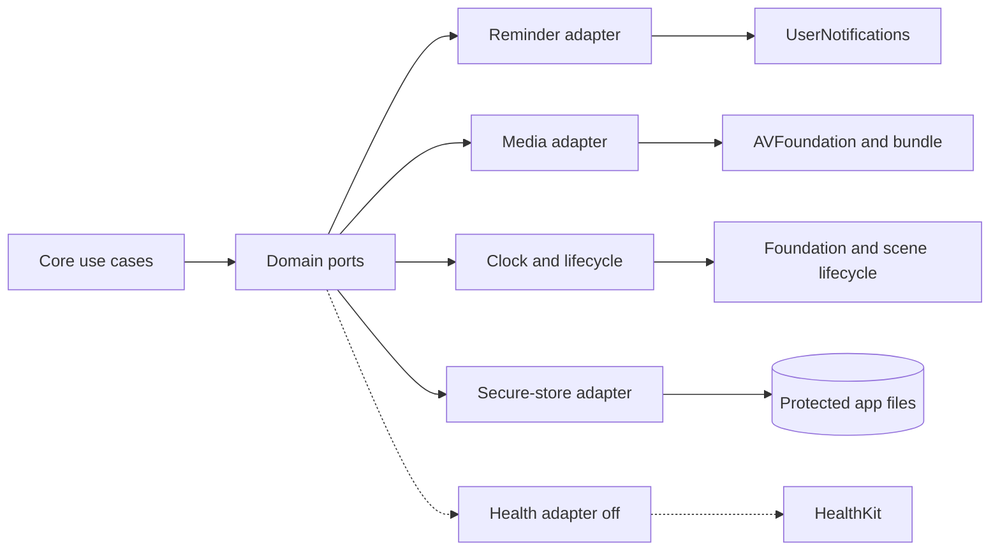

# TD-07: Platform Services

| Field | Value |
| --- | --- |
| Status | Approved prototype contract — M1 authorized August 7, 2026 |
| Depends on | TD-01 architecture, TD-02 domain/data, TD-05 flows |
| Owns | Apple-framework adapters and lifecycle behavior |
| Last updated | August 6, 2026 |

## 1. Scope

Platform services adapt Apple frameworks to Kineo's domain without becoming sources of product decisions. The domain layer sees small protocols and stable value types; it does not import HealthKit, UserNotifications, AVFoundation, OSLog, UIKit, or SwiftUI.

Version-one services are:

- local notification scheduling;
- bundled demonstration-media access and optional audio cues;
- app lifecycle, clock, calendar, and timer restoration;
- protected file and store configuration;
- privacy-safe diagnostic logging;
- local feature configuration;
- a disabled-by-default HealthKit boundary.

There is no account, sync client, remote-config client, analytics SDK, or server dependency.

### Adapter map

Adapters translate framework values into domain-owned results. Optional services never control selection or composition.

## 2. Dependency boundary

Each platform adapter implements a domain-facing protocol and returns domain-owned results. Framework types are converted at the boundary and are never persisted directly.

Required interfaces:

| Interface | Responsibility | Required test substitute |
| --- | --- | --- |
| ReminderService | Inspect authorization, request permission in context, schedule/cancel one recurring reminder | In-memory scheduler with controllable authorization |
| MediaAssetService | Resolve and verify installed media by catalog asset identifier | Fixture resolver supporting present/missing/corrupt cases |
| RoutineTimer | Monotonic elapsed-time calculation and lifecycle restoration | Manually advanced timer |
| AppClock | Current instant | Fixed/advancing clock |
| AppCalendar | User-local day boundaries and date labels | Fixed time-zone calendar |
| SecureStoreConfigurator | Apply and verify file protection and backup exclusion | Recording verifier |
| DiagnosticLogger | Privacy-safe structured operational messages | Capturing logger that rejects forbidden fields |
| HealthContextService | Authorization and derived-context reads only when enabled | Disabled and fixture implementations |

Dependency construction occurs once at the app composition root. Screens receive feature stores/use cases, not service locators or Apple singletons.

## 3. Local notifications

### 3.1 Permission and scheduling

- Do not request notification permission during initial onboarding.
- Request permission only after the user explicitly enables a reminder and selects a general local-time window.
- If the status is denied, retain the user's preferred window locally, schedule nothing, explain the status, and offer the system Settings route.
- If provisional or authorized, schedule a local calendar notification. No push token or server is used.
- If authorization later changes, reconcile the displayed status when Profile becomes active or the app returns to the foreground.
- Turning reminders off cancels every pending Kineo request and preserves no scheduled occurrence.
- Deleting Kineo data cancels pending requests and removes the reminder preference.

### 3.2 Time behavior

The preference stores a local hour/minute window, not an absolute UTC instant. Scheduling uses the injected calendar and current time zone. On significant time change, time-zone change, or foreground entry, the adapter replaces the pending request rather than accumulating duplicates.

The implementation uses a stable, non-personal request identifier. Exactly one pending routine reminder may exist. DST gaps and repeated times defer to the next valid system calendar match; tests cover both transitions.

### 3.3 Notification privacy

Default copy is generic, for example: “Your Kineo check-in is ready.” It must not contain body area, discomfort state, routine level, completion history, HealthKit context, or a streak warning. Notification metadata and deep links may identify only the Today entry point, not a sensitive record.

Opening a reminder routes to Today. It does not reuse an old check-in or automatically generate a routine.

## 4. HealthKit boundary

### 4.1 Prototype state

HealthKit is disabled in the initial prototype. The disabled state shows no connection prompt, context card, baseline, or empty chart. Core flows behave identically whether HealthKit exists on the device or not.

Enabling it later requires an approved addendum defining:

- exact read types and purpose strings;
- rolling-baseline window, minimum valid days, stale-data limit, time-zone rules, and aggregation rules;
- failure and partial-permission presentation;
- wording that separates context from Kineo's routine reasons;
- tests demonstrating that HealthKit never changes the selection or composition result.

### 4.2 Enforced constraints when enabled

- Read-only authorization; Kineo writes no HealthKit samples.
- Authorization is requested from the Health context screen, never required for onboarding.
- The UI must not claim that a particular read permission was denied: HealthKit intentionally makes denied read access appear like no matching data. Present only `Not connected`, `Connected with available context`, or `No context available` states supported by observable behavior.
- Raw samples and framework identifiers are not stored in Kineo's database.
- Only approved, minimal derived display values may be cached locally with source window, calculation version, and expiry.
- The selection and catalog APIs accept no HealthKit value. Architectural separation, not a UI disclaimer, enforces this.
- Denied, restricted, partial, stale, malformed, or unavailable data produces no context and no core-flow failure.
- Disconnect guidance accurately states that permission is managed in Apple system controls; Kineo deletion removes only Kineo-derived cache.

## 5. Media and audio

All routine media required by an installed catalog is bundled in the application package or an approved offline content package before that catalog becomes active. A catalog is rejected during validation if a required asset is missing, has the wrong declared type, or fails its integrity check.

- Written instructions and safety cues are always available and authoritative for accessibility.
- Media failure never causes a movement substitution. The step continues with text if the catalog marks media as optional; otherwise the routine is unavailable before it starts.
- Audio cues are optional and never the only instruction. Respect silent mode and interruptions according to the approved product behavior; do not seize audio focus merely for optional cues.
- Backgrounding pauses presentation playback. Session timing follows the timer rules below, not video playback time.
- Logs may contain a non-sensitive asset-validation error code but not a routine, movement, body-area, or session identifier.

## 6. Timing and app lifecycle

### 6.1 Timing model

Routine timing uses monotonic elapsed time while the process is active. The stored session snapshot contains lifecycle state and safe restoration metadata, not a per-second history.

- Paused time does not count toward a timed step.
- Backgrounding immediately persists the current session and behaves as an automatic pause.
- Foreground restoration returns to a paused review state; it never assumes the user continued moving off-screen.
- Process termination can restore an incomplete session only when its catalog version and assets remain available. Otherwise the user can end it as incomplete.
- Device clock changes do not alter elapsed step time.
- A new local day affects display grouping only. It does not silently finish, delete, or reclassify an in-progress session.

Timer UI may update frequently, but persistence is event-based: start, pause, resume, step change, alternative, skip, safety action, background, stop, and finish. Accessibility announcements do not fire every second.

### 6.2 Multiple scenes and re-entry

Only one guided session may be active. The repository enforces this invariant. A second route to Today detects the session and offers Resume or End; it cannot create another plan over the active session. Scene restoration references only a local non-sensitive route and retrieves state through the repository.

## 7. Protected storage integration

The persistence design owns the schema; the platform adapter owns file-system attributes.

- Apply `NSFileProtectionComplete` to the store and sidecar files. Kineo has no requirement to read or write sensitive records while the device is locked; lifecycle persistence must checkpoint before protection becomes unavailable and tolerate recovery from the last committed event.
- Mark the containing Application Support directory, store, derived HealthKit cache, and any pending local diagnostic files as excluded from backup using the documented iOS resource value. This is the strongest app-controlled mechanism, not a guarantee about platform backup behavior.
- Reapply and verify attributes after store creation, migration, replacement, or recovery.
- Treat inability to establish required protection as a blocking storage error, not a warning that allows sensitive writes.
- Do not place sensitive values in `UserDefaults`, state-restoration payloads, Spotlight, widgets, pasteboard, or notification metadata.

Automated integration tests inspect the actual store and relevant sidecars. Physical-device release checks confirm protection while locked and backup exclusion.

## 8. Diagnostics and network posture

### 8.1 Initial prototype

Kineo-controlled telemetry, crash upload, and third-party SDKs are absent. There is no application network client. Apple-managed diagnostics remain governed by the user's system settings and are not represented as Kineo telemetry.

### 8.2 Local logging

Use privacy-redacted operational logs only in development and diagnostics builds. Allowed fields are coarse subsystem and error codes. Forbidden fields include:

- body area and check-in answers;
- Attention state or safety answer;
- routine, movement, catalog-content, session, or record identifiers;
- HealthKit values;
- feedback, history, reminder time, free text, or persistent device/user identifiers.

Do not rely only on OSLog privacy interpolation; the logger interface itself accepts an allow-listed event and code rather than arbitrary metadata. Production log verbosity is minimal.

Adding network access, analytics, remote diagnostics, or a third-party SDK requires a new data-flow design, consent decision, retention and deletion rules, privacy disclosure, network inspection, and explicit approval.

## 9. Feature configuration

Feature configuration is local and typed. It is created at launch from the build channel plus approved persisted preferences.

| Flag | Internal prototype | Distribution default | Rule |
| --- | --- | --- | --- |
| Placeholder catalog | On | Off and build-blocked | A distribution archive fails validation if any active content is `prototypeOnly` |
| HealthKit context | Off | Off | Cannot be enabled without the approved addendum |
| Kineo telemetry | Absent | Absent | Not a runtime switch until a data-flow design exists |
| Local reminders | On | On | Still requires user action and system permission |

Flags cannot alter safety priority or transform unapproved content into approved content. The active configuration is inspectable in an internal diagnostics screen containing no sensitive user data.

## 10. Failure behavior

| Failure | User-visible behavior | Data behavior |
| --- | --- | --- |
| Notification denied/restricted | Reminders show Off/Unavailable; core app continues | No pending notification |
| Notification scheduling error | Neutral retry guidance in Profile | Preference retained; no duplicate request |
| Required media missing | Plan or session shows content unavailable before unsafe partial playback | No invented substitute; failure code only |
| App backgrounds mid-step | Restore to paused session | Snapshot persisted atomically |
| Store protection cannot be verified | Block sensitive write and show recoverable app error | Do not downgrade protection |
| HealthKit unavailable | Hide/mark optional context unavailable | No effect on routine data |
| Local calendar/time zone changes | Reconcile reminder and display grouping | Do not mutate historical instants |
| Unexpected network availability | No behavior change | Core product makes no network request |

## 11. Verification checklist

- Permission is requested only from an explicit reminder action.
- Denied and later-changed notification permissions render accurately.
- Exactly one generic local reminder exists across rescheduling, time-zone change, and DST.
- Notification deep links always require a fresh check-in for a new routine.
- Airplane mode supports onboarding, selection, guided routine, feedback, Progress, Profile, and reminders already scheduled by iOS.
- Background, interruption, termination, clock-change, and catalog-update tests restore only valid paused sessions.
- On a physical device, locking during an active step commits the background/pause checkpoint before protected storage becomes unavailable; unlock restores that exact paused checkpoint without elapsed-time inflation or regression to an older snapshot.
- Every active catalog asset is available offline and passes integrity validation.
- No HealthKit type crosses into selector or composer interfaces.
- Store files and sidecars have `.complete` protection and the documented backup-exclusion resource value after creation and migration.
- Runtime network inspection shows no Kineo-controlled request in the initial prototype.
- Logs and crash artifacts contain none of the forbidden product values.
- A distribution configuration cannot load a placeholder catalog.

## 12. Platform references

- [Apple: File protection—complete](https://developer.apple.com/documentation/foundation/fileprotectiontype/complete)
- [Apple: Optimizing app data for iCloud Backup](https://developer.apple.com/documentation/foundation/optimizing-your-app-s-data-for-icloud-backup)
- [Apple: `UNCalendarNotificationTrigger`](https://developer.apple.com/documentation/usernotifications/uncalendarnotificationtrigger)
- [Apple: `UNUserNotificationCenter`](https://developer.apple.com/documentation/usernotifications/unusernotificationcenter)
- [Apple: Protecting HealthKit user privacy](https://developer.apple.com/documentation/healthkit/protecting-user-privacy)
