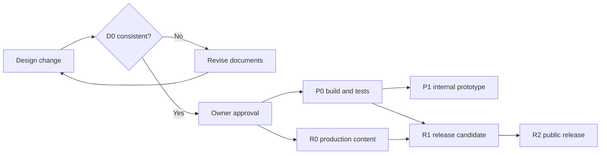

# Kineo v1 Testing and Release Gates

| Field | Value |
| --- | --- |
| Status | Approved verification contract — M1 authorized August 7, 2026 |
| Scope | Automated tests, manual validation, acceptance traceability, prototype and public-release gates |
| Sources | `../KINEO_PRODUCT_DESIGN.md`, `../KINEO_UX_DESIGN_SPEC.md`, TD-01 through TD-07 |
| Implementation authorization | Not granted by this document |

Kineo handles sensitive self-reported information and selects guided movement content. Functional execution alone is insufficient; this document defines required evidence and release blockers.

### Gate pipeline

Each gate requires its own evidence; passing one does not waive later gates.

## 1. Verification principles

1. Test the domain result, durable record, user-visible state, and prohibited side effects—not only a screen path.
2. Safety, selection, composition, migration, deletion, and privacy tests are deterministic and fail closed.
3. No test silently changes production rules to make fixtures pass. Rules and catalog versions are explicit inputs.
4. Automated coverage is required where inputs are enumerable; physical-device/manual evidence is required where simulators cannot establish behavior.
5. A placeholder catalog proves mechanics only. It cannot prove movement appropriateness, claims, safety wording, licensing, or release readiness.
6. HealthKit, telemetry, notifications, networking, and media failure never become hidden prerequisites for core acceptance tests.
7. Accessibility is tested across complete common tasks, not inferred from isolated labels or static screenshots.
8. A test passes only against the distribution configuration to which its evidence applies.

## 2. Test layers and ownership

| Layer | Scope | Runs | Required evidence |
| --- | --- | --- | --- |
| Core unit | Domain invariants, selection, safety, eligibility, explanations, composition | Every change | Machine-readable results and coverage report |
| Persistence unit/integration | Schema constraints, repositories, transactions, migrations, deletion, projections | Every change touching Core/Infrastructure; full suite in CI | Temporary-store test results; migration fixture hashes |
| Catalog validation | Manifest schema, cardinality, compatibility, durations, alternatives, assets, build eligibility | Every catalog/build; before archive | Signed validation report containing catalog/rules versions, no user data |
| Feature-model tests | Every event/state/guard/effect in TD-05 through fake use cases | Every UI change | State-transition test report |
| SwiftUI UI tests | Common paths, navigation guards, adaptive states, interruption/relaunch | Pull request smoke set; nightly/full before internal distribution | Result bundle, screenshots on failure |
| Accessibility automation | Labels, traits, identifiers, target geometry, selected states, basic audit | Every UI change | Audit output; not accepted as physical-device substitute |
| Platform integration | File attributes, notification schedules, lifecycle/timers, media, feature flags | Infrastructure changes and release candidate | Device/simulator-specific report |
| Privacy/security | Network, logs, backups, deletion residue, dependencies, entitlements | Internal baseline and every release candidate | Reviewed evidence bundle |
| Physical-device accessibility | VoiceOver, Voice Control, Switch Control, Dynamic Type, appearance, motion, contrast | Before broad internal testing and every public release | Signed matrix with device/OS/build and defects |
| Content/professional review | Movement, alternatives, media, safety copy, plain language | Production catalog/copy changes | Named approval and immutable content/copy versions |

Tests live beside the owning module where possible. End-to-end tests verify integration but do not replace exhaustive Core tests.

## 3. Controlled test environment

### 3.1 Injected nondeterminism

All domain and flow tests inject:

- fixed or manually advancing wall and monotonic clocks;
- a fixed calendar and time zone, including day-boundary and DST fixtures;
- deterministic identifiers;
- an immutable rules version;
- an immutable catalog/content version;
- in-memory or isolated temporary repositories;
- controllable permission, protected-data, media, and app-lifecycle adapters.

No test depends on the tester's current date, system time zone, network, Health data, notification permission, or random UUID output.

### 3.2 Canonical fixtures

Maintain one reviewed fixture set:

- all three body areas and six ordered distinct-area pairs;
- all nine Change × Comfort combinations;
- safety answers No, Yes, Not sure, and correction;
- Active histories at 0, 1, and 2 qualifying completions plus Worse reset, incomplete, and skipped-feedback cases;
- Gentle, Balanced, and Active at both configured prototype durations;
- complete single/two-area catalog, missing module, missing pairing, invalid duration, missing asset, invalid alternative, and no-primary-content mutations;
- one-area and two-area session snapshots with timed and repetition steps;
- longest approved/pseudo-localized strings and media descriptions;
- empty, minimal, dense, corrupted, future-schema, and pre-migration stores.

Fixtures contain no real user or HealthKit data. Production incident data may not be copied into tests.

### 3.3 Build channels

- `DebugPrototype`: fixture and placeholder content permitted and visibly identified.
- `InternalPrototype`: schema-complete placeholder content permitted; HealthKit and Kineo telemetry off; no general network client.
- `ReleaseCandidate/Release`: placeholder content prohibited; only approved production catalog/copy and reviewed capabilities.

Catalog validation derives prototype durations from the authoritative catalog configuration: Quick is nominally 5 minutes (270–360-second valid range) and Standard is nominally 10 minutes (480–720-second valid range). These are internal fixtures, not production claims.

## 4. Required automated suites

### 4.1 Selection and safety (`SEL`)

`SEL-001` Exhaust all 3 areas × 9 answer pairs × 2 Active states × both durations. Verify:

- Worse or Limited requests the conditional answer and yields no plan while pending;
- a No answer yields Gentle for those rows;
- only Better + Good + unlocked yields Active;
- every other non-Gentle result is Balanced;
- first use cannot receive Active;
- duration changes no decision field other than the requested content variant.

`SEL-002` Exhaust the two-area safety matrix. Any included-area Yes/Not sure yields no decision and no routine for the whole current session. It creates Attention for each Yes/Not sure area, retains audit data, and cannot be bypassed by omitting the secondary after a triggering answer. E3 primary-only fallback must never be emitted for safety.

`SEL-003` Verify global Attention preflight across all three supported areas, including an area removed from current Profile preferences. Any row blocks every new plan until cleared. Return-to-usual Yes clears only the named area and requires a fresh check-in; No/Not sure preserves it. Selected by mistake alone keeps the row and opens a fresh correction draft. Only a committed non-triggering or trigger-plus-No corrected entry clears it; Yes/Not sure reaffirms it, and cancellation/termination leaves it intact. Multiple rows must all resolve.

`SEL-004` Exhaust 3 × 3 per-area level reduction for each ordered distinct-area pair and duration. Overall level is always the more conservative result.

`SEL-005` Verify Active history sequences per area: qualifying/qualifying unlocks; Worse resets; skipped feedback, Pause Today, stopped, safety-stopped, abandoned, and Active-level completions do not increment; an explicit incomplete-session response becomes latest response only.

`SEL-006` Exhaust override permissions: any gentler approved level is accepted; a higher, locked, disallowed, or safety-blocked level is rejected; override never changes areas or duration.

`SEL-007` Verify explanation reason codes and bounded interpolation: at most two, deterministic order, no HealthKit input, unsupported score, diagnosis, causation, or guarantee.

`SEL-008` Non-influence metamorphic tests vary Health context, telemetry choice, reminder state, connectivity, time available outside Quick/Standard, occupation, and consistency history while holding allowed inputs fixed; selection/composition output remains identical.

### 4.2 Catalog and composition (`CAT`)

`CAT-001` Validate unique identities, version fields, review/build status, exact cardinality, required text/safety keys, and all installed assets.

`CAT-002` Compose every single-area area × level × duration request and every ordered two-area pair × level × duration request. Output contains only exact eligible template/module content in authored order.

`CAT-003` Verify a secondary module replaces only its declared compatible slot and never appends unbounded time. Every default, composed, skipped, and approved-alternative path satisfies the configured duration policy.

`CAT-004` Mutation-test each invalid condition: missing/ineligible primary, missing secondary, absent pairing, duplicate IDs, mismatched role/area/level/duration, equipment/position conflict, duplicate movement, invalid transition, missing asset, alternative cycle, and invalid duration. Expected result is exact primary-only disclosure, approved gentler fallback, or Content Unavailable—never invented or more-active content.

`CAT-005` Decode the same manifest repeatedly and under reordered source collections; canonical snapshot and output hashes remain identical. Verify the exact canonical field projection and lower-case SHA-256 value independently for the manifest and composed routine; generated IDs/timestamps do not affect the composition fingerprint.

`CAT-006` Build enforcement rejects every placeholder, unreviewed item, missing approval identifier, or prohibited asset in Release. Internal builds visibly label placeholders.

### 4.3 Domain data and privacy behavior (`DAT`)

`DAT-001` Verify schema constraints and relationships prevent duplicate decisions/sessions, invalid area pairs, feedback for unincluded areas, invalid lifecycle transitions, and more than one active routine.

`DAT-002` Verify each TD-01 transaction boundary under success and injected failure at every write: draft secondary omission; check-in/safety; decision/composition revision including the in-transaction Attention recheck; Start-time snapshot plus `prepared` session; asset-ready transition plus `started` event; routine event/checkpoint; terminal status/event; optional feedback submission; Reset History; and Delete All. A failed secondary-omission write keeps the secondary included and returns to the recoverable draft state. Partial state is never visible, and adjacent boundaries are not falsely treated as one transaction.

`DAT-003` Run migrations from every supported historical fixture to current, twice for idempotence. Verify record counts, semantic values, versions, file attributes, and migration rollback on injected failure. A future schema is preserved and not downgraded or recreated.

`DAT-004` Verify history isolation among all three areas, distinct same-day sessions, immutable decision versions, and deterministic derived Progress/Active projections.

`DAT-005` Reset History removes check-ins and entry revisions, decision revisions, sessions, feedback, Progress/eligibility caches, pending telemetry, and safety transition history. It retains profile/preferences, safety acknowledgement, reminder choice, consent choices, and only the minimum current Attention Required row. Verify that cleared safety history is gone while the retained row globally blocks new routines even if its area is not selected.

`DAT-006` Delete All removes every Kineo-owned record, derived cache/file, pending telemetry item, mutable installed content, and notification; verifies emptiness before returning to Welcome. System permissions and Apple-owned Health data remain unchanged and are accurately disclosed.

`DAT-007` Process termination/relaunch reconstructs draft, plan, and routine states only from valid checkpoints; no interrupted session becomes completed. A backgrounded timer remains paused.

`DAT-008` Replaying a failed routine-event command with its original UUID returns the existing logical result and does not advance the sequence twice. Retrying with a new UUID is treated as a distinct event and must still satisfy lifecycle guards. Independently recompute the lower-case SHA-256 checksum over the exact canonical snapshot bytes and reject any mutation.

### 4.4 Feature state and navigation (`FLOW`)

For every state-machine row in TD-05, test the source state, event, guard success/failure, required use-case call, resulting state, and error recovery. Minimum named suites:

- `FLOW-ONB`: onboarding checkpoint/resume, age unavailable/correction, duplicate-area prevention, no premature permission prompts.
- `FLOW-CHK`: single/two-area drafts, same-day resume, day/area invalidation, all triggered safety questions completed before atomic commit, secondary skip only before a triggering answer, and blocked commit after any Yes/Not sure.
- `FLOW-ATT`: per-area persistence with global plan gating, omitted-preference area, multiple flags, return answers, correction tap without clearance, valid correction-clear transaction, distinct return-answer versus correction-submission reaffirmation events with correct source entry, cancel/termination behavior, and no route/profile/reset bypass.
- `FLOW-PLAN`: initial Standard decision/composition revision, immutable Quick/Standard and gentler-choice revisions over one frozen check-in, revision-write failure with stale Start disabled, in-transaction Attention recheck, Pause Today eligibility plus rejection for Balanced/Active, non-triggered Gentle, pending/Yes/Not sure safety, and any existing Attention, same-day consistency deduplication, catalog fallbacks, Content Unavailable, and newest-revision Start guard.
- `FLOW-RTN`: load, step progression, monotonic timer, pause/resume, background pause, skip, approved alternative, timer freeze while Alternative Preview or End Confirmation is presented, cancel returning without elapsed-time inflation or automatic playback, end, safety guidance, terminal safety stop, accidental-tap return to Paused with no automatic playback, and idempotent completion.
- `FLOW-FBK`: one/two-area responses, partial skip, skip all, Worse reset, incomplete-session response, duplicate-submit prevention.
- `FLOW-PRG`: empty/history, per-area filters, neutral consistency, separate optional Health context, deletion refresh.
- `FLOW-PRF`: area validation/history retention, reminder rationale/denial, disabled Health seam, telemetry-off behavior, Reset/Delete confirmations and failures.
- `FLOW-NAV`: route guards, independent tab paths, one modal, full-screen routine, safe deep links, Delete All root reset.

### 4.5 UI and adaptive presentation (`UI`)

Automated UI tests cover the primary, safety, interruption, deletion, and offline journeys on the smallest supported iPhone simulator and the reference 402 × 874 pt viewport. A broader device matrix runs before distribution.

For every common screen:

- capture standard and maximum Dynamic Type layouts with longest/pseudo-localized content;
- assert required controls exist, are hittable, are not clipped/overlapped, and have at least 44 × 44 pt frames;
- exercise light/dark, Increase Contrast, Differentiate Without Color, and Reduce Motion;
- verify no required state is conveyed by color, animation, video, audio, haptic, or gesture alone;
- verify system back/dismiss actions cannot bypass route guards or discard active state;
- run platform accessibility audit and treat serious findings as failures.

Snapshot tests detect regressions but cannot prove usability, reading order, focus, contrast, or platform semantics by themselves.

### 4.6 Platform, offline, and lifecycle (`PLAT`)

- `PLAT-001`: airplane mode from cold launch supports installed onboarding, check-in, selection, routine, feedback, Progress, Profile, Reset, and Delete.
- `PLAT-002`: exactly one generic local reminder exists after enable/reschedule/time-zone/DST changes; permission request occurs only after a window choice; denial changes no core behavior.
- `PLAT-003`: notification title/body and route contain no area, answer, level, history, Health context, or sensitive identifier; opening requires Today entry evaluation and a fresh check-in.
- `PLAT-004`: background, interruption, termination, device-clock change, and midnight transition preserve session truth. Wall-clock changes do not alter elapsed step time.
- `PLAT-005`: required media missing before Start blocks the routine; optional-media failure retains complete written instructions; no substitute movement is invented.
- `PLAT-006`: disabled HealthKit build has no entitlement, prompt, context card, or selector dependency. Future-enabled test doubles prove denied/restricted/stale/partial data changes no plan and that read denial is never presented as distinguishable from no matching data.
- `PLAT-007`: protected data unavailable never creates an empty store or new-user route; unlock retries bootstrap. On a physical device, locking during an active step commits the pause checkpoint before Complete Protection becomes unavailable, and unlock restores that exact checkpoint without elapsed-time inflation or older-snapshot regression.

## 5. Privacy and security verification

### 5.1 Network boundary (`PRIV-NET`)

Run the ReleaseCandidate build through an intercepting proxy and device-level traffic capture during cold launch and every common task, with both IPv4/IPv6 and Wi-Fi/cellular where practical.

Initial prototype expectation: no Kineo-controlled network request. Any observed endpoint fails the gate until identified and approved. Apple-managed OS traffic must be separated from app-originated traffic with documented evidence, not ignored wholesale.

If telemetry is later approved, repeat before opt-in, after opt-in, immediately after opt-out, offline queue/retry, and Delete All. Payload/header/query inspection must show no body area, check-in/safety answer, Health value, routine/movement/catalog identifier, feedback, free text, reminder time, stable Kineo/device/account/cross-app identifier, or reconstructable precise timeline.

### 5.2 Storage and backup (`PRIV-STO`)

- Enumerate the exact app-owned sensitive directory and database sidecars after creation, writes, migration, checkpoint, Reset, and Delete.
- Verify `NSFileProtectionComplete` and the backup-exclusion resource value on database, WAL, SHM, derived caches, pending diagnostic/telemetry files, and recoverable copies.
- On physical devices, test protected-data behavior before first unlock and while locked as allowed by the chosen protection class.
- Inspect representative encrypted and unencrypted device backups for Kineo sensitive records. Record that this is evidence of configuration/representative behavior, not a guarantee about all OS behavior.
- Search UserDefaults, restoration payloads, Spotlight, widgets, pasteboard, notifications, logs, screenshots created by the app, and temporary directories for prohibited values.

### 5.3 Deletion residue (`PRIV-DEL`)

Seed a uniquely identifiable synthetic dataset, pending notification, derived context, and (if it exists) pending telemetry. Execute Reset and Delete separately, close/relaunch, inspect logical repositories and app-owned files, then verify the exact retained/deleted scope. Inject a partial-deletion failure and confirm the UI does not claim success.

### 5.4 Logging and dependency review (`PRIV-LOG`)

- Exercise every error path and scan unified logs/crash artifacts for forbidden values and identifiers.
- Logger APIs accept allow-listed codes only; mutation tests attempt forbidden metadata.
- Generate a dependency/SDK inventory with version, checksum, license, entitlements, privacy manifest, network capability, and purpose.
- Reject unreviewed SDKs, dynamic remote configuration, advertising identifiers, iCloud/CloudKit, or a general network client.

## 6. Physical-device accessibility matrix

### 6.1 Common tasks

Each row must be completed end-to-end without tester assistance:

1. First launch through first plan.
2. Single-area and two-area check-in.
3. Conditional safety No and Yes/Not sure paths, including a secondary trigger and the resulting global block across later preference changes.
4. Global Attention after removing the flagged area from Profile, multiple-area return prompts, and Selected by mistake correction—including abandoned, clearing, and reaffirming submissions.
5. Duration selection, gentler override, primary-only catalog disclosure, and Pause Today.
6. Timed/repetition routine, pause/resume, alternative, skip, end, Something feels wrong, its End Routine path, and its accidental-tap correction followed by a separate Resume.
7. One/two-area feedback, partial skip, and completion.
8. Progress overview/area detail/empty.
9. Change areas, reminders denial, privacy explanation, Reset, and Delete.
10. Content unavailable, offline, protected-data unavailable, and recoverable save failure.

### 6.2 Settings matrix

| Dimension | Required coverage |
| --- | --- |
| Hardware | Smallest supported physical iPhone, reference/typical iPhone, largest supported iPhone |
| OS | Minimum supported iOS and current shipping iOS; latest beta is exploratory, not release evidence |
| Screen reader | VoiceOver with screen recognition off; portrait and routine-use placement |
| Alternative input | Voice Control and Switch Control for every common task |
| Text | Default, approximately 200%, and maximum accessibility category |
| Visual | Light, dark, Increase Contrast, Differentiate Without Color, Bold Text |
| Motion/audio | Reduce Motion, silent mode, no audio, captions where meaningful speech exists |
| Content | Longest U.S. English and pseudo-localized expansion |

Record build hash, device, OS, settings, task result, defect, retest, tester, and date. Simulator-only results do not close this gate.

### 6.3 Required assertions

- Focus order matches reading order and stays within modals.
- Initial/restored focus lands on the new/changed heading or initiating control.
- Labels, values, traits, selected state, headings, and custom actions are accurate and non-duplicative.
- Timer is queryable and announces sparse meaningful changes, never every second.
- Safety activation stops playback immediately; its accidental-tap action returns focus to Paused and does not auto-resume.
- Written instruction and safety cues make routine operation possible without media or sound.
- Visible labels match Voice Control names; no precise gesture is required.
- Maximum text size loses no instruction, choice, control, deletion scope, or safety content.
- Reduce Motion removes nonessential/continuous movement without hiding progress.
- Color/contrast and selected/level/chart meaning survive all appearance settings.
- App Store Accessibility Nutrition Labels claim only behaviors verified for every common task.

## 7. Product acceptance traceability

The authoritative scenario number is product document section 14.

| # | Acceptance | Primary evidence | Required layers |
| ---: | --- | --- | --- |
| 1 | First use receives Gentle/Balanced, never Active | `SEL-001`, `FLOW-ONB`, first-launch UI journey | Core, feature, UI |
| 2 | Secondary area and conservative combined level | `SEL-004`, `CAT-002/003`, two-area UI journey | Core, catalog, UI |
| 3 | Recurring Worse + No → Gentle regardless of Health context | `SEL-001/008` | Core |
| 4 | Worse/Limited + Yes/Not sure → Attention, no routine | `SEL-002`, `FLOW-CHK/ATT` | Core, feature, UI |
| 5 | Attention return precedes check-in | `SEL-003`, `FLOW-ATT/NAV`, relaunch UI | Core, feature, UI |
| 6 | Selected by mistake starts re-answering; valid corrected submission clears | `SEL-003`, `FLOW-ATT` | Core, feature, UI |
| 7 | Limited + No → Gentle with Pause Today | `SEL-001`, `FLOW-PLAN` | Core, feature, UI |
| 8 | Better + Good remains Balanced while Active locked | `SEL-001/005` | Core |
| 9 | Gentler allowed; disallowed higher blocked | `SEL-006`, plan UI | Core, UI |
| 10 | Missing/denied HealthKit preserves core flow | `SEL-008`, `PLAT-006` | Core, platform, UI |
| 11 | Health context is separate and non-influential | `SEL-008`, `PLAT-006`; future addendum UI test | Core, architecture, UI |
| 12 | Two-area catalog gap → disclosed primary-only | `CAT-004`, `FLOW-PLAN` | Catalog, feature, UI |
| 13 | Pause/skip/stop/alternative preserve state; no invention | `FLOW-RTN`, `DAT-002/007`, `CAT-004` | Feature, persistence, catalog, UI |
| 14 | Per-included-area feedback; skipping allowed | `FLOW-FBK`, `DAT-001/002` | Feature, persistence, UI |
| 15 | Core works in airplane mode | `PLAT-001`, full offline UI journey | Integration, UI, device |
| 16 | Reset retains only current Attention; Delete All removes every Kineo-owned record | `DAT-005/006`, `PRIV-DEL` | Persistence, privacy, UI |
| 17 | Skipped feedback neither qualifies nor replaces latest response | `SEL-005`, `DAT-004` | Core, persistence |
| 18 | Stopped remains incomplete; explicit response retained, no qualification | `SEL-005`, `FLOW-RTN/FBK`, `DAT-004` | Core, feature, persistence |
| 19 | Area histories never transfer | `SEL-005`, `DAT-004`, Progress area UI | Core, persistence, UI |
| 20 | Repeat same-day routine requires new check-in/decision | `FLOW-CHK/FBK/NAV`, `DAT-004` | Feature, persistence, UI |
| 21 | Bounded approved pairing within duration | `CAT-002/003` | Catalog |
| 22 | Incompatible pairing → disclosed primary-only | `CAT-004`, `FLOW-PLAN` | Catalog, feature, UI |
| 23 | Forbidden values/identifiers never leave app | `PRIV-NET`, `PRIV-LOG` | Privacy/device |
| 24 | Protected, backup-excluded sensitive storage | `PRIV-STO`, `DAT-003` | Integration/device |
| 25 | Common tasks accessible with VoiceOver, Voice Control, text sizes | Section 6 matrix plus UI automation | Device, UI |
| 26 | Routine usable without sight/audio/color/precise gesture | Routine task in section 6 plus `PLAT-005` | Device, UI, content |
| 27 | Worse resets Active; skipped/stopped cannot rebuild | `SEL-005`, `DAT-004` | Core, persistence |
| 28 | No telemetry before opt-in/after opt-out; no functional loss | Initial build: absence/inventory + `PRIV-NET`; future: telemetry consent suite | Architecture, privacy, UI |

Scenario 4 is interpreted by the global Attention rule: if the triggering area is the secondary already included in that check-in, no routine is created, and its unresolved Attention row blocks later routines even if that area is removed from Profile.

## 8. Gates

### Gate D0 — documentation consistency (before implementation approval)

All must be true:

- Product, UX, index, engine, flow, and data documents use one global unresolved-Attention scope.
- Architecture, index, and data documents select one persistence technology.
- Index and catalog use one pair of prototype duration values and ranges.
- Every TD cross-reference exists; owned decisions are not duplicated with different values.
- Every product acceptance scenario maps to evidence in section 7.
- Coding still requires the product owner's explicit approval.

Rerun D0 whenever any source or TD changes. Passing D0 does not authorize coding.

### Gate P0 — code/build hygiene (every change, once coding is authorized)

- Clean build with Swift 6.1+ in Swift 6 language mode and strict concurrency under Xcode 16.3+; warnings treated according to the approved zero-warning policy.
- All Core, data, catalog, feature-model, and required UI tests pass.
- GRDB resolves exactly to 7.10.0 and its recorded revision; no unapproved dependency, entitlement, capability, endpoint, placeholder change, or privacy-manifest drift.
- Static analysis and secret scan pass.
- Test failures cannot be waived by rerunning until green; flaky tests are quarantined only with owner, issue, and expiry and cannot cover safety/privacy gates.

### Gate P1 — internal prototype distribution

- Gate D0 and P0 pass.
- All 28 acceptance scenarios pass with prototype fixtures where applicable; a deliberately disabled optional feature uses the explicit absence/non-influence evidence in section 7 rather than a fabricated UI path.
- Placeholder catalog is visibly labeled and technically blocked from public configuration.
- HealthKit and Kineo telemetry are off/absent; no general network client or third-party SDK is present.
- Airplane-mode, lifecycle restoration, schema/migration, Reset/Delete, notification privacy, and network-zero tests pass.
- Automated accessibility suite and at least one complete physical-device common-task pass have no critical/major defects.
- Internal testers receive explicit prototype/non-production-content disclosure.
- If any tester is outside the product team, the archive contains professionally reviewed interim wording for the safety acknowledgment, conditional branch, Attention guidance, and routine safety control; without it, distribution remains product-team-only.

P1 proves app mechanics for controlled internal use. It does not establish movement appropriateness, medical/regulatory status, production privacy claims, accessibility declarations, or public-release readiness.

### Gate R0 — production-content candidate

- Licensed production movement content, alternatives, media, compatibility, duration ranges, level meanings, and Active threshold have named qualified review.
- Catalog completeness and every default/composed/alternative path pass the full CAT suite.
- Placeholder and unreviewed identifiers are absent and build-blocked.
- Exact safety copy and behavior versions have qualified professional and legal/regulatory approval.
- Demonstration format/provider and offline package integrity are approved.

### Gate R1 — public Release Candidate

- P0 and R0 pass on the exact archive candidate.
- Qualified U.S. intended-use/regulatory assessment accepts the implemented behavior and all claims, or the product is revised and re-tested.
- Full migration, corruption, protected storage, backup, deletion-residue, log, dependency, entitlement, and network evidence passes.
- All common tasks pass the complete physical-device accessibility matrix with no unresolved critical/major defect.
- Privacy policy, App Store privacy answers, accessibility declarations, support/safety content, age boundary, and notification copy match runtime behavior.
- Any HealthKit, telemetry, diagnostics, or third-party service remains absent or has its separately approved design, consent, disclosures, vendor review, and tests.

### Gate R2 — public release

- R1 evidence references the exact signed archive and immutable catalog/rules/copy versions submitted.
- No code, configuration, content, dependency, entitlement, privacy answer, or store copy changed after evidence capture; otherwise affected gates rerun.
- Named product, engineering, content/professional, privacy/security, accessibility, and regulatory owners sign their scopes.
- Rollback/support plan exists without requiring collection of sensitive user data.
- App Store review materials make no diagnosis, treatment, recovery, causation, safety, or equivalence claim beyond the approved contract.

## 9. Defect policy

| Severity | Definition | Gate effect |
| --- | --- | --- |
| Critical | Safety bypass, wrong/unapproved routine, sensitive-data transmission/exposure, destructive data loss beyond confirmed scope, inaccessible safety action, release placeholder | Blocks every distribution; immediate fix and full affected-suite rerun |
| Major | Core task cannot complete, state/audit mismatch, offline failure, lost instruction/control at supported accessibility setting, misleading claim | Blocks P1/R1/R2 |
| Moderate | Workaround exists without safety/privacy/meaning loss; non-core usability or appearance defect | Must be triaged with owner and release decision; cannot support an accessibility claim if relevant |
| Minor | Cosmetic defect with no task, meaning, privacy, or accessibility effect | May defer with recorded issue |

Safety/privacy/accessibility failures cannot be downgraded solely because occurrence is rare.

## 10. Evidence bundle and sign-off

For each candidate preserve:

- source revision, signed build hash, build channel, rules/catalog/copy versions;
- dependency, entitlement, capability, and privacy-manifest inventory;
- automated test results and catalog-validation report;
- migration fixture/version report;
- device/OS accessibility matrix and defect/retest record;
- network capture summary and endpoint disposition;
- storage protection, backup, Reset/Delete, and residue report;
- content, safety, privacy/security, accessibility, and regulatory approvals applicable to that gate.

Evidence contains synthetic identifiers only and no real user, HealthKit, check-in, feedback, or free-text data. A gate owner signs only their scope; product ownership cannot substitute for a qualified professional, privacy/security, accessibility, or regulatory review.
