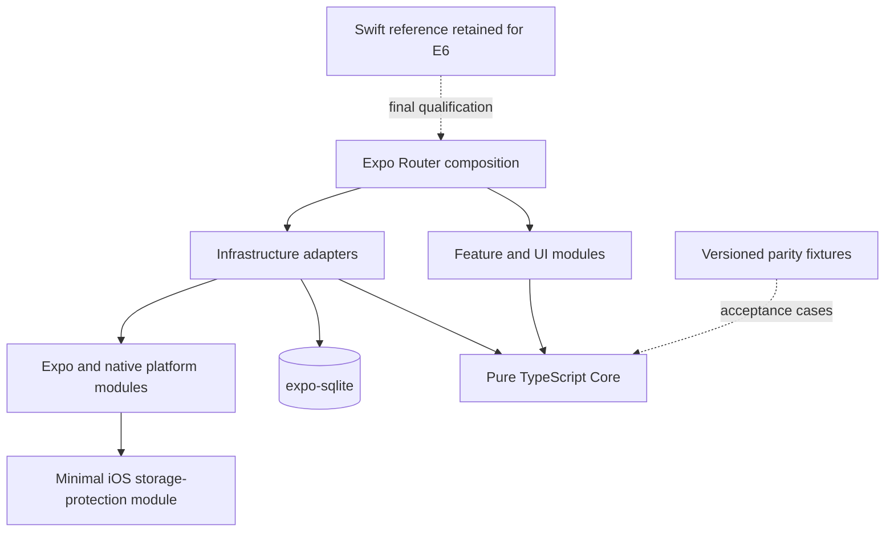

# Kineo v1 — Expo Migration

| Field | Value |
| --- | --- |
| Status | E0–E4 automated gates complete; E5 UI qualification and E6 cutover pending |
| Target | Expo SDK 57, React Native, strict TypeScript, iOS 17 minimum |
| Source | Existing product behavior and TD-00 through TD-08 |
| Last reviewed | August 28, 2026 |

## 1. Migration contract

This document overrides SwiftUI-, Swift-, Xcode-module-, and GRDB-specific implementation choices only as each equivalent Expo slice is completed. All product rules, safety invariants, release gates, and acceptance scenarios remain unchanged.

- Keep the Swift app available until the remaining E6 device and archive gates pass.
- Port vertical behavior slices; do not translate files mechanically.
- Treat the existing deterministic Swift behavior and product matrices as reference evidence, not code to call at runtime.
- Do not share production state between the Swift and Expo apps during migration.
- Do not add networking, telemetry, accounts, remote configuration, HealthKit, or new product scope.
- The `kineo` URL scheme exists only so Expo can launch development builds and the simulator. It does not authorize product deep links, inbound navigation, or authentication callbacks.
- Keep exact-archive and physical-device qualification visibly open until those checks run.

## 2. Target architecture

`Core` owns domain values, deterministic policies, typed failures, and use-case interfaces. It imports no React, React Native, Expo, SQLite, media, notification, or networking module. Features and adapters depend inward on Core; Expo Router is the composition root.

## 3. Verification seams

Tests exercise these existing product seams:

1. Pure domain decisions: current reports and history produce a decision or typed no-plan result.
2. Catalog composition: a decision plus validated content produces one immutable routine or typed unavailability.
3. Product use cases: commands commit truthful state atomically through repository interfaces.
4. App routes: screens expose the same guarded flows and accessibility behavior.

Parity expectations come from product decision tables and stable fixtures captured from the Swift reference. Tests do not reach through these interfaces into implementations.

## 4. Ordered migration

| Stage | Outcome | Exit gate |
| --- | --- | --- |
| E0 Foundation | Expo workspace, strict TypeScript, tests, dependency policy, first pure rule | Expo checks and existing Swift gates pass |
| E1 Core | Domain values, safety, selection, eligibility, and typed failures | Decision matrices match the reference behavior |
| E2 Content | Catalog validation, fingerprints, composition, and bundled assets | Complete catalog and fallback matrices pass |
| E3 Persistence | SQLite schema, exclusive transactions, migrations, protection, reset, and deletion | TD-02 failure/recovery gates pass on real SQLite |
| E4 Product flow | Onboarding through feedback, Progress, and Profile | All feature state-machine scenarios pass offline |
| E5 Platform and UI | Media, reminders, lifecycle, adaptive UI, and accessibility | Automated UI and platform gates pass |
| E6 Cutover | Expo becomes the sole product implementation | Exact archive and physical-device gates pass; source cutover is recorded |

E0–E4 automated gates pass locally: strict type checking, lint, 22 Jest suites with 183 tests, Expo dependency validation, native storage-path tests, iOS bundling, a Release simulator build, and clean first-screen launch checks at the default and maximum accessibility text sizes in light/dark appearance. E5 still needs automated common-task UI coverage; E6 still needs exact-archive and physical-device evidence before source removal. `npm audit --audit-level=high` passes; 11 moderate transitive Expo build-tool advisories remain because the proposed forced remediation downgrades Expo.

E1 is delivered in three reviewable slices: domain and Attention safety, Active history eligibility, then the complete plan selector. Each slice must keep Swift and Expo green before the next begins.

E2 is delivered in three slices: catalog contracts, the signed prototype catalog and validator, then composition, immutable snapshots, revision auditing, bundled assets, and shared Swift/Expo fingerprint parity.

## 5. E0 acceptance

- `apps/mobile` launches from the Expo toolchain without changing the Swift app.
- TypeScript strict checking, linting, and non-watch Jest tests run locally.
- The first domain slice implements the complete area-level matrix through a pure interface.
- No runtime network client, telemetry package, account system, database, or native capability is added.
- Dependency versions and lockfile are committed; generated caches and secrets are ignored.
- During E0–E5, the Swift tests and project-boundary checks remained green.
