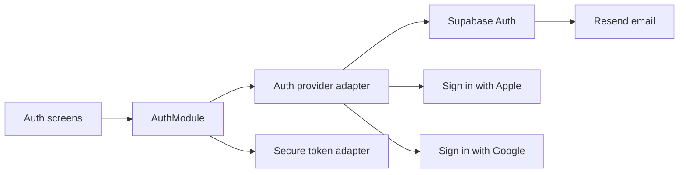

# TD-10: Account and Authentication

| Field | Value |
| --- | --- |
| Status | Approved implementation contract |
| Owns | Account access, authentication, session restoration, verification, reauthentication, logout |
| Depends on | TD-00, TD-05, TD-07 |
| Last updated | September 2, 2026 |

## Architecture



`AuthModule` is the only client Interface for account access. React and product-flow code do not call provider SDKs directly.

## Interface

```ts
interface AuthModule {
  restoreSession(): Promise<AuthResult<AuthState>>;
  signInWithApple(): Promise<AuthResult<AuthState>>;
  signInWithGoogle(): Promise<AuthResult<AuthState>>;
  signUpWithEmail(input: EmailCredentials): Promise<AuthResult<VerificationPending>>;
  signInWithEmail(input: EmailCredentials): Promise<AuthResult<AuthState>>;
  resendVerification(email: string): Promise<AuthResult<void>>;
  requestPasswordReset(email: string): Promise<AuthResult<void>>;
  reauthenticate(method: ReauthenticationMethod): Promise<AuthResult<ReauthenticationGrant>>;
  logout(policy: LogoutPolicy): Promise<AuthResult<void>>;
}
```

Expected failures are discriminated values: `cancelled`, `invalidInput`, `verificationRequired`, `invalidCredentials`, `rateLimited`, `offline`, `providerUnavailable`, `sessionExpired`, `reauthenticationRequired`, and `unexpected`. UI copy never reveals whether an email is registered.

## Rules

- First-use order is Promise → 18+ declaration → Authentication → Legal Acceptance → Hydration → progressive body-area and safety onboarding.
- Apple and Google use native provider flows. Email/password requires verified email.
- Passwords require at least 15 Unicode characters, permit paste/autofill/passphrases, apply no composition rule, and rely on server compromised-password screening.
- Matching verified emails use Supabase automatic identity linking. Manual linking is deferred.
- Access tokens remain in memory. Refresh tokens use an Expo SecureStore adapter configured for non-synchronizing iOS Keychain storage.
- Refresh rotation is serialized. A failed refresh cannot be replaced by an unauthenticated empty account.
- Password changes, export, identity changes, and deletion require a short-lived reauthentication grant.
- Logout first asks `SyncModule` to flush. If offline changes remain, the user chooses wait or explicit discard; successful logout revokes the Installation and wipes local SQLite.
- Authentication emails contain no wellness data. Logs contain allow-listed codes only.

## Configuration

Development, staging, and production have separate Supabase projects and OAuth credentials. Public Expo environment values may contain only the project URL, publishable key, non-secret provider client IDs and URL scheme, and availability flags; provider secrets, Resend credentials, and database credentials remain server-side.

The account screen offers Apple or Google only when its explicit public enablement flag is set. Google also requires both client IDs and its iOS URL scheme. These flags hide unconfigured actions; they do not replace provider and backend qualification.

## Verification

- Provider cancellation, revocation, unavailable-provider, and invalid-token paths.
- Email verification, resend, reset, weak/compromised password, rate limit, and enumeration resistance.
- Session restore, serialized refresh, expiry, reauthentication timeout, and logout with pending mutations.
- SecureStore failures block authenticated bootstrap and never fall back to AsyncStorage.
