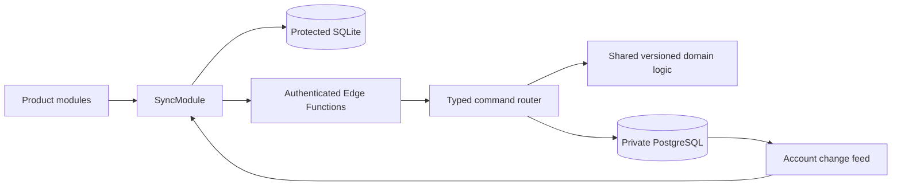

# TD-11: Cloud Data and Synchronization

| Field | Value |
| --- | --- |
| Status | Approved implementation contract |
| Owns | Account-scoped PostgreSQL model, command validation, bootstrap, outbox, conflicts, hydration |
| Depends on | TD-02, TD-03, TD-04, TD-10 |
| Last updated | September 2, 2026 |

## Architecture



The client cannot write product tables directly. Edge Functions verify the JWT, derive `account_id` from it, validate a typed command, and call transactional PostgreSQL routines.

## Interface

```ts
interface SyncModule {
  bootstrap(): Promise<SyncResult<BootstrapState>>;
  synchronize(input: SyncRequest): Promise<SyncResult<SyncState>>;
}
```

`bootstrap` registers or restores an Installation, returns account state, and hydrates a paginated snapshot. `synchronize` idempotently pushes Mutations, then pulls ordered changes after an opaque Change Cursor.

## Ownership model

- `accounts` owns status and `history_epoch`.
- `device_installations` owns random installation identity, app/platform version, cursor, and revocation state.
- `legal_acceptances` is immutable and versioned.
- Every product row has `account_id`; composite foreign keys keep child and parent ownership identical.
- Mutable aggregates carry an optimistic `version`. Safety and Routine events remain append-only.
- `mutation_receipts` deduplicates `(account_id, mutation_id)`.
- `account_changes` provides an ordered per-account feed. The numeric sequence is server-internal; clients receive an opaque encoded cursor.
- Local `sync_outbox` stores typed pending Mutations and retry metadata inside protected SQLite.

## Conflict and offline rules

- The server creates the authoritative Plan with shared, versioned TypeScript selection and composition logic.
- Check-in submission and new Plan creation require server validation. Draft answers may remain local until submission.
- Cached history and playback of the current Routine remain usable offline.
- At most one unfinished Routine exists per Account. Its originating Installation owns playback until it ends or an explicit takeover policy is added.
- Immutable records merge by stable ID. Mutable commands supply `expectedVersion`; stale versions return a typed conflict and authoritative state.
- Reset History increments `history_epoch`; Mutations created under an older epoch are rejected.
- Foreground synchronization runs at launch, resume, committed actions, and manual retry. There is no realtime socket or background health-data sync.
- Retry uses bounded exponential backoff with jitter, honors server retry hints, and never reorders Mutations from one Installation.

## Server interfaces

- `bootstrap`: authenticated account state and paginated snapshot.
- `sync`: typed mutation push plus cursor-based change pull.
- Product commands accepted through `sync`: profile/settings, Check-in and Attention transitions, server Plan creation, Routine lifecycle events, and feedback.
- Responses use stable typed error codes and contain no raw database or provider errors.

## Verification

- Cross-account denial for every table, function, and composite relationship.
- Duplicate, stale, reordered, malformed, interrupted, and paginated synchronization.
- Two Installations racing to start Routines.
- Old-epoch Mutations cannot restore reset history.
- Cursor replay is deterministic; partial pages never skip changes.
- Network and log inspection contains no credentials beyond transport requirements and no unapproved sensitive fields.

