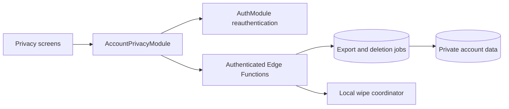

# TD-12: Account Privacy Lifecycle

| Field | Value |
| --- | --- |
| Status | Approved implementation contract |
| Owns | Reset History, personal-data export, Delete Account, interrupted-workflow recovery |
| Depends on | TD-10, TD-11 |
| Last updated | September 2, 2026 |

## Architecture



## Interface

```ts
interface AccountPrivacyModule {
  resetHistory(grant: ReauthenticationGrant): Promise<PrivacyResult<void>>;
  requestExport(grant: ReauthenticationGrant): Promise<PrivacyResult<ExportStatus>>;
  deleteAccount(grant: ReauthenticationGrant): Promise<PrivacyResult<DeletionStatus>>;
  resumeDeletion(): Promise<PrivacyResult<DeletionStatus>>;
}
```

## Rules

- Reset History is Account-wide. It increments `history_epoch`, deletes historical wellness records, and retains account identity, legal acceptance, preferences, reminders, and only the minimum currently active Attention Required state.
- Export requires recent reauthentication. `request-export` creates a structured JSON archive in private storage. Download authorization is one-time, short-lived, and bound to the requesting Account. Filenames and notifications contain no wellness detail.
- Delete Account requires recent reauthentication and explicit irreversible confirmation.
- `delete-account` prepares a recovery capability without changing access or removing data. The app saves it in protected storage before calling `deletion-status` to commit deletion: mark the Account deleting, revoke Installations and sessions, remove product data, then remove the Auth identity. A lost preparation response is non-destructive; a lost completion response is recoverable with the saved capability.
- A deleting Account rejects every product command. A stale Installation cannot authenticate or restore data.
- On relaunch, check the protected recovery marker before authentication or opening product data. The narrowly scoped `deletion-status` capability works without an Auth identity. Only confirmed completion permits local SQLite/credential cleanup and reminder cancellation; retain recovery state until cleanup succeeds.
- Staff have no routine access path to wellness history. Emergency access, if ever introduced, requires a separate audited design.

## Verification

- Reset scope and old-epoch rejection across two Installations.
- Export reauthentication, authorization, structured contents, single use, expiry, and cleanup.
- Deletion interruption at every phase, idempotent resume, token revocation, stale-device rejection, and verified local wipe.
- Generic errors and notifications reveal no account existence or wellness detail.
